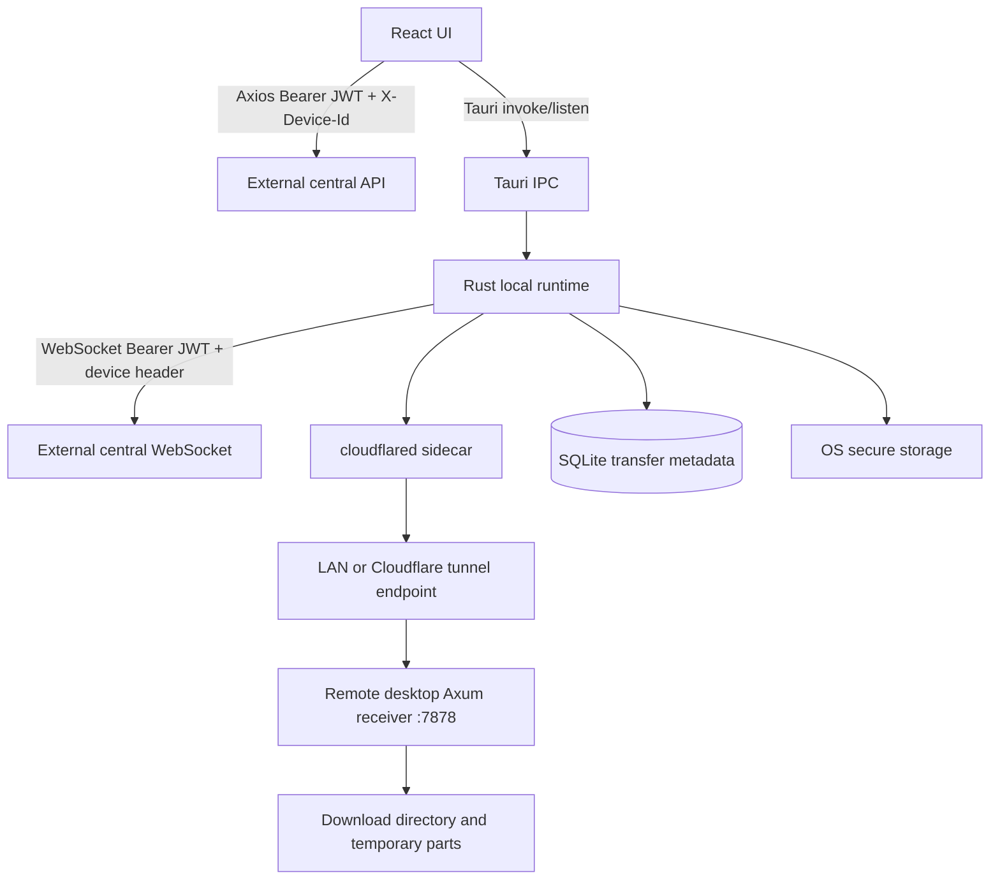

# Architecture

## Verified current implementation

VilSend is a desktop client composed of four runtime boundaries:

1. React/Vite UI in `src/`.
2. Tauri v2 IPC and application lifecycle in `crates/desktop/src/lib.rs`.
3. Rust local runtime for credentials, WebSocket connectivity, Cloudflared, SQLite metadata, and file transfer.
4. External central API/WebSocket services, defaulting in production to `https://api.vilsend.in` and `wss://api.vilsend.in/ws`.

There is no embedded Spring Boot server. The Rust process starts an Axum HTTP receiver on `0.0.0.0:7878` for incoming encrypted transfer chunks.

## Startup

`crates/desktop/src/lib.rs` creates the app configuration, app-data directory, SQLite pool, `LocalTransferFileService`, `AppState`, event dispatcher, Cloudflared state, and an Axum receiver. The receiver binds all interfaces on port 7878. The frontend is served from Vite in development and `dist` in a production Tauri build.

`src/hooks/useDesktopServices.ts` synchronizes services after Clerk/profile loading: it registers the device through the central API when needed, starts Cloudflared, and starts the Rust WebSocket. `src/contexts/auth-context.tsx` sends the Clerk token to Rust and refreshes the Rust-held token every 30 seconds.

## Data planes

- Control plane: Clerk authentication, Axios calls to central device/transfer/organization APIs, and a central WebSocket for events.
- Transfer plane: central API returns `TransferMetadata`; Rust uploads encrypted chunks directly to the receiver endpoint over LAN or tunnel.
- Local state: OS secure storage holds tunnel and X25519 device keys; SQLite holds file paths and transfer IDs; settings store holds the download directory.

## Architectural boundary assessment

The split between UI and Rust is sensible for large-file I/O and process control. The main coupling is that the UI owns service orchestration, Rust owns a second authentication state, and transfer authorization is passed as an opaque endpoint/token contract. The external central backend is a critical undocumented dependency and cannot be reviewed from this repository.

## Recommended target

Keep Tauri as the privileged desktop boundary, but make it a narrow façade over explicit Rust services. Move service lifecycle policy into Rust, define a typed transfer-session protocol, validate receiver authorization cryptographically or through a central authorization callback, and add a bounded per-transfer scheduler instead of a process-wide write lock.
