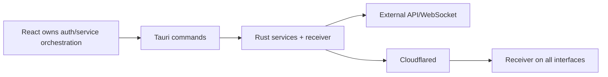

# Engineering Review

## Executive summary

VilSend has a sensible desktop split: React handles product UI and central API workflows while Rust handles privileged networking, process control, secure storage, and large-file transfer. The code compiles and the transfer primitive uses modern AEAD encryption. The project is currently under-tested and the local receiver is exposed more broadly than its authorization model supports.

| Area | Score |
|---|---:|
| Architecture | 6/10 |
| Code quality | 5/10 |
| Security | 4/10 |
| Performance | 6/10 |
| Maintainability | 5/10 |
| Scalability | 4/10 |
| Testing | 1/10 |
| Developer experience | 4/10 |

## What is good

- Clear Tauri/React separation for desktop capabilities.
- Centralized typed IPC wrappers in `src/api/tauri.ts`.
- Secure-storage usage for tunnel and device secrets.
- Per-chunk AES-GCM with fresh nonces and X25519/HKDF key derivation.
- Bounded transfer chunk size, worker count, retries, pause/resume/cancel states.
- Atomic temporary-file merge and basic traversal checks.
- WebSocket heartbeat, reconnect, and cancellation primitives.

## Biggest problems

1. **High, `src-tauri/src/transfer/writer.rs`:** Authorization header presence is accepted as authentication. Fix before exposing receiver to networks.
2. **High, `src-tauri/src/lib.rs`:** fixed Stronghold password is source-visible.
3. **High, `src-tauri/src/lib.rs`:** receiver binds `0.0.0.0:7878` without equivalent authentication/rate controls.
4. **High, transfer writer:** in-memory keys/state and incomplete cleanup make restart/recovery weak.
5. **Medium, `src/lib/api.ts`:** token existence and length are logged.
6. **Medium, `tauri.conf.json`:** null CSP and production devtools weaken desktop hardening.
7. **Medium, `writer.rs`:** one global mutex serializes writes and completion checks.
8. **Medium, `useDesktopServices.ts`:** UI owns lifecycle orchestration and repeats IPC status calls.
9. **Medium, repository-wide:** no meaningful automated tests were found.
10. **Medium, `src-tauri/src/app/mod.rs` and Cargo warnings:** duplicated commented architecture and dead fields increase ambiguity.

## What I would change first

1. Implement transfer-scoped receiver authentication and expiry.
2. Bind receiver to the minimum interface and document tunnel/firewall exposure.
3. Remove fixed Stronghold password and decide one secret-storage strategy.
4. Add receiver quotas, rate limits, size/header limits, cleanup, and replay protection.
5. Add end-to-end transfer tests with malicious paths, duplicate chunks, restart, and retries.
6. Replace global receiver lock with per-transfer/file locking and counters.
7. Centralize desktop service lifecycle in Rust.
8. Remove credential diagnostics, tighten CSP, and disable production devtools.
9. Persist resumable transfer state and final checksums.
10. Delete stale commented architecture and resolve warnings before broader refactors.

## Current vs recommended architecture

Recommended: React calls a small lifecycle façade; Rust owns service state and exposes typed status. A transfer session service validates scoped credentials, binds identities and expiry, persists resumable state, and schedules per-transfer work. The receiver is isolated behind authenticated tunnel/LAN policy.

## Things currently underengineered

Receiver authorization, tests, observability, restart recovery, cleanup, and release verification are underengineered. The application is also overcomplicated by duplicated/commented Rust architecture and two separate frontend/Rust service orchestration paths.

## Evidence limits

Central backend authorization, database indexes, Redis, server thread pools, refresh-token semantics, and cloud deployment cannot be assessed because their source is not in repository.
