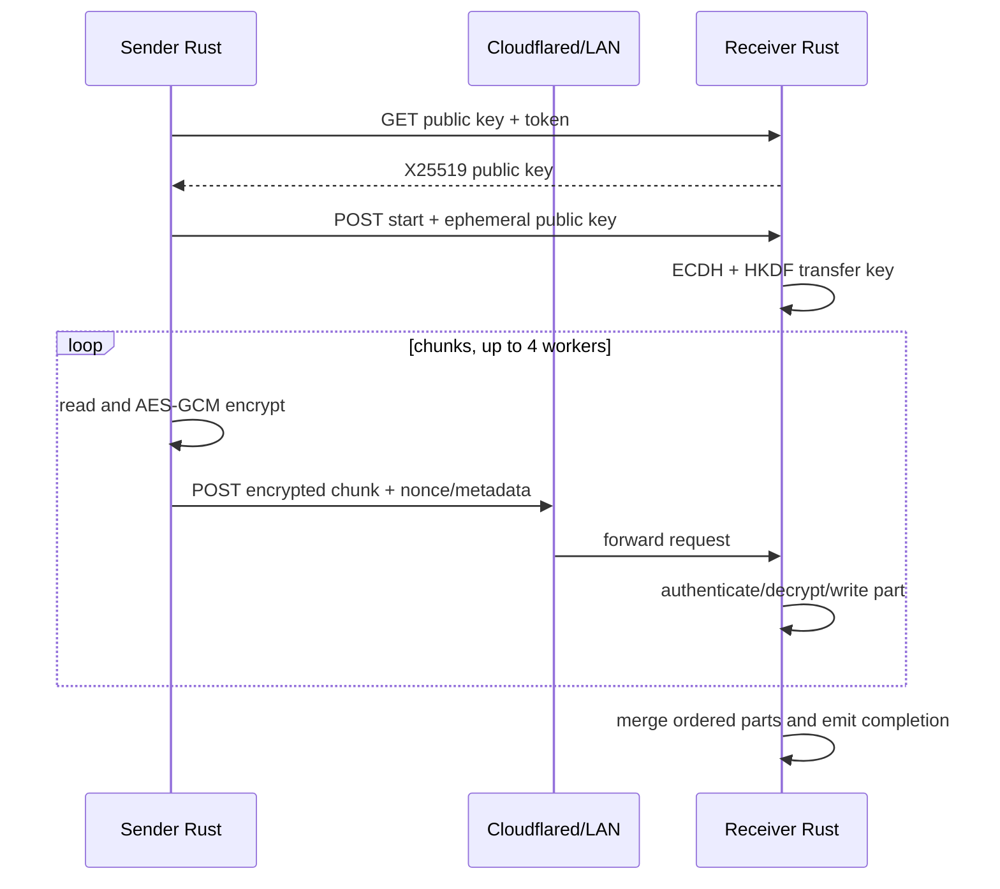

# File Transfer

## Sender path

1. Central API `/transfers` returns `TransferMetadata`: transfer ID, receiver ID, endpoint, auth token, optional chunk size, concurrency, and retry limits.
2. `UploadManager` loads file paths from SQLite by transfer ID and scans them with `scanner.rs`.
3. `chunker.rs` creates jobs using a default 4 MiB chunk size.
4. Rust fetches `/transfer/public-key`, derives an ephemeral X25519/HKDF transfer key, and calls `/transfer/start`.
5. `scheduler.rs` runs four workers by default. Each worker reads one chunk, encrypts it with AES-GCM, and POSTs it to `/transfer/chunk`.
6. Failed chunks retry up to four times with 1/2/4/8-second delays. Progress is emitted through Tauri events.

## Receiver path

The receiver creates an in-memory transfer key and download state during `/transfer/start`. Each chunk is authenticated/decrypted, path-checked for absolute paths and `..`, written to `app-data/transfers/incoming/<transfer>/<file>/<index>.part`, and merged into the configured download directory after all indices exist. Merge writes a `.transfer-tmp` file and renames it into place.

## Current limitations

- `0.0.0.0:7878` exposes the receiver on every interface.
- The receiver checks header presence, not token validity, in the visible code.
- A process-wide async mutex serializes chunk directory/write/merge work across transfers.
- Download state and transfer keys are in memory; restart recovery is not implemented.
- No final whole-file checksum is verified; the `checksum.rs` module is not part of the visible upload/merge path.
- Cleanup of completed incoming parts is not visible in the receiver path.
- Files are read into a full chunk buffer before encryption, which is bounded by chunk size but multiplied by worker count.

## Recommended direction

Use a transfer-session record with expiry, authenticated headers, per-transfer locks, bounded disk quotas, atomic metadata, restart recovery, final hash verification, and explicit cleanup. Keep the current chunked AEAD design but bind associated data to transfer ID, file ID, chunk index, and relative path.
