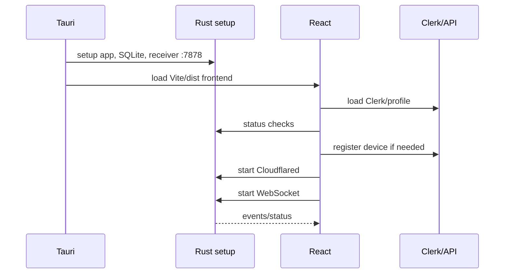
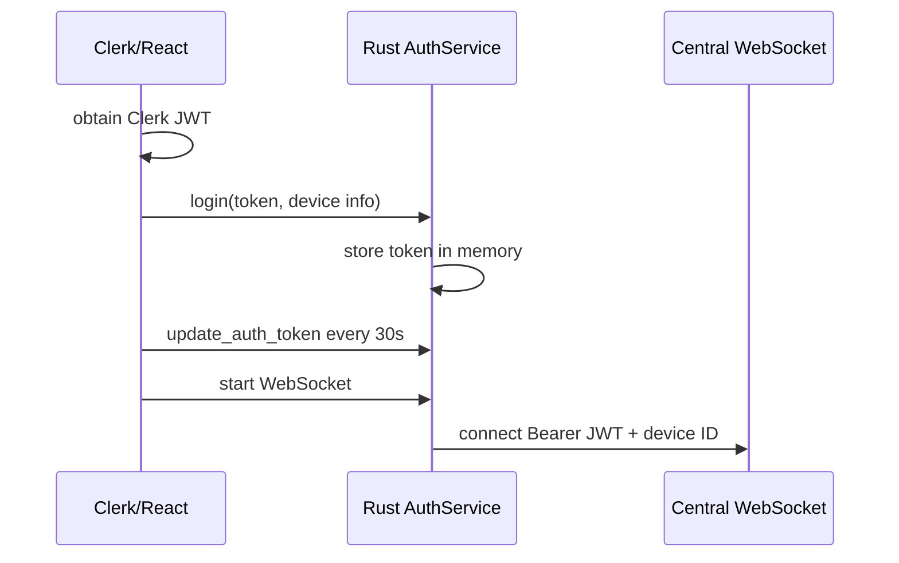

# Important Flows

## Startup and service synchronization

## Login and token refresh

## Device registration and pairing

The visible frontend calls central `/devices/register` and `/devices/pair*` endpoints. Device registration includes an X25519 public key. QR rendering/scanning UI exists in `src/features/devices/qr-pairing-page.tsx`, but the cryptographic pairing protocol and central validation are not found in this repository.

## Transfer

The sender fetches metadata from `/transfers`, then Rust performs public-key retrieval, handshake, encrypted chunk upload, retries, progress events, and completion. The receiver derives a key, decrypts and writes parts, then merges them into the configured download path.

## Logout and shutdown

React logout stops WebSocket and Cloudflared and clears Rust auth. Window destruction kills Cloudflared. Explicit active-transfer cancellation and receiver cleanup during app shutdown are not fully coordinated in the visible implementation.
