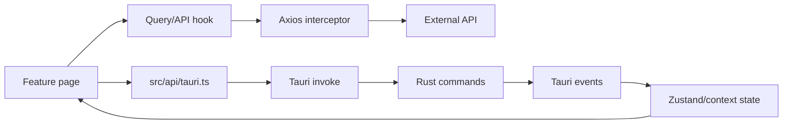

# Frontend

## Stack and entry points

- React 18.3, TypeScript 5.5, Vite 5.4, React Router 6.
- Clerk for hosted authentication.
- Axios for central API calls and TanStack Query for server-state providers.
- Zustand stores for UI, notifications, transfer requests, auth, and WebSocket state.
- Tauri API/event listeners for native commands and transfer events.

`src/main.tsx` mounts `AppProviders`, `BrowserRouter`, and `App`. Providers include Clerk when configured, Axios token wiring, Query, theme, auth, and WebSocket contexts. `src/router.tsx` defines public auth routes, protected organization/device/transfer/settings routes, and billing/member guards.

## Main data paths

Central API calls go through `src/lib/api.ts`. The request interceptor obtains a Clerk token and adds `Authorization: Bearer ...` plus `X-Device-Id`. Device and transfer functions live in feature API modules such as `src/features/devices/devices-api.ts` and `src/features/transfers/transfers-api.ts`.

Native calls are centralized in `src/api/tauri.ts`, which wraps `invoke()` for login, logout, WebSocket, Cloudflared, identity, transfer lifecycle, local-file metadata, and settings. Tauri events are listened to by `useDesktopServices`, `AuthProvider`, and `WebSocketProvider`.

## Authentication state

Clerk is the source of web identity. `AuthProvider` mirrors the current token into Rust using `login` and `update_auth_token`; it does not persist the token in the frontend store. `ProtectedRoute` and `AuthGate` are bypassed in preview mode when the publishable key is absent. `src/store/auth-store.ts` exists but is not the main auth state path.

## Service lifecycle

`useDesktopServices` runs status checks and starts/stops Cloudflared and WebSocket based on Clerk/profile state. It registers incoming transfer requests and adds notification/store entries. A 402 from device registration triggers a 10-second Clerk logout countdown.

## Risks and improvements

- Token existence and length are written to logs by `src/lib/api.ts`; remove this telemetry and use redacted correlation IDs.
- The service hook makes multiple native calls and owns lifecycle policy; move this policy behind one idempotent Rust command.
- `WebSocketProvider` appends every message without a retention bound; add a ring buffer or event-specific stores.
- Preview mode renders protected UI without authentication and must never be enabled in production builds.
- There are no frontend tests found in the repository. Prioritize auth, device registration, transfer request handling, and event cleanup tests.
