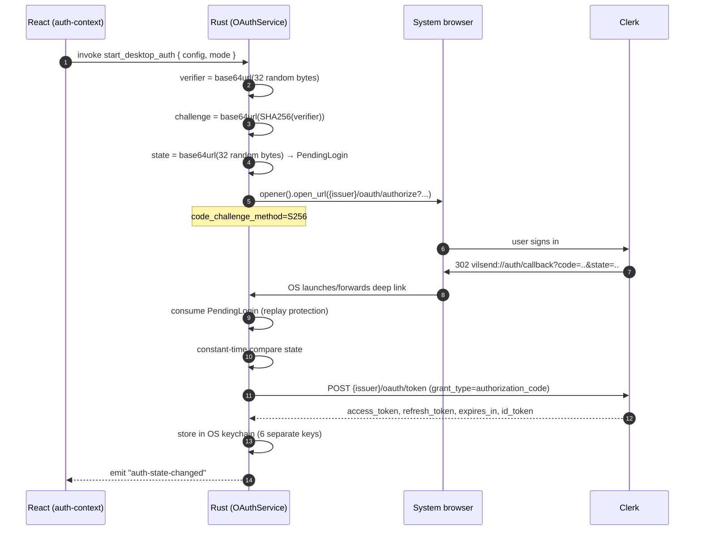

# 00 — Current State

> **How to read this document.** Everything below was read from the repository
> at commit `7c6b82b` (branch `main`). File paths and line numbers are real.
> Where I could not determine something from the code, it is marked
> **NOT FOUND** or **ASSUMPTION** — those markers are load-bearing, not filler.
> Nothing here is inferred from the existing `docs/` folder without independent
> verification; where the existing docs disagree with the code, the code wins
> and the discrepancy is called out.

---

## 1. What this repository is

A **Tauri v2 desktop application** named **VilSend** (`in.vilsend.app`),
version `1.0.4`.

| Fact | Value | Evidence |
|---|---|---|
| Tauri version | **v2** (`tauri = "2"`, resolved **2.11.5**) | `src-tauri/Cargo.toml:16`, `src-tauri/Cargo.lock` |
| Crate name | `vilsend`, lib `server_frontend_lib` | `src-tauri/Cargo.toml:2`, `:12` |
| Frontend | React 18 + Vite 5 + TypeScript (strict) + Tailwind + shadcn/ui (Radix) | `package.json`, `tsconfig.app.json:16` |
| State | Zustand + React Query (TanStack v5) | `src/store/`, `src/providers/query-provider.tsx` |
| Rust async | tokio (multi-thread) | `src-tauri/Cargo.toml:22` |
| Local DB | SQLite via `sqlx` (`app_data_dir/transfer.db`) | `src-tauri/src/lib.rs:134-144` |
| Central backend | **NOT IN REPOSITORY.** External HTTPS/WSS service | `docs/README.md:25-27` |

**Repo size:** ~10,400 lines of Rust across 78 files in `src-tauri/src/`;
~200 TypeScript files in `src/`.

**Note on the crate name:** `server_frontend_lib` is a leftover from the
directory name `server-frontend`. It is public-facing only inside the workspace,
but it is confusing and should be renamed when the workspace splits.

---

## 2. Repository layout

```
server-frontend/
├── src/                       # React frontend (~200 files)
│   ├── api/tauri.ts           # THE single IPC boundary — every invoke() lives here
│   ├── features/              # auth, devices, transfers, tunnel, billing, org, onboarding
│   ├── contexts/              # auth-context, websocket-context
│   ├── store/                 # zustand
│   └── lib/                   # api.ts (axios), auth-config.ts, env.ts
├── src-tauri/                 # the Rust core + Tauri shell (NOT separated)
│   ├── src/
│   │   ├── lib.rs             # 455 lines — composition root
│   │   ├── app/mod.rs         # AppState — lines 288-392 live, 1-287 commented dead
│   │   ├── commands/          # #[tauri::command] boundary
│   │   ├── services/          # auth, oauth, cloudflared, keyring, sqlite, updates
│   │   ├── transfer/          # the transfer engine (27 files!)
│   │   ├── websocket/         # control-plane WS client (10 files)
│   │   ├── state/             # 7 files, 2 of them case-duplicate orphans
│   │   ├── models/, events/, utils/
│   │   └── error.rs           # AppError
│   ├── capabilities/default.json
│   ├── resources/cloudflared/{windows-x64,linux-x64,linux-arm64,macos-x64,macos-arm64}/
│   ├── msix/AppxManifest.xml
│   ├── tauri{,.windows,.linux,.macos,.windows.store}.conf.json
│   └── Cargo.toml
├── .github/workflows/release.yml   # 1799 lines
├── docs/                       # 19 pre-existing docs (see §10)
└── src-tauri/2                 # ← stray file, see §9
```

**There is no Cargo workspace.** One `Cargo.toml`, one crate.
**There are no tests.** No `src-tauri/tests/`, no `examples/`, no `benches/`,
no `#[test]`, no `#[cfg(test)]` anywhere in `src-tauri/src`. Verified by
`grep -rn "#\[cfg(test)\]"` → zero hits. This is the single most important fact
in this document for planning a refactor.

---

## 3. The Tauri boundary

### 3.1 Complete command surface — 32 commands

From the `generate_handler!` registry at `src-tauri/src/lib.rs:396-429`, verbatim:

```
start_desktop_auth, cancel_desktop_auth, get_auth_status, get_auth_token, logout,
start_websocket, send_message, get_connection_status,
save_tunnel_token, get_tunnel_token, delete_tunnel_token,
get_default_download_location, set_default_download_location,
start_transfer, pause_transfer, resume_transfer, cancel_transfer, get_transfer_status,
save_tunnel_hostname, get_tunnel_hostname, delete_tunnel_hostname,
start_cloudflared_cmd, stop_cloudflared_cmd, cloudflared_status,
clear_all, create_device_identity,
save_local_transfer_file, get_local_transfer_files, delete_local_transfer_files,
delete_local_transfer_file, check_local_transfer_exists, detect_device_type
```

### 3.2 Complete event surface — 11 events

| Event | Emitted from | Consumed at |
|---|---|---|
| `auth-state-changed` | `events/dispatcher.rs:68-79` | `src/contexts/auth-context.tsx:148` |
| `auth-error` | `events/dispatcher.rs:83-89` | `src/contexts/auth-context.tsx:170` |
| `server-event` | `events/dispatcher.rs` (connection status) | `src/contexts/websocket-context.tsx:19` |
| `websocket-message` | `events/dispatcher.rs` | `src/contexts/websocket-context.tsx:25` |
| `transfer-request` | `events/dispatcher.rs:43-50` | `src/api/tauri.ts:156` |
| `transfer-progress` | `transfer/events.rs` via `manager.rs`/`writer.rs` | `src/api/tauri.ts:150` |
| `transfer-completed` | ditto | ditto |
| `transfer-failed` | ditto | ditto |
| `transfer-paused` | ditto | ditto |
| `transfer-resumed` | ditto | ditto |
| `transfer-cancelled` | ditto | ditto |
| `update-available` | `events/dispatcher.rs:203-210` | **NOT FOUND** — no frontend `listen` for it |

### 3.3 Boundary defects found

| # | Defect | Evidence | Impact |
|---|---|---|---|
| B1 | **`stop_websocket` is invoked by the frontend but is not registered in Rust.** The manager has `WebSocketManager::stop()` (`websocket/manager.rs:419-443`) but no `#[tauri::command]` wrapper. | called at `src/api/tauri.ts:99`; absent from `lib.rs:396-429` | Runtime "command not found" on **logout** (`src/contexts/auth-context.tsx:270`) and on teardown (`src/hooks/useDesktopServices.ts:255`). The socket keeps running after sign-out. |
| B2 | **`AppError` serializes to the frontend as a flat `String`.** | `error.rs:53-60` — manual `Serialize` calling `Display` | The UI cannot distinguish `NotAuthenticated` from `Auth` from `Network` by type. Every variant's discriminant is lost at the IPC boundary. |
| B3 | **Devtools open in production.** `window.open_devtools()` is called unconditionally in `setup`. | `lib.rs:119-123` | Ships a devtools-enabled release build. Security + polish defect. |
| B4 | `ConnectionStatus` casing mismatch — the frontend compares against the literal `"Connected"` while the type union uses lowercase `'connected'`. | `src/hooks/useDesktopServices.ts:112` vs `src/types/auth.ts:24-29` | Status checks may silently never match. |
| B5 | Five commands are registered but never invoked from the frontend: `get_tunnel_token`, `delete_tunnel_token`, `start_transfer`, `get_transfer_status`, `clear_all`. | `lib.rs:406-421` vs no `invoke` in `src/` | Dead surface. `start_transfer` in particular is bypassed — transfers start from the WebSocket `START_TRANSFER` command instead. |
| B6 | `update-available` is emitted but nothing listens. | `events/dispatcher.rs:203-210` | The updater may notify into the void. |
| B7 | Capabilities grant only `core/opener/store/dialog/fs:allow-stat/fs:allow-read/log`. | `capabilities/default.json` | No `deep-link`, `secure-storage`, or `updater` permissions. Currently harmless (those run Rust-side), but any future frontend plugin call is denied. |

### 3.4 Tauri coupling density

Counts of `tauri::` references per file (`grep -rc`):

```
commands/auth.rs                 20
lib.rs                           16
services/secure_storage.rs        9   ← 100% commented-out file
commands/local_transfer_commands.rs  7
commands/transfer_commands.rs     6
transfer/writer.rs                4   ← the receiver
commands/device.rs, cloudflared.rs, app/mod.rs   4 each
error.rs                          2
transfer/manager.rs, transfer/events.rs, services/{updates,oauth,keyring,cloudflared}.rs, events/dispatcher.rs   1 each
```

**The 27-file `transfer/` module has exactly three Tauri-touching files**
(`events.rs`, `manager.rs`, `writer.rs`). Everything else — `crypto`, `chunker`,
`merger`, `scheduler`, `upload`, `scanner`, `http_client`, `progress`, `retry`,
`state`, `errors`, `constants` — is already free of Tauri types. The entire
`websocket/` module and the entire `utils/` module are Tauri-free.

**This is the good news, and it is genuinely good news.** The extraction seam
is narrow and already nearly clean.

---

## 4. Transfer mechanism

### 4.1 Shape

Split across **two halves that barely know about each other**:

- **Sender** — `transfer/manager.rs` (`UploadManager`), outbound `reqwest`
  HTTP, driven by a WebSocket command; concurrency via `transfer/scheduler.rs`.
- **Receiver** — `transfer/writer.rs`, an **axum HTTP server on
  `0.0.0.0:7878`** mounted by `lib.rs:298-337`, with the handler functions
  `get_public_key` / `start_transfer` / `receive`.

Despite the name, `transfer/writer.rs` (819 lines) is the **receiver's HTTP
layer**, not a file writer.

### 4.2 Protocol

| Aspect | Value | Evidence |
|---|---|---|
| Chunk size | 4 MiB default | `transfer/constants.rs:1` |
| Concurrency | 4 workers default | `transfer/constants.rs:2` |
| Max retries | 4 default | `transfer/constants.rs:3` |
| Retry delays | `2^min(attempt,3)` → 1, 2, 4, 8 s | `transfer/retry.rs:1-3` |
| Receiver port | 7878, bound `0.0.0.0` | `lib.rs:300`, `constants.rs:4` |
| Body limit | 10 MiB | `lib.rs:319` |
| Endpoints | `POST /transfer/start`, `POST /transfer/chunk`, `GET /transfer/public-key` | `lib.rs:306-318` |
| Chunk headers | `Authorization`, `Transfer-Id`, `File-Id`, `Chunk-Index`, `Total-Chunks`, `Relative-Path`, `Chunk-Nonce`, `Encryption: AES-256-GCM` | `transfer/http_client.rs:75-140` |
| Endpoint source | `TransferMetadata.endpoint` / `START_TRANSFER.endpoint` — **an opaque string the engine never validates** | `transfer/http_client.rs:30-36` (`normalize_endpoint` prefixes `https://` if no scheme) |

### 4.3 Cryptography — exact

From `transfer/crypto.rs`:

| Property | Implementation | Line |
|---|---|---|
| Key exchange | **X25519 ECDH** — sender ephemeral × receiver **long-term device** key | `:32-41`, `:69-74` |
| KDF | **HKDF-SHA256**, `info = b"carsdv-transfer-key-v1"`, **salt = none** | `:82-91` |
| AEAD | **AES-256-GCM**, **fresh random 12-byte nonce per chunk** | `:116-138` |
| Key scope | One AES key **per transfer**, shared across all files and chunks | `:82-91` |
| AAD | **None** | `:116-138` |
| Whole-file integrity | **None.** `transfer/checksum.rs` is a **0-byte stub** | — |
| Nonce uniqueness | Random only — no counter, no tracking | `:119-120` |

Two things worth stating plainly, because they are the crux of
[`02-transport-layer.md`](./02-transport-layer.md) §7:

1. **There is no associated data.** A ciphertext is bound to nothing — not to
   the transfer, the file, the chunk index, or the path. A captured chunk can be
   replayed into a different slot. This is recorded honestly in the repo's own
   `docs/DECISIONS.md:13` as "replay binding remain[s] incomplete".
2. **The receiver's public key is fetched unauthenticated.** From
   `GET {endpoint}/transfer/public-key` (`transfer/http_client.rs:142-183`),
   with the endpoint supplied by the control plane. There is no signature, no
   pinning, and no device identity binding. **ASSUMPTION:** over the tunnel path
   this is *probably* acceptable (Cloudflare terminates TLS to a hostname the
   control plane assigned); over any direct/LAN path it would be trivially
   spoofable.

### 4.4 Resume, pause, cancel, persistence

| Feature | Reality |
|---|---|
| **Resume (receiver)** | Implemented, accidentally: a chunk is skipped if its `.part` file already exists (`transfer/writer.rs:669`, `fs::metadata(&part).is_err()`). No bitmap, no manifest exchange. |
| **Resume (sender)** | **NOT FOUND.** No persisted offset, no restart recovery. |
| **Pause/resume/cancel** | Real: `AtomicBool` flags polled by workers (`transfer/scheduler.rs:16-38`, `writer.rs:619-625`). |
| **Persistence** | **NONE for transfer state.** `transfer/persistence.rs` is a **0-byte stub**. Keys and progress live in memory only; `UploadState`/`DownloadState` hold everything in RAM (`transfer/state.rs`). |
| **Restart recovery** | **NOT FOUND.** Closing the app loses all in-flight state. |
| **Completion check** | `(0..total).all(|i| metadata(parts/{i}.part).is_ok())` — one `stat` per chunk (`transfer/writer.rs:723`). O(n) syscalls per completion. |
| **Merge** | Sequential 64 KiB copy to `.transfer-tmp`, then atomic `rename` (`transfer/merger.rs:7-28`). Correct. |
| **Cleanup** | Temp dir removed on success (`writer.rs:725-779`). **NOT FOUND** on failure or cancellation. |

### 4.5 The concurrency bottleneck

`ReceiverState` holds `guard: Arc<tokio::sync::Mutex<()>>`
(`transfer/writer.rs:37-45`), acquired in the receive handler (`:600`). This is
a **single process-wide mutex that every chunk write across every concurrent
transfer must take**. It is flagged Medium in the repo's own
`docs/ENGINEERING_REVIEW.md` ("one global mutex serializes writes and
completion checks") and P1 in `docs/IMPROVEMENT_ROADMAP.md`.

Combined with `mpsc::unbounded_channel` in `transfer/manager.rs:158` and
`websocket/sender.rs:4-7`, the current concurrency story is: bounded workers,
unbounded queues, one global lock.

### 4.6 Empty stubs and dead modules

| File | Bytes | Declared in `mod.rs`? |
|---|---|---|
| `transfer/checksum.rs` | 0 | **No** |
| `transfer/persistence.rs` | 0 | **No** |
| `transfer/pause.rs` | 0 | **No** |
| `transfer/download.rs` | 0 | **No** |
| `transfer/cancle.rs` *(sic — misspelled)* | 0 | **No** |
| `utils/bitset.rs`, `fs.rs`, `hash.rs`, `path.rs`, `time.rs` | 0 each | **No** |
| `transfer/worker.rs` | 96 | Yes — contains only a comment |
| `websocket/protocol.rs` | 430 | No (`// pub mod protocol;`) — **entirely commented out** |
| `websocket/WebSocketManager.rs` | 117 | No — orphan, third case-duplicate |
| `websocket/error.rs` | — | Declared but `WebSocketError` is not re-exported; unused |
| `services/secure_storage.rs` | 657 lines | No — **100% commented out** |

The empty-file set is **not** wired into the module tree, so these are dead
files rather than stubs with intent. `transfer/mod.rs:1-16` declares only:
`chunker, constants, errors, events, http_client, manager, merger, progress,
retry, scanner, scheduler, state, upload, worker, writer, crypto`.

---

## 5. Authentication

### 5.1 The flow, verified

**OAuth 2.0 Authorization Code + PKCE (S256), system browser, public client,**
hand-rolled with `reqwest` in `services/oauth_service.rs` (903 lines).



Verified specifics:

| Aspect | Value | Evidence |
|---|---|---|
| Verifier / state size | 32 random bytes each, base64url-no-pad | `oauth_service.rs:39`, `:41`, `:827-831` |
| Challenge method | **S256** — confirmed | `oauth_service.rs:833-836`, `:355` |
| State comparison | **constant-time** (`constant_time_eq`) | `oauth_service.rs:434`, `:840-853` |
| Redirect URI | from frontend config; default `vilsend://auth/callback`; Rust validates scheme+host+path (case-insensitive, trailing-slash trimmed) | `oauth_service.rs:856-869` |
| Browser open | `tauri-plugin-opener` → `app.opener().open_url(...)` | `commands/auth.rs:74-75` |
| Callback receipt | `tauri-plugin-deep-link`, both `on_open_url` (running) and `get_current()` (cold start) | `lib.rs:237-271` |
| Double-start guard | error if `pending_login.is_some()` | `oauth_service.rs:333-337` |
| **Total HTTP calls made by Rust** | **Two hand-built URLs.** `{issuer}/oauth/authorize` (redirect) and `{issuer}/oauth/token` (POST). | `oauth_service.rs:83-85`, `:69-81` |

**Critically absent, verified by grep across the whole crate:**

- ❌ No `/.well-known/openid-configuration` discovery — **zero hits**
- ❌ No JWKS fetch, **no JWT signature verification anywhere**
- ❌ No Clerk SDK crate — pure `reqwest`
- ❌ No `/oauth/revoke`, `/logout`, or `/sessions` call on logout
- ❌ `exp` claim is **never read**. Expiry comes only from the token response's
  `expires_in` field (`oauth_service.rs:458`, `:541`)
- ✅ The only JWT handling is `subject_of()` (`oauth_service.rs:875-884`), which
  base64url-decodes the payload and reads `sub` **without verifying the
  signature** — correctly documented in-code as being used "only to label local
  session state".

### 5.2 Issuer derivation is in TypeScript, not Rust

**Verified.** Rust treats `issuer` as opaque config, validated only for
`https` scheme (or loopback) at `oauth_service.rs:101-106`. The derivation is
`src/lib/auth-config.ts:26-45`:

```ts
export function deriveIssuerFromPublishableKey(key: string): string | null {
  const encoded = key.replace(/^pk_(test|live)_/, '');
  if (!encoded || encoded === key) { return null; }
  try {
    const decoded = atob(encoded).replace(/\$$/, '').trim();
    if (!decoded || !decoded.includes('.')) { return null; }
    return `https://${decoded}`;
  } catch { return null; }
}
```

It relies on the (Clerk-specific) structure of the publishable key: base64 of
the frontend-API hostname with a trailing `$`. **ASSUMPTION:** undocumented by
Clerk; this is reverse-engineered and will break silently if Clerk changes the
key format. The resolved issuer + client id are passed to Rust **per call** as
`DesktopAuthConfig` (`src/api/tauri.ts:50-56`) because Rust has no access to
`VITE_*` env vars.

### 5.3 Token storage — the three-stack problem

**Only one mechanism is live.** This is the single most clarifying finding in
the auth area:

| Mechanism | File | Live? | What goes through it |
|---|---|---|---|
| **`tauri-plugin-secure-storage`** | `services/keyring_service.rs` | ✅ **YES — the only one** | **Everything:** auth access/refresh/expiry/user-id/token-endpoint/client-id, tunnel token, tunnel hostname, device private+public key |
| `tauri-plugin-stronghold` + `iota_stronghold` | `services/secure_storage.rs` | ❌ **No** — file is **100% commented out** and **not declared** in `services/mod.rs`. Plugin *is* registered at `lib.rs:112` but **never called**. | Nothing |
| `keyring` crate | declared `Cargo.toml:44` | ❌ **No** — zero references in the codebase | Nothing |

The struct is named `KeyringService` but does **not** use the `keyring` crate —
it wraps `tauri_plugin_secure_storage` (`keyring_service.rs:3`, `:59-62`).

**Auth tokens are deliberately split across six keys**, with the reason
documented in-code at `keyring_service.rs:10-16`: the Windows credential store
caps a single secret at 2560 bytes, and an access + refresh token pair can
exceed it. `save_auth_session`/`load_auth_session` at `:161-201`;
`delete_auth_session` at `:204-212`.

### 5.4 Token refresh

| Aspect | Implementation | Evidence |
|---|---|---|
| Trigger | **Lazy**, on `token_for_request()` — i.e. only when the frontend calls `get_auth_token`. Threshold: `now + 60 >= expires_at`. | `oauth_service.rs:499-501`, `:35` |
| Startup restore | **Zero network I/O** — reads the keychain only, by design | `oauth_service.rs:255-263` |
| Concurrency | `refresh_lock: Arc<Mutex<()>>` + **double-checked re-read** so a waiter returns the token the first refresher installed, without spending the refresh token twice | `state/auth_state.rs:45`, `oauth_service.rs:524-537` |
| Error handling | Two-tiered via `TokenRequestError::is_definitive()`: **4xx/Malformed → clear session + `NotAuthenticated`**; **Transport/5xx → keep session**, return the stale token so an offline machine is not signed out | `oauth_service.rs:154-176`, `:563-587` |

This is genuinely well-designed — better than most hand-rolled implementations.
Note it **contradicts** the older `docs/ARCHITECTURE.md:32` claim of a 30-second
refresh timer; the per-request design is what the code does.

### 5.5 Logout and the WebSocket token bug

`AuthService::logout` (`services/auth_service.rs:60-74`) → stops the websocket,
`oauth_service.clear()`, emits `auth-state`. `clear()`
(`oauth_service.rs:803-817`) wipes in-memory state + deletes the keychain
session. **No revocation endpoint is called** — logout is purely local deletion,
so the refresh token remains valid server-side until it expires.

**Additional defect (A1):** the WebSocket client captures the token **once at
connect time** (`websocket/client.rs:39-50` reads `auth_state.token` captured by
`websocket_service.rs:105-117`) and does **not** go through the refresh-aware
`token_for_request` path. A token that expires mid-session is never refreshed
for the socket — the connection will be rejected on the next reconnect.

### 5.6 Device identity

| Aspect | Value | Evidence |
|---|---|---|
| Algorithm | **X25519** (`StaticSecret::random_from_rng(OsRng)`), base64 **STANDARD** | `services/generate_device_keypair.rs:25-45` |
| Ed25519 | **DEAD.** `generate_device_keypair.rs:1-23` is a commented-out ed25519-dalek implementation. `ed25519-dalek` is a dependency but unused. | `Cargo.toml:47` |
| Storage | secure-storage keys `device_private_key` / `device_public_key` | `keyring_service.rs:7-8` |
| Usage | the **receiver's long-term key** for transfer E2E crypto | `transfer/writer.rs:248` |
| Defect | **`get_device_public_key` ignores the stored value and re-derives from the private key.** `save_device_public_key` writes something nothing reads (its only reader is commented out at `keyring_service.rs:235-237`). | `keyring_service.rs:239-242` |
| Generation trigger | `create_device_identity` command, idempotent | `commands/device.rs:8-21` |

**Implication for the refactor:** there is currently **no signing key**. The
peer-authentication design in [`02-transport-layer.md`](./02-transport-layer.md)
§7.3 needs one, and X25519 cannot sign. See ADR-0007.

---

## 6. Tunnel (Cloudflare)

| Aspect | Reality | Evidence |
|---|---|---|
| Binary | **Bundled sidecar**, per-platform, copied into Tauri resources | `resources/cloudflared/{windows-x64,linux-x64,linux-arm64,macos-x64,macos-arm64}/` |
| Resolution | `app.path().resource_dir()` + `"resources"` + arch-mapped relative path | `services/cloudflared.rs:262-305` |
| Invocation | `cloudflared tunnel --no-autoupdate run --token <token>` | `cloudflared.rs:66-81` |
| Token source | OS keychain (`tunnel_token`) | `cloudflared.rs:30` |
| Hostname | Read from the keychain by `start_cloudflared_cmd`; **used only in a log/message string** — it is not passed to cloudflared (the tunnel is token-configured) | `commands/cloudflared.rs:13-19`, `cloudflared.rs:134` |
| Hostname population | In practice the **frontend** does it: reads the keychain, falls back to `GET /tunnel/info` on the central API, writes back via `save_tunnel_hostname` | `src/features/tunnel/tunnel-hostname.ts:14-41` |
| "Connected" detection | **stderr line scraping**: `line.contains("Registered tunnel connection")` | `cloudflared.rs:124` |
| Startup wait | polls every 200 ms for up to **15 s**, using a blocking `std::thread::sleep` **inside a synchronous `#[tauri::command]`** | `cloudflared.rs:130-140` |
| Shutdown | Two paths: `CloudflaredService::stop` (`:143-156`) and the window-destroyed handler (`lib.rs:432-452`) | — |
| Windows | `CREATE_NO_WINDOW` (0x08000000) | `cloudflared.rs:76-78` |

### 6.1 macOS/arm64 cloudflared is broken — corrected finding

The Rust resolver maps `("macos","aarch64") → "cloudflared/macos-arm64/cloudflared"`
(`cloudflared.rs:268-282`), but **`tauri.macos.conf.json` bundles only
`resources/cloudflared/macos-x64/cloudflared`**. On Apple Silicon the resolver
therefore looks for a file the bundle never contains.

**This is not a Rosetta fallback — it is a hard failure: cloudflared will not
start on Apple Silicon macOS.** The `macos-arm64/cloudflared` binary is present
in `src-tauri/resources/` but is never copied into the bundle, because only the
`macos-x64` path is listed in `tauri.macos.conf.json`. Every arm64 Mac — which
includes the `macos-latest` CI runner — resolves to a path that does not exist
in the shipped app.

Also note the path join is doubled: `resource_dir()` already resolves to a
`resources`-style directory, and the relative path is then joined under an
additional `"resources"` segment (`cloudflared.rs:278-282`). It works today
because Tauri copies `src-tauri/resources/**` into a `resources/` subdirectory
of the bundle — verified on disk in `src-tauri/target/{debug,release}/resources/` —
but it is fragile and will break if the bundle layout changes.

### 6.2 `Win32_System_Power`

Not in cloudflared. It is `detect_device_type` in `commands/device.rs:44-62`,
calling `GetSystemPowerStatus` and reading `BatteryFlag` (128 = no battery →
DESKTOP, else LAPTOP). macOS uses `system_profiler`; Linux checks
`/sys/class/power_supply/BAT0`.

---

## 7. Control-plane WebSocket

| Aspect | Reality | Evidence |
|---|---|---|
| URL | `wss://api.vilsend.in/ws` (env `WS_URL` overrides) | `utils/config.rs:21-33` |
| Auth | `Authorization: Bearer {token}` + `x-device-id` header | `websocket/client.rs:39-64` |
| Library | `tokio-tungstenite` with rustls | `Cargo.toml:25` |
| Wire format | `#[serde(tag = "type")]` enum, UPPER_SNAKE variant names | `websocket/server_command.rs:3-29` |
| Commands | `START_TRANSFER`, `CANCEL_TRANSFER`, `TRANSFER_REQUEST`, `PING`, `PONG` | same |
| Heartbeat | `{"type":"PING"}` every 30 s | `websocket/heartbeat.rs:28-37`, `config.rs:27` |
| Reconnect | exponential backoff, `initial * 2^(attempt-1)` capped at max; 8 attempts, 500 ms → 15 s | `websocket/reconnect.rs:5-10`, `config.rs:29-31` |
| Internet pre-check | `TcpStream::connect(("1.1.1.1", 443))` with 3 s timeout | `utils/network.rs:4-12` |
| Role | Always-connected **client** receiving server push | `websocket/manager.rs:79-417` |
| Tauri coupling | **None.** Communicates via injected `Arc<AuthState>` + `Arc<EventDispatcher>` | verified |

`websocket/protocol.rs` (the would-be `WebSocketMessage` struct) is **entirely
commented out**; the real schema lives in `server_command.rs`.

**Note:** the internet check hardcodes `1.1.1.1:443`. In a network that blocks
that IP, the app reports "no internet" and never connects — even if the actual
API is reachable. Worth replacing with an API-reachability probe.

---

## 8. Frontend ↔ backend boundary

**The React app talks to the central API directly over axios** — it is *not*
proxied through Rust.

```ts
// src/lib/api.ts:6-12
const api = axios.create({
  baseURL: env.apiBaseUrl,   // VITE_API_BASE_URL — .env sets https://api.vilsend.in/api
  timeout: 30_000,
  headers: { "Content-Type": "application/json" },
});
```

The auth token is attached by a request interceptor that calls into Rust on
every request (`src/lib/api.ts:14-44`):

```ts
api.interceptors.request.use(async (config) => {
  if (tokenGetter) {
    const token = await tokenGetter();          // → invoke("get_auth_token")
    if (token) config.headers.Authorization = `Bearer ${token}`;
    config.headers["X-Device-Id"] = await getDeviceIdentifier();
  }
  return config;
});
```

**The access token never enters React state.** It lives only in Rust and is
fetched per-request. This is a deliberate, well-documented design
(`src/types/auth.ts:12-22`) and one of the stronger parts of the current
architecture.

### 8.1 Backend endpoints (observed, grouped)

| Group | Endpoints |
|---|---|
| Auth | `GET /auth/me` |
| Devices | `GET /devices`, `GET /devices/health`, `GET /devices/{id}`, `POST /devices/register`, `PUT /devices/{id}/rename`, `DELETE /devices/{id}`, `POST /devices/pair`, `GET /devices/pair/{code}`, `POST /devices/pair/{code}/connect`, `POST /devices/pair/{code}/cancel` |
| Transfers | `POST /transfers`, `GET /transfers`, `PATCH /transfers/{id}` |
| Organization | `GET /organization/me`, `GET /members`, `GET /organization/invitations`, `POST /organization`, `PUT /organization/{id}`, `DELETE /organization/{id}`, `POST /organization/invitation`, `PUT /organization/members/{id}/role`, `DELETE /organization/members/{id}`, `DELETE /organization/invitations/{id}`, `POST /organization/invitations/{id}/response` |
| Onboarding | `POST /onboarding` |
| Billing | `POST /subscription/seats`, `POST /subscription/create`, `POST /subscription/razorpay/verify-subscription`, `POST /subscription/razorpay/verify`, `GET /subscription/usage-summary`, `GET /subscription/history` |
| Tunnel | `GET /tunnel/info` |
| Dashboard | `GET /dashboard` — **dead**, the page/route is commented out |

**`NOT FOUND`:** the server implementation, schema, and authorization policy.
Everything above is inferred from client call sites. There is no OpenAPI spec
in this repository.

### 8.2 Razorpay

`src/services/razorpay-checkout.ts:101` loads
`https://checkout.razorpay.com/v1/checkout.js` into the **webview** and opens
the modal client-side. This is relevant to the mobile plan: the same approach
inside a mobile WebView has different platform requirements.

---

## 9. Build, release, and repository hygiene

### 9.1 CI

`.github/workflows/release.yml` — **1799 lines**, triggers on `v*` tags.

| Job | Status |
|---|---|
| `release` (matrix: ubuntu / windows / macos) | active — `:901-1035` |
| `build-windows-store` | active — `:1039` |
| `upload-windows-store-to-r2` | active — `:1528` |
| `upload-updater` | active — `:1654` |
| Lines `1-890` | **entirely commented out** — a superseded copy of the same pipeline |

Commands are invoked as `--config src-tauri/${{ matrix.config }}`
(`:1029`), i.e. the per-platform `tauri.*.conf.json` overrides. Build-time
`VITE_*` secrets are injected (`:1001-1027`).

**Known release risk:** the workflow uses `tauri-apps/tauri-action@v1` while
the project is on Tauri v2 — already flagged in `docs/BUILD_AND_RELEASE.md:19`.

### 9.2 Distribution

| Channel | Detail |
|---|---|
| GitHub Releases | MSI/NSIS, deb/AppImage, dmg/app |
| Auto-updater | `https://update.vilsend.in/latest.json`, artifacts mirrored to Cloudflare R2 |
| Microsoft Store | MSIX pipeline exists; the **publish job is disabled** (`if: ${{ false }}` historically; the current file has `upload-windows-store-to-r2` active instead) |
| macOS notarization | **NOT FOUND** — no signing/notarization config |

### 9.3 Repository hygiene findings

| # | Finding | Evidence |
|---|---|---|
| H1 | **`TAURI_SIGNING_PRIVATE_KEY` is present in the committed root `.env`.** | `.env` (grep for `^[A-Z_]+=`) |
| H2 | `src-tauri/2` is a stray file containing npm audit output — an accidental shell redirect (`npm install 2> file`). | `src-tauri/2` |
| H3 | **Three case-duplicate orphan files** exist because this directory has per-directory case sensitivity enabled on Windows. Confirmed **distinct inodes and distinct md5s**, both tracked by git. | `state/auth_state.rs` + `state/AuthState.rs`; `state/websocket_state.rs` + `state/WebSocketState.rs`; `websocket/manager.rs` + `websocket/WebSocketManager.rs` |
| H4 | Version drift: `tauri.conf.json` = `1.0.4`, `Cargo.toml` = `0.1.0`, `msix/AppxManifest.xml` = `1.0.0.0`. | three files |
| H5 | `app/mod.rs`: lines **1-287 are three commented-out historical `AppState` implementations**; lines 288-392 are live. | `app/mod.rs` |
| H6 | Every service file carries a fully-commented-out earlier draft above the live code (`websocket_service.rs`, `local_transfer_file_service.rs`, `cloudflared.rs`, `secure_storage.rs`). | multiple |
| H7 | `Logger::init()` is defined but commented out of `lib.rs:55`; the real subscriber is `tauri-plugin-log` at `:90-106` with `LevelFilter::Trace` — **debug-level logging ships in release**. | `lib.rs:90-106` |
| H8 | Root `README.md` is still the Tauri starter template. | `README.md` |
| H9 | `src/hooks/use-tauri-events.ts` (the generic event hook) is **never used**. | dead code |
| H10 | `src/store/auth-store.ts` and `src/store/websocket-store.ts` are **dead** — auth state lives in React context, WS state in `WebSocketProvider`. | dead code |
| H11 | `registerTransferNotificationListener.ts` **duplicates** the `transfer-request` listener in `useDesktopServices.ts:294-314`; if both ran, every request would be double-added. | `src/services/registerTransferNotificationListener.ts:9` |
| H12 | 20 npm vulnerabilities reported by `npm audit` (9 high) — from the stray-file capture, `src-tauri/2`; not independently re-verified. | `src-tauri/2` |

---

## 10. Assessment against the existing `docs/`

The repository already contains 19 documents in `docs/`, written 2026-09-05.
They are **unusually good** — honest, specific, and self-critical. This
migration set does not replace them; it builds on them.

**Where the existing docs are accurate and I have confirmed them:**
the receiver-auth defect (`SECURITY.md`), the global write mutex
(`ENGINEERING_REVIEW.md`), the absence of tests (`DEVELOPMENT.md:32`), the
zero-byte `checksum.rs` (`FILE_TRANSFER.md:40`), the crypto primitive set
(`DECISIONS.md:13`).

**Where the existing docs are now stale — trust the code:**

| Stale claim | Location | Reality |
|---|---|---|
| "refreshes the Rust-held token every 30 seconds" | `ARCHITECTURE.md:32`, `FLOWS.md:31` | Per-request lazy refresh with a 60 s skew. No timer. |
| `login` / `update_auth_token` are current commands | `TAURI.md:7`, `FRONTEND.md:34` | Neither exists in the registry. The PKCE flow replaced them. |
| Stronghold password is `your-stronghold-password` | `SECURITY.md:11` | Actually `vilSend-strongHold-password` (`lib.rs:112`) — **and the whole Stronghold stack is unused**. |
| `checksum.rs` "exists but is not wired in" | `FILE_TRANSFER.md:40` | It is a **0-byte file**. |
| `docs/AUTHENTICATION.md` is the current auth model | — | ✅ Accurate. The *other* docs are the stale ones. |

**Where the existing docs were wrong and I am correcting them:**
`BUILD_AND_RELEASE.md` implies macOS ships a working tunnel; it does not
(§6.1). `SECURITY.md` lists the fixed Stronghold password as a live High finding;
it is dead code, which makes it a *cleanup* finding rather than a security one —
the live secret-storage path is `tauri-plugin-secure-storage`.

---

## 11. Summary: what the refactor actually faces

**Already clean — reuse as-is:**

- All of `transfer/crypto.rs`, `chunker.rs`, `merger.rs`, `scheduler.rs`,
  `upload.rs`, `scanner.rs`, `http_client.rs`, `progress.rs`, `retry.rs`,
  `state.rs`, `errors.rs`, `constants.rs` — Tauri-free.
- The entire `websocket/` module — Tauri-free, dependency-injected.
- The entire `utils/` module — Tauri-free.
- `OAuthService` — only 1 Tauri reference (`AppHandle` for keychain access).
- The frontend's token-handling design (token never in React state).

**Weld points to break — exactly three concerns:**

1. **Event emission** — `transfer/events.rs:2` (`app.emit`). One file.
2. **Store + path resolution** — `transfer/writer.rs:68-84` (`app.store`, `app.path().download_dir()`).
3. **Secure storage** — `writer.rs:248`, `:807`, plus `OAuthService`'s `AppHandle`.

**Pre-existing defects that the refactor will otherwise inherit and multiply:**

| Priority | Defect |
|---|---|
| **P0** | Receiver accepts any present `Authorization` header (`transfer/writer.rs`); binds `0.0.0.0:7878`. **A LAN transport makes this strictly worse.** |
| **P0** | No AAD on chunk encryption; no whole-file integrity check. |
| **P0** | Devtools open in production (`lib.rs:123`); `csp: null`. |
| **P0** | `TAURI_SIGNING_PRIVATE_KEY` committed in `.env` (H1). |
| **P1** | Zero automated tests — nothing can be refactored safely without a seam. |
| **P1** | `stop_websocket` missing → sign-out leaves the socket running (B1). |
| **P1** | WebSocket token captured once, never refreshed (§5.5). |
| **P1** | No data-plane liveness signal — no stall detection, no failover. |
| **P1** | Global write mutex + unbounded channels. |
| **P2** | ~1500 lines of commented-out dead code; 3 case-duplicate orphans; empty stub files; dead dependencies (`keyring`, `ed25519-dalek`, `iota_stronghold`); stray `src-tauri/2`. |
| **P2** | macOS/arm64 tunnel is broken. |

---

## Evidence index

| Claim area | Files read |
|---|---|
| Composition/wiring | `src-tauri/src/lib.rs`, `app/mod.rs`, `error.rs`, `events/dispatcher.rs` |
| Transfer | all 27 files in `src-tauri/src/transfer/` |
| WebSocket | all 10 files in `src-tauri/src/websocket/` |
| Auth | `services/oauth_service.rs`, `auth_service.rs`, `keyring_service.rs`, `secure_storage.rs`, `generate_device_keypair.rs`, `commands/auth.rs`, `state/auth_state.rs` |
| Tunnel | `services/cloudflared.rs`, `commands/cloudflared.rs`, `state/cloudflared_state.rs` |
| Frontend boundary | `src/api/tauri.ts`, `lib/api.ts`, `lib/auth-config.ts`, `contexts/*`, `features/tunnel/*`, `hooks/useDesktopServices.ts` |
| Build | `src-tauri/Cargo.toml`, `tauri*.conf.json`, `.github/workflows/release.yml`, `capabilities/default.json` |
| Existing docs | all 19 files in `docs/` plus 3 root-level implementation docs |

---

## See also

- [`01-target-architecture.md`](./01-target-architecture.md) — where this should go
- [`02-transport-layer.md`](./02-transport-layer.md) — the transport redesign
- [`03-authentication.md`](./03-authentication.md) — the auth redesign
- [`07-risks-and-open-questions.md`](./07-risks-and-open-questions.md) — unresolved questions
