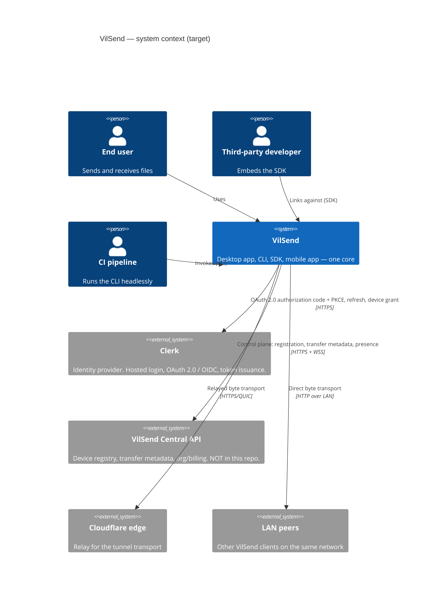
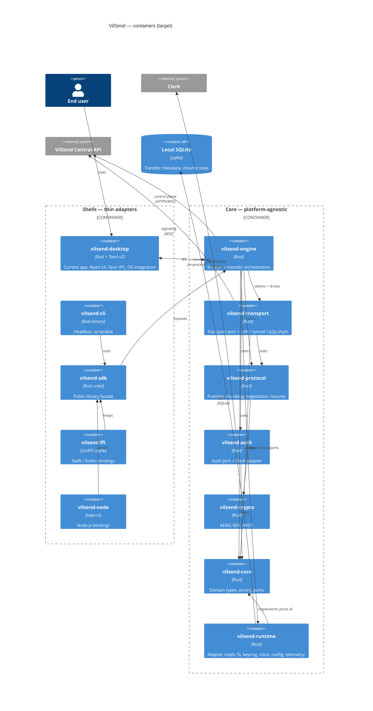
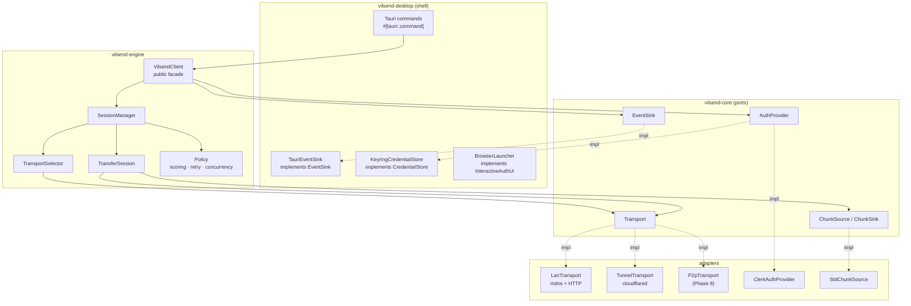

# 01 — Target Architecture

> Status: **proposal**. Nothing in this document is implemented. Every claim about
> the *current* code is cited to a real file path and is backed by
> [`00-current-state.md`](./00-current-state.md).

---

## 1. Design principles

These are the rules the rest of the document derives from. Where a principle
conflicts with shipping speed at the current stage, the conflict is called out
explicitly in §9 ("What to defer").

| # | Principle | Concrete consequence here |
|---|---|---|
| P1 | **Dependencies point inward.** The domain knows nothing about Tauri, HTTP, or the OS. | `vilsend-core` has zero Tauri, zero `reqwest`, zero `tokio::net`. Enforceable in CI by a dependency-lint job. |
| P2 | **The core is I/O-free.** Ports are traits; adapters do the syscalls. | `TransferEngine` takes `Arc<dyn ChunkSource>`, not `PathBuf`. Replaces today's direct `std::fs` calls inside `transfer/`. |
| P3 | **Shells are thin.** A shell may translate, marshal, and render. It may not contain policy. | `src-tauri/src/lib.rs` today is 455 lines of composition — that shape is right. What is wrong is that `writer.rs` (819 lines) mixes HTTP handling, crypto, path policy, and filesystem writes. |
| P4 | **Adding a transport must not modify existing code.** Open/Closed. | Registration is a list of factories in the shell, not a `match` in the engine. See [`02-transport-layer.md`](./02-transport-layer.md) §6. |
| P5 | **One codebase, many artifacts.** Divergence is expressed as Cargo features, not as forks. | `cargo build -p vilsend-cli --no-default-features --features transport-tunnel`. |
| P6 | **Wire compatibility is a versioned contract.** | The current tunnel protocol is frozen as `protocol v1` and stays byte-compatible until the server is upgraded. §7. |
| P7 | **Observability is a port, not a `println!`.** | `tracing` spans are emitted by the core; each shell decides where they land. Enables CLI `--json` logs and SDK log callbacks. |

### The honest counterweight

This design is **more machinery than a 12k-line desktop app needs today**. The
justification is not the current size — it is the observed coupling. The
strongest evidence that extraction is already overdue:

- `transfer/writer.rs` — 819 lines — is simultaneously an axum HTTP handler, a
  crypto boundary, a path-safety validator, a filesystem writer, a merge
  orchestrator, **and** a Tauri event emitter (`src-tauri/src/transfer/writer.rs:12-13`,
  `:39`, `:68`). Six responsibilities in one file.
- Receiver authorization is currently "an `Authorization` header exists"
  (`src-tauri/src/transfer/writer.rs:600` region; flagged High in
  `docs/SECURITY.md:5-18`). There is no seam to fix it because there is no
  `AuthorizationPolicy` abstraction — the check is inline in the handler.
- **Zero automated tests exist** (no `src-tauri/tests/`, no `#[test]`, no
  `#[cfg(test)]` anywhere in `src-tauri/src`). You cannot refactor a transfer
  protocol safely without a seam to test behind. This is the single strongest
  argument for the crate split: it makes the core *unit-testable without a
  webview*.

If the SDK/CLI/mobile goals were dropped tomorrow, roughly §3's `core` +
`protocol` + `transport` split would still be worth doing **on the security and
testability merits alone**.

---

## 2. C4 Level 1 — System context



**Note on the API box:** the central backend is *not* in this repository
(`docs/README.md:25-27`, `docs/BACKEND.md:5`). Every design decision below that
touches it is marked **requires backend change**.

---

## 3. C4 Level 2 — Container view



Read the arrows as **compile-time dependency direction**. `vilsend-core` points
at nothing. `vilsend-engine` points at everything and is pointed at by nothing
except shells. This is the "ports and adapters" shape: `vilsend-core` owns the
port traits, `vilsend-runtime` (and `transport`, `auth`) own the adapters.

---

## 4. Cargo workspace layout

The repo becomes a virtual workspace. `src-tauri/` is renamed to
`crates/vilsend-desktop/` at the end of Phase 3 — not at the start, so the
existing release pipeline keeps working (see [`05-migration-plan.md`](./05-migration-plan.md) §"Rollback").

```
vilsend/                              # repo root — virtual manifest
├── Cargo.toml                        # [workspace] only, no [package]
├── Cargo.lock
├── rust-toolchain.toml               # pin the toolchain; today it is unpinned
├── crates/
│   ├── core/            # vilsend-core
│   ├── crypto/          # vilsend-crypto
│   ├── protocol/        # vilsend-protocol
│   ├── transport/       # vilsend-transport
│   ├── auth/            # vilsend-auth
│   ├── engine/          # vilsend-engine
│   ├── runtime/         # vilsend-runtime
│   ├── sdk/             # vilsend-sdk          ← public Rust API
│   ├── cli/             # vilsend-cli          ← bin
│   ├── desktop/         # vilsend-desktop      ← today's src-tauri/
│   ├── ffi/             # vilsend-ffi          ← cdylib, UniFFI
│   └── node/            # vilsend-node         ← cdylib, napi-rs
├── apps/                             # JS/TS side
│   └── desktop-ui/                   # today's src/ + package.json
└── docs/
```

### 4.1 Crate responsibilities and dependency rules

| Crate | Owns | May depend on | **Must never** depend on |
|---|---|---|---|
| `vilsend-core` | Domain entities (`TransferId`, `DeviceId`, `PeerRef`, `ChunkSpec`, `TransferPlan`), the `Error` enum, **all port traits** (`Transport`, `AuthProvider`, `CredentialStore`, `ChunkSource`, `ChunkSink`, `Clock`, `EventSink`, `Telemetry`, `TransferStore`) | `serde`, `thiserror`, `async-trait`, `bytes`, `futures-core`, `tracing` | tauri, tokio runtime features that do I/O, reqwest, axum, sqlx, keyring, `std::fs` |
| `vilsend-crypto` | `encrypt_chunk`/`decrypt_chunk`, X25519+HKDF, nonce policy, key fingerprints, `zeroize` wrappers | `core`, `aes-gcm`, `x25519-dalek`, `hkdf`, `sha2`, `rand`, `zeroize`, `base64` | Everything else |
| `vilsend-protocol` | Frame encoding, chunker, manifest, **handshake/negotiation messages**, resume bookkeeping, `PROTOCOL_VERSION`, wire DTOs | `core`, `crypto`, `serde`, `bytes`, `thiserror` | transports, auth, any I/O |
| `vilsend-transport` | `Transport` trait impls: `LanTransport`, `TunnelTransport`, later `P2pTransport`/`RelayTransport`; `TransportSelector` | `core`, `protocol`, `crypto` | `engine`, shells, tauri |
| `vilsend-auth` | `AuthProvider` impls: `ClerkPublicClient` (PKCE), `ClerkDeviceGrant`, `ApiKeyProvider`, `ByoAuthProvider`; token lifecycle | `core`, `reqwest`, `serde`, `oauth2` (optional), `url`, `sha2`, `base64`, `rand` | tauri, transports, engine |
| `vilsend-engine` | `TransferEngine`, `SessionManager`, orchestration, failover, policy | **everything above** | tauri, shells |
| `vilsend-runtime` | Native adapters: `StdFileSource`, `SqliteTransferStore`, `OsKeyringStore`, `SystemClock`, `TracingSink` | `core`, `sqlx`, `keyring`, `tracing`, `sysinfo` | engine, tauri |
| `vilsend-sdk` | The **stable public API**. Re-exports a curated subset; owns semver. | `engine`, `runtime`, `auth`, `transport`, `core` | tauri |
| `vilsend-cli` | `clap` commands, exit-code mapping, `--json` output | `sdk` | tauri |
| `vilsend-desktop` | Tauri commands, events, plugin wiring, capabilities | `sdk`, tauri + plugins | — |
| `vilsend-ffi` | UniFFI UDL, Swift/Kotlin-facing types | `sdk` | tauri |
| `vilsend-node` | napi-rs bindings + TS type generation | `sdk` | tauri |

### 4.2 Enforcing the rules

Handwritten discipline rots. Three cheap gates, all in CI:

```toml
# deny.toml (cargo-deny)
[bans]
multiple-versions = "warn"

# crates/core/Cargo.toml — the load-bearing assertion
[dev-dependencies]
cargo-deny = { version = "0.16", optional = true }
```

```bash
# .github/workflows/architecture.yml
- name: Core must not depend on Tauri, HTTP, or the OS
  run: |
    cargo tree -p vilsend-core --prefix none \
      | grep -E '^(tauri|reqwest|axum|sqlx|keyring|hyper|tokio)' \
      && { echo "FAIL: vilsend-core has an outbound adapter dependency"; exit 1; } \
      || echo "OK"
```

This one check is worth more than an architecture slide deck — it is the whole
of P1 made mechanical, and it fails loudly the first time someone reaches for
`reqwest` inside the domain.

### 4.3 Ports — the load-bearing traits

These are illustrative signatures. They are the contract the rest of the design
hangs off; [`02-transport-layer.md`](./02-transport-layer.md) and
[`03-authentication.md`](./03-authentication.md) expand the first two.

```rust
// crates/core/src/ports/transport.rs

/// Everything about *how* bytes move. Knows nothing about what they mean.
#[async_trait]
pub trait Transport: Send + Sync + 'static {
    fn kind(&self) -> TransportKind;
    fn capabilities(&self) -> Capabilities;

    /// Cheap probe: is this transport currently usable for `peer`?
    /// Must be fast (<50ms) and must not block the selector.
    async fn probe(&self, peer: &PeerRef) -> Result<ProbeOutcome, TransportError>;

    /// Establish a byte channel. Idempotent per (peer, session).
    async fn connect(&self, peer: &PeerRef, session: &SessionId)
        -> Result<Box<dyn DuplexStream>, TransportError>;

    /// Liveness for mid-transfer failover.
    async fn health(&self, session: &SessionId) -> Health;
}

/// One ordered, reliable, byte-oriented channel.
#[async_trait]
pub trait DuplexStream: Send + Sync {
    async fn send(&mut self, chunk: Bytes) -> Result<(), TransportError>;
    async fn recv(&mut self) -> Result<Option<Bytes>, TransportError>;
    async fn close(&mut self) -> Result<(), TransportError>;
}
```

```rust
// crates/core/src/ports/auth.rs
#[async_trait]
pub trait AuthProvider: Send + Sync + 'static {
    fn id(&self) -> &'static str;                 // "clerk-pkce", "clerk-device", "api-key"
    fn capabilities(&self) -> AuthCapabilities;   // interactive? refreshable? headless?

    /// Acquire a credential. May open a browser — the *shell* decides how.
    async fn authenticate(&self, ctx: &AuthContext) -> Result<Credential, AuthError>;

    /// Produce a usable token, refreshing if needed. Engine calls this per request.
    async fn token(&self) -> Result<AccessToken, AuthError>;

    async fn logout(&self) -> Result<(), AuthError>;
}
```

```rust
// crates/core/src/ports/events.rs

/// The single seam that replaces today's `transfer/events.rs`.
/// The Tauri shell implements this with `app.emit`; the CLI with JSON lines;
/// the SDK with a caller-supplied callback; the FFI with a UniFFI callback interface.
pub trait EventSink: Send + Sync + 'static {
    fn emit(&self, event: DomainEvent);
}
```

`DomainEvent` is a *domain* enum (`TransferProgress { id, bytes, total, .. }`,
`TransferCompleted { .. }`, `AuthStateChanged { .. }`), **not** a Tauri event
name string. Today the event names are literals scattered through
`transfer/manager.rs:160-198` and `transfer/writer.rs`; centralising them in one
enum means a renamed event becomes a compile error in every shell rather than a
silently-dead `listen()` in the UI.

---

## 5. C4 Level 3 — Component view: the engine



The shells appear exactly twice: once to **inject** adapters, once to **receive**
events. That is the entire shell surface. Compare with today, where
`transfer/writer.rs` reaches directly into `tauri::AppHandle` for three separate
concerns (`:68-84` store + `path().download_dir()`, `:248`/`:807` keyring,
`:12` event emission).

---

## 6. Public SDK surface

The SDK is the product boundary for third parties. Treat it as a semver-stable
artifact from day one, even while it is pre-1.0 — because the moment you publish
it, someone will pin it.

```rust
// crates/sdk/src/lib.rs — the curated public API

pub struct Vilsend { /* opaque */ }

pub struct VilsendBuilder {
    auth: Option<Arc<dyn AuthProvider>>,
    transports: Vec<Arc<dyn Transport>>,
    events: Option<Arc<dyn EventSink>>,
    store: Option<Arc<dyn TransferStore>>,
    credential_store: Option<Arc<dyn CredentialStore>>,
    policy: Policy,
    api_base: Option<Url>,
}

impl VilsendBuilder {
    /// Sensible native defaults: LAN + tunnel, OS keyring, SQLite store.
    pub fn native() -> Self;

    /// No filesystem, no keyring, no network — for tests and embedded use.
    pub fn in_memory() -> Self;

    pub fn with_auth(self, p: Arc<dyn AuthProvider>) -> Self;   // bring-your-own-auth
    pub fn with_transport(self, t: Arc<dyn Transport>) -> Self;
    pub fn with_event_sink(self, s: Arc<dyn EventSink>) -> Self;
    pub fn with_policy(self, p: Policy) -> Self;
    pub fn build(self) -> Result<Vilsend, VilsendError>;
}

impl Vilsend {
    pub async fn send(&self, req: SendRequest) -> Result<Handle<SendOutcome>, VilsendError>;
    pub async fn receive(&self, req: ReceiveRequest) -> Result<Handle<ReceiveOutcome>, VilsendError>;
    pub async fn cancel(&self, h: &HandleId) -> Result<(), VilsendError>;
    pub async fn pause(&self, h: &HandleId) -> Result<(), VilsendError>;
    pub async fn resume(&self, h: &HandleId) -> Result<(), VilsendError>;
    pub async fn auth_state(&self) -> AuthState;
    pub fn subscribe(&self) -> EventStream;      // Stream<Item = DomainEvent>
}
```

### 6.1 API design decisions

| Decision | Choice | Rationale |
|---|---|---|
| **Async model** | `async fn` on `&self`, `Send + Sync`, runtime-agnostic via `futures` traits | Host apps may run their own runtime. Do **not** hardcode tokio in the public signatures. |
| **Error model** | One non-exhaustive `VilsendError` enum, `#[non_exhaustive]`, with `kind()` accessors for FFI | See §8. |
| **Progress** | `futures::Stream`, not callbacks | Composes with `select!`, supports backpressure, maps cleanly to Node `AsyncIterator` and Swift `AsyncSequence`. Callbacks are a shell concern; the FFI layer translates. |
| **Handles** | Opaque `HandleId` + `send`/`receive` return a `Handle<T>` | Mirrors today's transfer-id model (`UploadManager::start` → `TransferStatusResponse`) without leaking internals. |
| **Cancellation** | Explicit `cancel` **and** drop-safety | Dropping a `Handle` must cancel the transfer deterministically. Today cancellation relies on `AtomicBool` flags polled in `scheduler.rs:16-38` — invisible to a library consumer. |
| **Configuration** | Builder, not a config file | Files are a shell concern. A library that reads `~/.config` behind your back is a library that breaks in a sandbox. |

### 6.2 Versioning policy

- `vilsend-sdk` follows semver strictly.
- `vilsend-core`, `-protocol`, `-engine` are **internal**. They may break in
  any release. Shells are pinned to exact versions in the workspace.
- `vilsend-protocol` carries a separate, explicit `PROTOCOL_VERSION: u16` that
  is **not** the crate version — the wire contract and the code version evolve
  independently.
- Deprecation: `#[deprecated(since = "x.y.0", note = "...")]` for at least one
  minor release before removal.

### 6.3 Bindings strategy — recommended order

Rust crate first. Bindings are expensive (two extra crates, per-arch CI, an ABI
to maintain) and are only worth it once the API has stopped moving.

| Order | Target | Tool | When | Trade-off |
|---|---|---|---|---|
| **1** | Rust crate | — | Phase 4 | Zero cost. Validates the API against one real consumer. **Do this first, always.** |
| **2** | CLI | `clap` | Phase 5 | Not a binding — it is a shell, and it exercises the headless auth path. Ordering it second proves the core has no hidden UI dependency. |
| **3** | Node/TS | **napi-rs** | Phase 7 | Near-native overhead; production-proven (SWC, Rspack, Biome). Async iterators map well to the event stream. |
| **4** | Swift/Kotlin | **UniFFI** | Phase 8 (with mobile) | Powers Firefox's Rust components. Caveat: the **JVM/Kotlin path has materially higher marshalling overhead** than the Swift path. |
| **5** | WASM | `wasm-bindgen` | Defer | The core needs real sockets and real files. A WASM target would force a second transport axis (WebRTC/browser) and is a *different product*, not a binding. |
| **6** | C ABI | `cbindgen` | Defer until asked | UniFFI covers the realistic cases. A hand-rolled C ABI is a permanent maintenance tax. |

**Recommendation: 1 → 2 → 3 → 4.** Skip WASM and a raw C ABI until a specific
customer blocks on them.

> Watch item: `uniffi-bindgen-react-native` now generates Node bindings off the
> same UniFFI definitions. If it stabilises, it could replace the separate
> napi-rs crate with one toolchain. Not worth betting on today; revisit at
> Phase 7.

---

## 7. One codebase → many artifacts

### 7.1 Feature flags

Features are additive and named by *capability*, not by target platform:

```toml
# crates/transport/Cargo.toml
[features]
default = ["lan", "tunnel"]
lan      = ["dep:mdns-sd", "dep:axum"]
tunnel   = ["dep:reqwest", "dep:cloudflared-supervisor"]
p2p      = ["dep:iroh"]          # Phase 8
relay    = []                    # Phase 8
```

```toml
# crates/auth/Cargo.toml
[features]
default        = ["clerk-pkce", "os-keyring"]
clerk-pkce     = ["dep:oauth2", "dep:sha2", "dep:base64", "dep:rand"]
clerk-device   = ["dep:oauth2"]              # CLI
api-key        = []                          # SDK / CI
os-keyring     = ["dep:keyring"]
memory-store   = []                          # tests, SDK embedders
```

### 7.2 Build matrix (the honest version)

| Target | Command | Runner | Status |
|---|---|---|---|
| Desktop Linux | `cargo tauri build --config tauri.linux.conf.json` | `ubuntu-latest` | exists today |
| Desktop Windows | `cargo tauri build --config tauri.windows.conf.json` | `windows-latest` | exists today |
| Desktop macOS | `cargo tauri build --config tauri.macos.conf.json` | `macos-latest` | exists today — **but broken for cloudflared, see §7.3** |
| Store MSIX | `--config tauri.windows.store.conf.json` | `windows-latest` | exists but publish job disabled |
| CLI × 3 OSes | `cargo build -p vilsend-cli --release` | + `macos-14` for arm64 | **new** |
| iOS | `cargo tauri ios build` **or** `xcframework` | `macos-latest` | **new** |
| Android | `cargo tauri android build` **or** `.aar` | `ubuntu-latest` | **new** |
| Node addon × 3 | `napi build --platform` | matrix | **new** |

### 7.3 Two build bugs to fix before extending the matrix

1. **macOS arm64 cloudflared never gets bundled — the tunnel is dead on Apple
   Silicon.** The runtime resolver maps
   `("macos", "aarch64") → "cloudflared/macos-arm64/cloudflared"`
   (`src-tauri/services/cloudflared.rs:270`), but
   `src-tauri/tauri.macos.conf.json` bundles **only**
   `resources/cloudflared/macos-x64/cloudflared`. On an arm64 Mac the resolver
   therefore looks for a file the bundle does not contain and cloudflared fails
   to start. This is a **hard failure, not a Rosetta fallback** — the
   `macos-arm64/` binary exists in the repo but is never copied into the bundle.
   Fix: add `resources/cloudflared/macos-arm64/cloudflared` to the macOS config,
   or resolve the path per `CARGO_CFG_TARGET_ARCH`.
2. **`linux-arm64` and `macos-arm64` binaries are bundled in the repo but never
   referenced by any config.** They are dead weight in git.

### 7.4 Mobile: Tauri 2 mobile vs native shell over UniFFI

The genuine fork in the road. Both are viable; they optimise for different things.

| Dimension | **A. Tauri 2 mobile** | **B. Native shell + UniFFI over the core** |
|---|---|---|
| Code reuse | React UI shared across desktop+mobile | UI rewritten (SwiftUI/Compose); core 100% shared |
| Core reuse | Same | Same |
| Binary size | ~8–15 MB baseline (WebView is OS-provided, but the runtime + assets are not) | ~1–3 MB per arch for the core |
| Plugin availability | **Restricted.** `updater` — not available. `single-instance` — desktop only. **Stronghold — desktop only.** Deep-link — supported but per-platform config. | N/A — you write the platform code |
| Local transfer receiver | Axum on a TCP port — **may conflict with iOS background/sandbox restrictions** | Same problem; needs `NSURLSession` background transport on iOS either way |
| Crypto storage | Must replace Stronghold with Keychain/Keystore anyway | Keychain/Keystore directly |
| CI cost | Low (one React codebase) | High (4 Android + 2 iOS targets, Xcode/Gradle) |
| Team skills | Existing React/Rust skills transfer | Requires Swift + Kotlin competence |
| Current blocker | **`window.open_devtools()` is called unconditionally** (`src-tauri/src/lib.rs:123`) and the app registers `tauri-plugin-stronghold` (`:112`) — both must be `#[cfg(desktop)]`-gated before any mobile build compiles. | None of these apply |

**Recommendation: A (Tauri 2 mobile) — with a deliberate exception.**

Choose Tauri 2 mobile because:
1. The team already owns the React codebase. Option B means writing and
   maintaining *two* UIs, which at this stage is the most expensive thing you
   could do.
2. Tauri 2's mobile support is stable (2.11.x line) and the desktop plugins you
   genuinely depend on (`dialog`, `fs`, `store`, `opener`, `deep-link`) are
   either available or have documented replacements.
3. The `ReceiverState` / transfer core is already mostly Tauri-free (see
   `00-current-state.md` §"Coupling"), so the *core* is portable either way —
   the mobile decision is really only about the **UI shell**.

**But** the iOS background-transfer problem is real and does not care which
option you pick. iOS will suspend the app; an in-process axum receiver on
`:7878` will not survive backgrounding. This needs a platform-specific design
(`NSURLSession` background downloads), and it is a genuine architectural risk —
see [`07-risks-and-open-questions.md`](./07-risks-and-open-questions.md) R-07.

**De-risking move:** build `vilsend-ffi` (UniFFI) *anyway* at Phase 8, even if
you ship via Tauri mobile. It is ~200 lines of UDL plus a build step, and it
buys you a cheap escape hatch to option B if Tauri mobile disappoints. Do not
build it *instead of* mobile — build it *alongside*, once, and keep it compiling.

---

## 8. Cross-cutting design

### 8.1 Error model

Today: `AppError` (Tauri-facing, `src-tauri/src/error.rs`, 2 `tauri::` refs) and
`TransferError` (`src-tauri/src/transfer/errors.rs:3-10`) coexist with no
mapping discipline between them.

Target: one `VilsendError` in `vilsend-core`, with a stable machine-readable
`kind()`:

```rust
#[derive(Debug, thiserror::Error)]
#[non_exhaustive]
pub enum VilsendError {
    #[error("authentication required")]
    Unauthenticated,
    #[error("the peer rejected this device")]
    PeerRejected { reason: String },
    #[error("no transport could reach the peer")]
    NoRoute { tried: Vec<TransportKind> },
    #[error("transport failed mid-transfer")]
    TransportFailed { kind: TransportKind, retries: u32, source: Box<VilsendError> },
    #[error("integrity check failed for {file}: expected {expected}, got {actual}")]
    IntegrityMismatch { file: String, expected: String, actual: String },
    #[error("insufficient storage: needed {needed} bytes, {available} available")]
    InsufficientStorage { needed: u64, available: u64 },
    #[error("cancelled")]
    Cancelled,
    #[error(transparent)]
    Internal(#[from] Box<dyn std::error::Error + Send + Sync>),
}

impl VilsendError {
    /// Stable across versions. FFI and CLI map on this, never on the message.
    pub fn kind(&self) -> ErrorKind { /* ... */ }
}
```

Mapping per shell — the only place shell-specific error semantics live:

| `ErrorKind` | CLI exit code | gRPC-ish code | Swift/Kotlin |
|---|---|---|---|
| `Unauthenticated` | 3 | `UNAUTHENTICATED` | `VilsendError.Unauthenticated` (sealed) |
| `NoRoute` | 4 | `UNAVAILABLE` | `NoRoute` |
| `IntegrityMismatch` | 5 | `DATA_LOSS` | `IntegrityMismatch` |
| `InsufficientStorage` | 6 | `RESOURCE_EXHAUSTED` | `InsufficientStorage` |
| `Cancelled` | 130 | `CANCELLED` | `Cancelled` |
| other | 1 | `INTERNAL` | `Internal(msg)` |

**Rule: never let a message string cross a boundary as the only signal.** Today
`TransferError::Receiver(String)` (`transfer/errors.rs:8`) does exactly that, so
the UI cannot distinguish "wrong token" from "disk full" without string
matching.

### 8.2 Observability

- Core emits `tracing` spans with stable field names (`transfer.id`,
  `transport.kind`, `peer.id`, `transfer.bytes`). No `println!`.
- Each shell installs its own subscriber: desktop → `tauri-plugin-log` +
  rotating file; CLI → stdout or `--json`, honoring `RUST_LOG`; SDK → silent by
  default, with an opt-in `Telemetry` port so the host app can forward spans.
- **A library must not install a global subscriber.** Today `Logger::init()`
  (`src-tauri/src/utils/logger.rs:4-10`) calls `try_init()`, which is global
  process state. It is already commented out of `lib.rs:55` for this reason —
  keep it that way and put the subscriber in the shell.

### 8.3 Configuration

- Domain config is a plain struct passed to `VilsendBuilder`. No file reads, no
  env reads inside the core.
- Shells resolve config: CLI flags > env > file > defaults. The desktop shell
  keeps `tauri-plugin-store` for user preferences.
- **Remove the current split-brain:** today `VITE_*` env vars are consumed by
  the *frontend* (`src/lib/auth-config.ts`) and passed into Rust as
  `DesktopAuthConfig` (`src/api/tauri.ts:50-56`), while a *separate*
  `AppConfig` in Rust reads `WS_URL`/`API_URL` (`src-tauri/src/utils/config.rs:21-33`).
  Two sources of truth for the API base URL. Target: one `ClientConfig`
  constructed in the shell and injected.

### 8.4 Testing

Expanded in [`06-testing-and-quality.md`](./06-testing-and-quality.md). The
shape:

- **Contract tests** that every `Transport` and every `AuthProvider` must pass.
  A new transport is not "done" until it passes the suite — this is what makes
  P4 real rather than aspirational.
- **In-memory adapters** for everything (`InMemoryTransport`, `MemoryCredentialStore`,
  `FakeClock`), enabling fast, deterministic tests of failover and retry logic —
  currently impossible.
- **`VilsendBuilder::in_memory()`** is the test entry point. If a test needs a
  real socket or a real keychain, that is a signal the port boundary leaked.

### 8.5 Performance and scale

| Concern | Current state | Target |
|---|---|---|
| Memory per transfer | `concurrency × (chunk + ciphertext)` — bounded, documented in `docs/PERFORMANCE.md:10` | Unchanged; keep 4 MiB chunks, add a global in-flight byte budget |
| Concurrency | Fixed 4 workers; **one process-wide write mutex** serializes all receivers (`transfer/writer.rs` `state.guard`) | Per-transfer/per-file locks + a bounded global semaphore. Flagged P1 in `docs/IMPROVEMENT_ROADMAP.md:20` |
| Backpressure | `mpsc::unbounded_channel` in `manager.rs:158` and the WS sender (`websocket/sender.rs:4-7`) — **unbounded** | Bounded channels; `send().await` applies backpressure instead of growing the heap |
| Completion detection | `(0..total).all(metadata(part).is_ok())` — one `stat` per chunk per completion (`transfer/writer.rs:723`) | Bitmap in SQLite + in-memory counter; O(1) |
| Large files | Streaming, chunked — sound | Add whole-file BLAKE3 verification (currently **absent**: `transfer/checksum.rs` is a 0-byte stub) |
| Many transfers | One global lock + unbounded task spawn | Bounded scheduler with a per-peer concurrency cap |

The `unbounded_channel` finding matters more than it looks: a fast producer and
a slow socket is a straightforward OOM, and it is reachable by a peer on the
LAN today.

---

## 9. What to defer — the over-engineering check

Being candid, as requested:

| Element | Verdict | Why |
|---|---|---|
| `core`/`protocol`/`transport`/`engine` split | **Do it now** | Security + testability, independent of the SDK goal |
| `Transport` port + selector | **Do it now** | The LAN transport is the highest-value feature you can ship, and it is only cheap to add behind an abstraction |
| `EventSink` port | **Do it now** | Smallest possible change, removes the worst Tauri coupling |
| `AuthProvider` port | **Do it now** | The CLI needs it anyway |
| Separate `vilsend-crypto` crate | **Borderline — could fold into `protocol`** | Start folded. Split only if a pure-crypto consumer appears. |
| `vilsend-ffi` (UniFFI) | **Phase 8, alongside mobile** | Escape hatch. Cheap to keep, expensive to add late. |
| `vilsend-node` (napi-rs) | **Defer until a Node customer exists** | An addon is a permanent build+release liability across 3 OSes × 2 arches. |
| WASM | **Defer indefinitely** | Different product. |
| C ABI | **Defer until asked** | UniFFI covers it. |
| Full hexagonal purity in `runtime` | **Relax** | Adapter crates are *allowed* to be concrete and messy. Purity pays off in the core, not in the code that calls `open(2)`. |
| Per-platform trait objects for the filesystem | **Defer** | `ChunkSource`/`ChunkSink` ports suffice. Do not model an abstract VFS. |
| Multi-account support | **Phase 9, not now** | Real requirement for the SDK/CLI, noise for the desktop app. Design the `CredentialStore` key space for it; do not build it. |

---

## 10. Diagram index

| Diagram | Location |
|---|---|
| C4 L1 Context | §2 |
| C4 L2 Containers | §3 |
| C4 L3 Engine components | §5 |
| Transport connect / failover / resume state machines | [`02-transport-layer.md`](./02-transport-layer.md) §5 |
| Transport negotiation sequence | [`02-transport-layer.md`](./02-transport-layer.md) §4 |
| Auth sequences per client | [`03-authentication.md`](./03-authentication.md) §2–§5 |
| Phase dependency graph | [`05-migration-plan.md`](./05-migration-plan.md) §"Dependency graph" |

---

## See also

- [`00-current-state.md`](./00-current-state.md) — what exists today, with evidence
- [`02-transport-layer.md`](./02-transport-layer.md) — the `Transport` port in full
- [`03-authentication.md`](./03-authentication.md) — the `AuthProvider` port in full
- [`04-sdk-cli-mobile-build-plan.md`](./04-sdk-cli-mobile-build-plan.md) — SDK surface, bindings, build matrix
- [`adr/`](./adr/) — the decisions above, recorded individually
