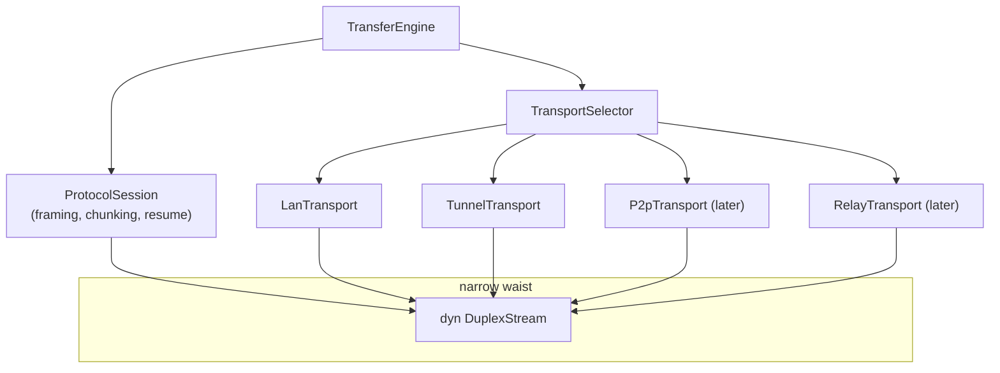
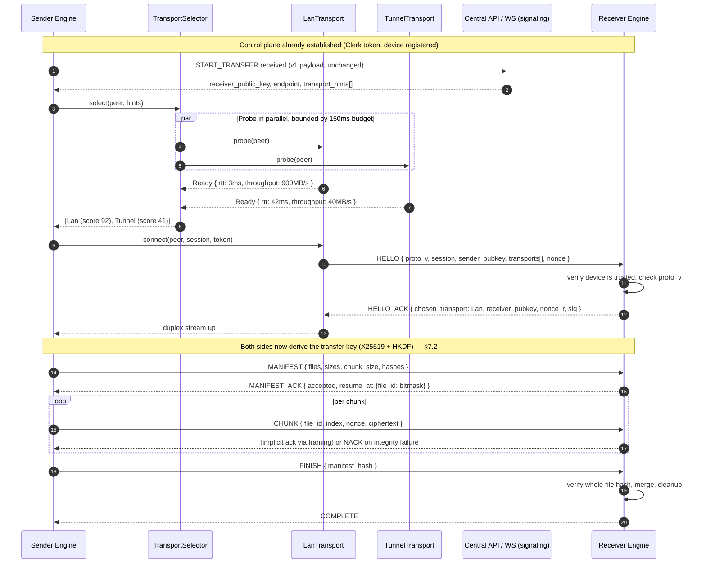
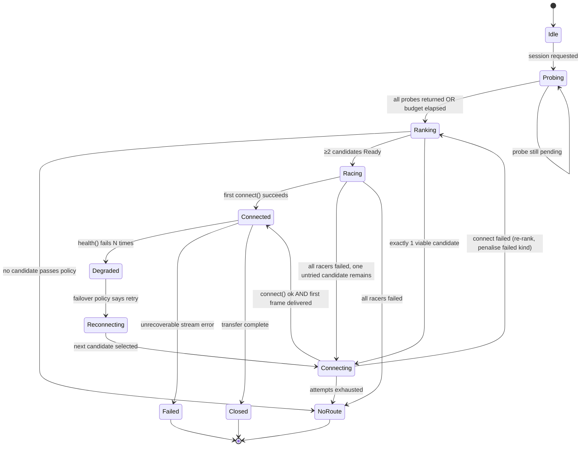
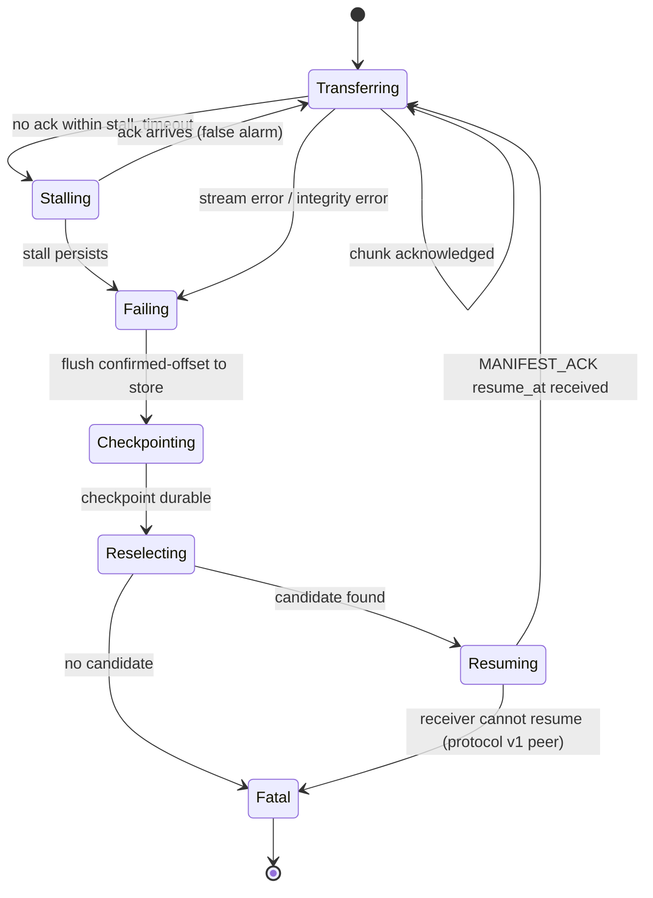
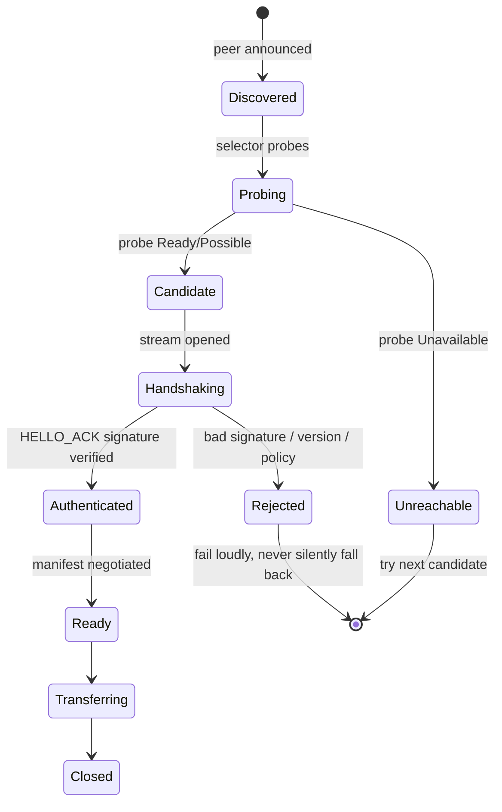

# 02 — Pluggable Transfer Transports

> Status: **proposal**. Current-state claims are cited to file paths; see
> [`00-current-state.md`](./00-current-state.md) for the full inventory.

---

## 1. The problem in one paragraph

Today there is exactly one way bytes move: an HTTP `POST` to
`{endpoint}/transfer/chunk` (`src-tauri/src/transfer/http_client.rs:75-140`),
where `{endpoint}` is whatever the central API put in `TransferMetadata.endpoint`
or in the WebSocket `START_TRANSFER` command
(`src-tauri/src/websocket/server_command.rs:3-29`). That endpoint is normally a
Cloudflare tunnel hostname. There is no transport concept, no LAN path, no
capability model, and no failover: if the tunnel is up but slow, or if both
peers are on the same Wi-Fi, the system cannot notice or care. `ConnectionType`
is a *field* on `UploadState` (`src-tauri/src/transfer/state.rs:11-27`) that is
carried around but never used to make a decision.

The redesign makes the transport a **port**.

---

## 2. The `Transport` port

```rust
// crates/core/src/ports/transport.rs

use async_trait::async_trait;
use bytes::Bytes;

#[derive(Debug, Clone, Copy, PartialEq, Eq, Hash)]
pub enum TransportKind {
    Lan,        // direct, same network, discovery-based
    Tunnel,     // today's cloudflared relay — the compatibility floor
    P2p,        // direct over NAT traversal (STUN/hole-punch)
    Relay,      // VilSend-operated relay
    Bluetooth,  // reserved
    Usb,        // reserved
}

/// What this transport can do. The selector scores on these; it must not
/// hardcode knowledge of any specific transport.
#[derive(Debug, Clone, Copy)]
pub struct Capabilities {
    /// No internet required.
    pub works_offline: bool,
    /// The bytes never traverse a third party.
    pub end_to_end_direct: bool,
    /// A relayed path exists as a fallback within this transport.
    pub has_relay_fallback: bool,
    /// NAT traversal is performed by this transport.
    pub needs_nat_traversal: bool,
    /// Resume from a byte offset is supported.
    pub resumable: bool,
    /// The transport itself can move arbitrary streams, not just chunk POSTs.
    pub streaming: bool,
    /// Order-of-magnitude hint, bytes/sec on a good day. Used for scoring only.
    pub nominal_throughput: u64,
    /// Typical setup latency in ms. Used to decide parallel racing.
    pub setup_latency_ms: u32,
}

#[derive(Debug, Clone)]
pub enum ProbeOutcome {
    /// Ready right now.
    Ready { rtt: Duration, estimated_throughput: u64 },
    /// Could work, but requires a handshake first.
    Possible,
    /// Definitively unavailable (peer absent, feature off, no network).
    Unavailable { reason: UnavailableReason },
}

#[async_trait]
pub trait Transport: Send + Sync + 'static {
    fn kind(&self) -> TransportKind;
    fn capabilities(&self) -> Capabilities;

    /// Fast availability probe. MUST complete within `budget` and MUST NOT
    /// perform a full handshake. Called concurrently for every candidate.
    async fn probe(&self, peer: &PeerRef, budget: Duration) -> ProbeOutcome;

    /// Establish the channel. Safe to call concurrently with other transports'
    /// `connect` during a race; losers must be cleanly abandoned.
    async fn connect(
        &self,
        peer: &PeerRef,
        session: &SessionId,
        token: &SessionToken,
    ) -> Result<Box<dyn DuplexStream>, TransportError>;

    /// Cheap liveness check used by the health monitor for mid-transfer failover.
    async fn health(&self, session: &SessionId) -> Health;

    /// Release any resources for a session (listener, socket, relay lease).
    async fn teardown(&self, session: &SessionId) -> Result<(), TransportError>;
}
```

### 2.1 The critical invariant

> **A transport moves bytes and knows nothing about what they mean.**

Concretely, a `Transport` implementation may not:
- know what a chunk is, what a manifest is, or what a file is;
- encrypt, decrypt, hash, or verify anything (except its own link-layer TLS);
- emit progress events (the engine does, from bytes moved);
- know about `transfer_id`, `file_id`, or the sender/receiver roles;
- decide retry policy.

This is exactly what makes P4 (Open/Closed) achievable: the protocol layer
sits *above* the transport, so adding WebRTC or Bluetooth touches zero existing
code. Compare with today, where `transfer/upload.rs:11-63` interleaves
"read the file, encrypt the chunk, POST it, retry on failure" into one function —
transport and protocol are the same code.

### 2.2 The port taxonomy, not the port list



Everything above the waist is protocol. Everything below is transport. The
`DuplexStream` is the interface segregation point — transports never see
`ChunkSpec`, `TransferId`, or `Bytes` that mean anything.

---

## 3. Initial transports

### 3.1 `LanTransport` (new)

The highest-value addition: on a shared network the payload never touches
Cloudflare at all, which is both much faster and much better for privacy.

- **Discovery:** mDNS (`mdns-sd` crate, pure Rust). Advertise
  `_vilsend._tcp.local.` with TXT records carrying: protocol version, device
  public key fingerprint, device id, and a rotating presence nonce.
  **Do not advertise the device's real name by default** — that is a privacy
  leak on a coffee-shop network. Make friendly-name advertisement opt-in.
- **Channel:** the existing axum receiver (`/transfer/*`) generalises into a
  framed duplex stream over HTTP/1.1 upgrade or a raw TCP+length-prefix.
  **Recommendation: keep HTTP.** It reuses the receiver you already have,
  traverses more middleboxes, and the framing layer already exists in
  `protocol`.
- **Encryption:** mandatory, at the protocol layer, identical to the tunnel
  path. LAN is *not* a trusted channel — see §7.4.
- **Windows firewall:** a Rust binary opening a listening socket triggers a
  Windows Defender prompt. This is a real onboarding cost. Mitigations: bind
  only when a LAN transfer is actually desired, or register the rule in the
  NSIS/WiX installer. Flagged as R-04 in
  [`07-risks-and-open-questions.md`](./07-risks-and-open-questions.md).

### 3.2 `TunnelTransport` (the current path, refactored)

A thin adapter over what exists: `HttpClient` (`transfer/http_client.rs`) +
`normalize_endpoint` (`:30-36`) + the cloudflared supervisor
(`services/cloudflared.rs`). Its job is to be **byte-compatible with today's
protocol** so old clients keep working (§8).

Two changes, both required for failover to work:
1. The endpoint must come from the **transport**, resolved per session, not
   from a `TransferMetadata` field the engine treats as opaque.
2. `health()` must exist. Today "is the tunnel up?" is answered by scraping
   cloudflared's stderr (`services/cloudflared.rs`) — a process-level signal
   that cannot tell you whether a *specific peer* is reachable.

### 3.3 Future transports, and what each one must touch

| Transport | New code | Changes to existing code |
|---|---|---|
| WebRTC / P2P (`iroh`) | new `P2pTransport` crate module | **none** |
| VilSend relay | new `RelayTransport` module | **none** |
| Bluetooth | new module | **none** |
| USB / ADB | new module | **none** |
| **New transport = one new file + one line in the shell's factory list.** |

---

## 4. Handshake and negotiation protocol

### 4.1 Sequence — happy path with a LAN candidate



### 4.2 Negotiation rules

1. **Both peers advertise.** `HELLO` carries the sender's supported
   `TransportKind` list **and** its protocol version. The receiver intersects
   with its own list and with local policy.
2. **The receiver decides, the sender may race.** The receiver picks the
   transport it prefers (it knows its own exposure better); the sender may
   abandon and re-offer if the choice underperforms.
3. **Never silently downgrade.** If the peer offers only `Tunnel` and policy
   requires `end_to_end_direct`, the session **fails** with
   `VilsendError::NoRoute` rather than silently relaying. This is the
   downgrade-attack defence — see §7.5.
4. **Version negotiation is explicit and monotonic.** `proto_v` is a
   `u16`. A peer that does not understand the offered version replies
   `HELLO_REJECT { supported: [..] }`, and the initiator retries once at the
   highest mutually supported version.

### 4.3 Message schemas (illustrative)

```rust
// crates/protocol/src/handshake.rs

#[derive(Serialize, Deserialize)]
#[serde(tag = "t", rename_all = "snake_case")]
pub enum Handshake {
    Hello {
        proto_v: u16,
        session: SessionId,
        sender_device: DeviceId,
        /// Sender's X25519 public key — ephemeral, per session.
        sender_key: [u8; 32],
        /// What the sender can do.
        transports: Vec<TransportKind>,
        nonce: [u8; 16],
        /// Overrides the receiver may honour.
        wants: SessionWants,
    },
    HelloAck {
        proto_v: u16,
        chosen: TransportKind,
        receiver_key: [u8; 32],
        nonce: [u8; 16],
        /// Signature over (session ‖ sender_key ‖ receiver_key ‖ nonce_s ‖ nonce_r)
        /// by the receiver's LONG-TERM device key. This is what authenticates
        /// the peer — see §7.3.
        device_sig: [u8; 64],
    },
    HelloReject { supported: Vec<u16>, reason: String },
}
```

### 4.4 The handshake runs *over* the transport, not beside it

A subtle but important point: `HELLO` is sent through `DuplexStream::send`. It
is not a separate HTTP endpoint and not a WebSocket message. That keeps the
transport abstraction honest — a transport that cannot deliver `HELLO` cannot
deliver anything.

**Consequence:** the very first message on a fresh transport is where you
*really* learn whether it works, so `probe()` is a hint and `connect()` +
first-frame is the truth. The selector must therefore handle "probe said Ready,
connect produced a dead stream" as a first-class case (§5.3).

---

## 5. `TransportSelector`

### 5.1 Scoring policy

```rust
// crates/engine/src/selector/policy.rs

pub struct Policy {
    /// Hard constraint: refuse relayed paths entirely.
    pub require_direct: bool,
    /// Never use a transport whose capability set lacks this.
    pub require_encrypted: bool,
    /// User override, e.g. `--transport lan` or "always relay for compliance".
    pub force: Option<TransportKind>,
    pub deny: Vec<TransportKind>,
    /// Minimum score to accept without trying anything else.
    pub accept_threshold: i32,
}

pub fn score(caps: &Capabilities, probe: &ProbeOutcome, policy: &Policy) -> i32 {
    if policy.deny.contains(&kind_of(probe)) { return i32::MIN; }
    if policy.require_direct && !caps.end_to_end_direct { return i32::MIN; }

    let mut s = 0;
    // Directness dominates: a LAN path is ~20x a tunnel path in practice.
    s += if caps.end_to_end_direct { 60 } else { 0 };
    s += if caps.works_offline { 15 } else { 0 };
    // Latency and throughput are secondary and only used to break ties.
    if let ProbeOutcome::Ready { rtt, estimated_throughput } = probe {
        s += (40 - rtt.as_millis().min(40) as i32);          // 0..=40
        s += (estimated_throughput / (16 * 1024 * 1024)).min(30) as i32;
    }
    s -= caps.setup_latency_ms.min(200) as i32 / 20;
    s
}
```

Default priority order, which falls out of the scores rather than being
hardcoded:

**LAN (≈92) > direct P2P (≈75) > tunnel (≈41) > relay (≈20)**

The ordering is a *consequence* of capability scoring, not a `match` statement.
That is what lets a new transport slot in by declaring its capabilities.

### 5.2 Racing vs sequential fallback

| Situation | Strategy |
|---|---|
| Exactly one candidate below `accept_threshold` | Sequential — just try it |
| Multiple candidates, all `probe == Ready` | **Race in parallel**, first successful `connect` wins, losers torn down |
| Candidate is `Possible` (needs handshake) | Sequential, ordered by score, with a per-attempt timeout |
| `policy.force` set | Sequential, only that transport |

Racing burns bandwidth and, on mobile, battery. Gate it: race only when the
top two scores are within 15 points, and never race more than 2 candidates.

### 5.3 Selection state machine



### 5.4 Mid-transfer failover

The hard requirement: **failover must not restart the transfer.** The engine
tracks `bytes_confirmed` per file. On failover:

1. `health()` fails or the stream errors.
2. Engine pauses new chunk dispatch (already-dispatched chunks may complete or
   fail — both are fine, the receiver is idempotent).
3. Selector re-runs, **excluding the failed `TransportKind`** for this session
   unless policy forces it.
4. New transport connects, new `HELLO`/`HELLO_ACK`, **same `session` id**.
5. Receiver replies with its `resume_at` bitmap. Sender resumes from there.
6. **The transfer key is preserved.** Re-deriving it is not required and, if the
   sender's ephemeral key were regenerated, would be wrong. The key lives in the
   session, not the transport.



> **v1-peer caveat:** today's receiver has no resume bitmap concept but *is*
> accidentally resumable — it skips writing a `.part` file that already exists
> (`src-tauri/src/transfer/writer.rs:669`, `fs::metadata(&part).is_err()` gate).
> So a v1 peer can be resumed at *file granularity only*, and the sender must
> re-send whole chunks. That is acceptable for the compatibility path; do not
> promise more than it delivers.

### 5.5 Health checks

Two levels, both needed:

- **Transport-level:** `health()` — is the pipe alive? Cheap. Every 5s while
  idle-ish, every 30s while actively transferring (there is no point probing a
  pipe you are actively pushing bytes through — the ack stream already tells you).
- **Path-level:** a **stall detector**, not a heartbeat. If `bytes_confirmed`
  has not advanced in `stall_timeout` (default 15s) *and* something is in
  flight, declare the path degraded. This catches the common failure the
  current design cannot: the tunnel process is alive, the socket is open, and
  nothing is moving.

> The existing heartbeat (`websocket/heartbeat.rs:11-43`) only covers the
> *control* WebSocket. There is currently **no liveness signal at all on the
> data plane**. This is the single most important reliability gap in the current
> transfer path.

---

## 6. Adding a new transport — the checklist

This is the concrete test of P4. Adding, say, a VilSend relay server:

**Must do:**
1. `crates/transport/src/relay/mod.rs` — new file.
2. `impl Transport for RelayTransport` — `kind`, `capabilities`, `probe`,
   `connect`, `health`, `teardown`.
3. `crates/transport/Cargo.toml` — add `relay = [...]` feature.
4. Register in the shell's factory list — **one line**:
   ```rust
   VilsendBuilder::native()
       .with_transport(Arc::new(RelayTransport::new(cfg)?))
   ```
5. Run the transport contract suite (§6.1) — it must pass **unmodified**.
6. Add the `TransportKind` variant. *(The one unavoidable edit to shared code —
   an enum variant. Keep the enum `#[non_exhaustive]` so this is additive.)*

**Must NOT do:**
- Edit `vilsend-engine`, `vilsend-protocol`, or any other transport.
- Add a branch to the selector. If you feel the need to, the *capability model*
  is missing a dimension — add the dimension instead, as a defaulted field.
- Teach the protocol about your transport.

### 6.1 The contract suite (non-negotiable)

```rust
// crates/transport/tests/contract.rs
// Every Transport impl must pass ALL of these, unmodified.

#[tokio::test] async fn probe_is_bounded() { /* must return inside budget */ }
#[tokio::test] async fn connect_is_idempotent_per_session() { /* ... */ }
#[tokio::test] async fn connect_after_teardown_succeeds() { /* ... */ }
#[tokio::test] async fn teardown_releases_resources() { /* no fd leak, asserted via /proc */ }
#[tokio::test] async fn health_reports_dead_after_peer_gone() { /* ... */ }
#[tokio::test] async fn stream_preserves_byte_order() { /* fuzz 10k random frames */ }
#[tokio::test] async fn partial_frame_does_not_corrupt() { /* kill mid-frame, reconnect */ }
#[tokio::test] async fn honours_peer_unavailable() { /* ... */ }
#[tokio::test] async fn capabilities_match_declared_behaviour() { /* meta-test */ }
```

That last one is worth its cost: it asserts that a transport declaring
`end_to_end_direct: true` genuinely does not touch an external endpoint. It
catches the most likely lie a new implementation will tell.

See [`06-testing-and-quality.md`](./06-testing-and-quality.md) §3 for the full
harness.

---

## 7. Security

### 7.1 The one rule

> **End-to-end encryption is a property of the protocol, never of the transport.**

A transport may add its own link encryption (TLS to Cloudflare). That is
defence in depth and worth having. It is **not** what protects the payload. If
you ever find yourself reasoning "this is fine, it's over TLS", the design has
failed — because the whole point of pluggable transports is that a future one
(Bluetooth, USB, a LAN multicast) may have no link encryption at all.

### 7.2 Key exchange

Keep the existing primitive set — it is sound and it is already
implemented (`src-tauri/src/transfer/crypto.rs`):

| Property | Current | Change |
|---|---|---|
| Sender key | X25519 ephemeral, per transfer (`crypto.rs:32-41`) | Per **session**; must survive failover |
| Receiver key | X25519 **device long-term** key (`crypto.rs:69-74`) | Unchanged |
| KDF | HKDF-SHA256, `info = b"carsdv-transfer-key-v1"`, **no salt** (`crypto.rs:82-91`) | Add a **salt derived from both nonces** from `HELLO`/`HELLO_ACK`. See §7.5. |
| AEAD | AES-256-GCM, fresh 12-byte random nonce per chunk (`crypto.rs:116-138`) | Unchanged, but **bind associated data** (below) |
| Whole-file integrity | **None.** `transfer/checksum.rs` is a 0-byte stub | **Add BLAKE3 per file, verified after merge** |

### 7.3 Peer authentication — the current hole

Today, the receiver's public key is fetched from
`GET {endpoint}/transfer/public-key` with **no authentication of the responder
beyond "the endpoint came from the control plane"**
(`transfer/http_client.rs:142-183`). The derived key is therefore only as
trustworthy as the endpoint value — which, on a LAN transport, is
**attacker-controllable** via mDNS spoofing.

**Required fix before LAN ships:**

```
device_sig = Sign_device_key( session ‖ sender_ephemeral_pub ‖ receiver_ephemeral_pub
                              ‖ nonce_s ‖ nonce_r ‖ chosen_transport )
```

The receiver signs with its **long-term device identity key** — the X25519 key
whose public half is already registered with the central API
(`docs/FLOWS.md:38`; `services/generate_device_keypair.rs`, and see
`00-current-state.md` on which key is actually live). The sender verifies
against the *control-plane-registered* public key, which it learned over an
authenticated channel. An mDNS spoofer cannot forge this.

> Note: X25519 keys are Diffie-Hellman keys, not signature keys. To sign, the
> device needs either an Ed25519 identity key alongside the X25519 key, or a
> KEM-style proof (sign-then-verify via a separate signing key). The repo
> *already depends on* `ed25519-dalek` (`src-tauri/Cargo.toml:47`) — determine
> whether it is live (see `00-current-state.md` §Auth) and, if so, use it as the
> signing identity. If not, add it. **This is a real design decision, not a
> detail** — recorded as ADR-0007.

### 7.4 Trust model on LAN

The LAN is an **untrusted broadcast domain**. Design consequences:

| Threat | Mitigation |
|---|---|
| mDNS spoofing — attacker advertises as the target device | Device signature (§7.3). Discovery only supplies a *candidate*, never an identity. |
| Rogue device harvesting friendly names / presence | Do not advertise names by default; advertise an opaque device-id hash. |
| Active MITM on the direct path | E2E key exchange is independent of the path; the signature binds the session to the real device. |
| Receiver flood (anyone on the LAN can POST to `:7878`) | **Session tokens.** `connect()` takes a `SessionToken` the receiver must validate — see §7.6. |
| Traffic analysis of "who is sending to whom" | Out of scope for v1. Document it as accepted. |

### 7.5 Downgrade-attack prevention

This is the subtle one. With multiple transports, an active attacker can
suppress the LAN path (mDNS poisoning, ARP spoofing) and force the session onto
a path it can observe. Even with E2E encryption, that is a real availability
and metadata attack.

Defences, in order of importance:

1. **Never let a fallback be silent.** The `chosen_transport` is **inside the
   signed transcript** (§7.3). If a peer is forced from LAN to tunnel, both
   sides know, and the event surfaces to the user (`TransportDegraded`). A
   downgrade the user is told about is a downgrade the user can refuse.
2. **Salt the KDF with both nonces** (change from today's salt-less HKDF).
   Without a salt, two sessions that happen to produce the same ECDH secret
   produce the same key; with nonces from the signed handshake, each session
   key is unique even under key-compromise-impersonation attempts.
3. **Policy can refuse.** `Policy::require_direct` makes tunnel-only
   unacceptable — the session fails loudly rather than degrading quietly.
   Expose it as a per-transfer and an org-wide setting.
4. **Associated data binds context.** Encrypt with
   `AAD = transfer_id ‖ file_id ‖ chunk_index ‖ relative_path ‖ proto_v`.
   Today the AEAD has **no AAD at all** (`crypto.rs:116-138`), so a
   ciphertext captured on one path can be replayed into a *different file or
   index* on another. This is the replay-binding gap already recorded in
   `docs/DECISIONS.md:13`. It is a genuine vulnerability, not a theoretical one.

### 7.6 Receiver authorization — fix this first

Independent of everything else above, and flagged High in
`docs/SECURITY.md:5-18`:

> The receiver rejects a chunk only when the `Authorization` header is
> **absent**; it does not validate the value
> (`src-tauri/src/transfer/writer.rs`, `receive` handler).

Any process that can reach `0.0.0.0:7878` can open a session and write files.
The transport work makes this **strictly worse** — a LAN transport puts the
receiver on every coffee-shop network in range.

Target design:

```rust
// crates/protocol/src/session_token.rs

/// Minted by the control plane per transfer; short-lived; bound to the session.
pub struct SessionToken {
    pub transfer_id: TransferId,
    pub sender_device: DeviceId,
    pub expires_at: UnixTime,
    /// HMAC over the above, keyed by a value the receiver obtains from the
    /// control plane — NOT a value the sender can mint.
    pub mac: [u8; 32],
}
```

Requirements:
- Validated **before** any filesystem work, in the receiver.
- **Bound** to `transfer_id` + `sender_device` + expiry, so a leaked token
  cannot be replayed against a different transfer.
- Short TTL (recommend ≤ 15 min) and single-use per session.
- **Requires backend change** — the control plane must mint and sign it.
  Until then, ship an interim: a per-receiver random secret stored in the OS
  keyring, exchanged out-of-band via the control plane's `START_TRANSFER`.

Layered with the existing per-transfer key, this gives:
*payload confidentiality* (E2E crypto) + *endpoint authorization* (session
token) + *peer authentication* (device signature) — three distinct properties
that today collapse into one weak check.

---

## 8. Backward compatibility with tunnel-only clients

You have shipped `v1.0.4` (`src-tauri/tauri.conf.json:4`) to real users. Those
clients speak exactly today's protocol. Non-negotiable constraints:

1. **`START_TRANSFER` on the control WebSocket must not change shape.** Today
   it carries `{transfer_id, receiver_public_key, endpoint, chunk_size,
   concurrency, max_retries}` (`websocket/server_command.rs:3-29`). New fields
   must be **optional and additive** (`transport_hints: Option<Vec<_>>`), so an
   old client deserialising it ignores them and a new client still works
   against an old server.
2. **The HTTP `/transfer/*` endpoints keep their exact request/response
   schema.** Headers `Transfer-Id`, `File-Id`, `Chunk-Index`, `Total-Chunks`,
   `Relative-Path`, `Chunk-Nonce`, `Encryption` (`transfer/http_client.rs:75-140`)
   are the frozen v1 wire contract. Framing for the *new* protocol goes under
   new paths (`/v2/session`, `/v2/stream`) so an old receiver returns 404 rather
   than misparsing.
3. **Version detection is by capability, not by version string.** Prefer
   probing `/v2/session` and falling back on 404. Version strings drift;
   endpoints do not.
4. **A v2 sender must be able to complete a transfer to a v1 receiver** via
   `TunnelTransport` alone, with no resume and no failover. This is the
   compatibility floor, and it should be a CI test with a pinned v1 binary.

### 8.1 Compatibility matrix

| Sender ↓ / Receiver → | v1 client | v2 client |
|---|---|---|
| **v1 client** | Works (today) | Works — v2 exposes `/transfer/*` unchanged |
| **v2 client** | **Must work** — tunnel only, no resume | Full feature set |

Building the v2 receiver to *also* serve the v1 endpoints (rather than replacing
them) is what makes this matrix diagonal-safe, and it is cheap: the v1 handler
becomes a thin adapter that translates headers into a `ChunkSpec` and calls the
same core.

---

## 9. State machines — summary index

| Machine | Section |
|---|---|
| Transport selection (Idle → Probe → Rank → Race → Connect → Connected) | §5.3 |
| Transfer + failover + resume (Transferring → Stalling → Checkpointing → Reselecting → Resuming) | §5.4 |
| Handshake sequence | §4.1 |
| Component/deployment view | [`01-target-architecture.md`](./01-target-architecture.md) §5 |

A connect-state machine worth calling out separately, because the current code
has no representation of it — `UploadState.status` (`transfer/state.rs:11-27`)
is a bare `Mutex<TransferStatus>` with no transition legality:



---

## See also

- [`01-target-architecture.md`](./01-target-architecture.md) — crate layout, ports, SDK surface
- [`03-authentication.md`](./03-authentication.md) — how peers learn each other's device keys
- [`05-migration-plan.md`](./05-migration-plan.md) — the phases that build this
- [`06-testing-and-quality.md`](./06-testing-and-quality.md) — the contract-test harness
- [`adr/0004-transport-abstraction.md`](./adr/0004-transport-abstraction.md)
- [`adr/0007-peer-authentication.md`](./adr/0007-peer-authentication.md)
