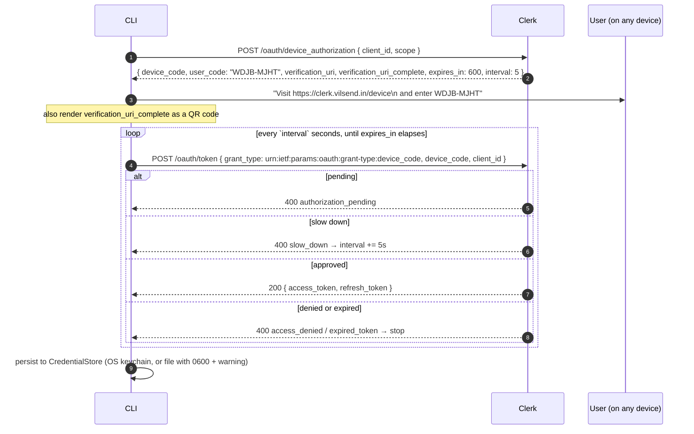
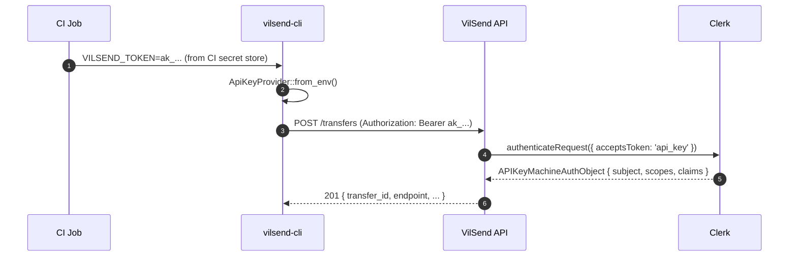
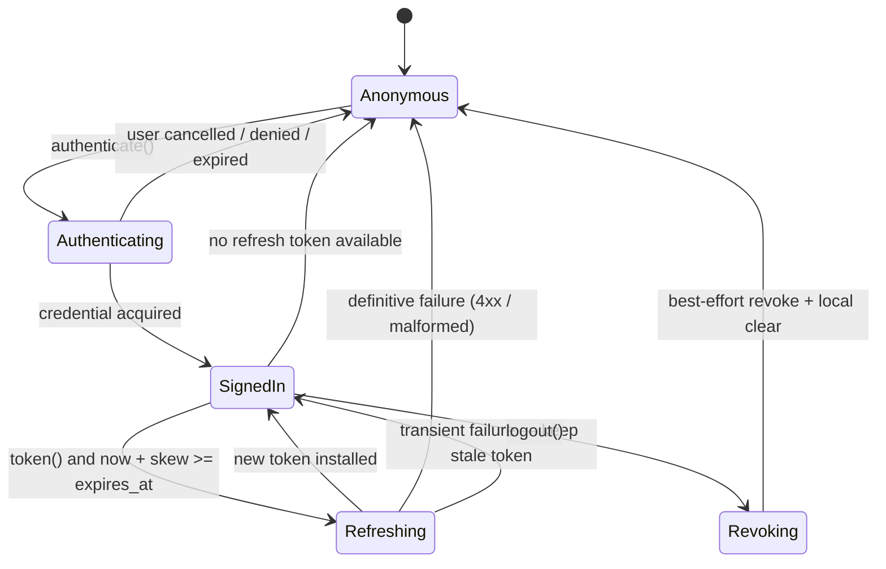

# 03 — Multi-Client Authentication

> Status: **proposal**. Current-state claims are cited to file paths; see
> [`00-current-state.md`](./00-current-state.md) §5.
> Clerk capabilities were verified against current Clerk documentation on
> 2026-09-19. **Every claim about what Clerk supports is marked with the
> verification status** — where I could not verify, it says so.

---

## 1. What authentication has to do, per client

| Client | User present? | Browser reachable? | Credential lifetime | Right flow |
|---|---|---|---|---|
| **Desktop** | Yes | Yes | Session-length, refreshable | **Browser + PKCE, loopback or custom scheme** |
| **CLI (interactive)** | Yes | Sometimes | Session-length | **Device Authorization Grant** (best) or loopback PKCE |
| **CLI (CI)** | No | No | Long-lived, scoped | **API key / service token** |
| **SDK (server-side)** | No | No | Long-lived, scoped | **API key**, or bring-your-own-auth |
| **SDK (embedded in a host app)** | Host decides | Host decides | Host's problem | **`ByoAuthProvider`** — callback into the host |
| **Mobile** | Yes | Yes | Session-length, refreshable | **System browser + PKCE via Universal/App Links**, tokens in Keystore/Keychain |

The unifying insight: **the differences are all in acquisition, not in use.**
Every flow ends with a bearer token, an expiry, and possibly a refresh token.
That is why the abstraction boundary belongs *after* token acquisition.

---

## 2. The abstraction

```rust
// crates/core/src/ports/auth.rs

#[async_trait]
pub trait AuthProvider: Send + Sync + 'static {
    /// Stable identifier: "clerk-pkce", "clerk-device", "api-key", "byo".
    fn id(&self) -> &'static str;
    fn capabilities(&self) -> AuthCapabilities;

    /// Acquire a credential. May be interactive — the provider signals *what*
    /// it needs through `AuthContext`, and the SHELL decides *how* to do it.
    async fn authenticate(&self, ctx: &AuthContext) -> Result<Credential, AuthError>;

    /// Produce a usable token. MUST refresh if expired or near expiry.
    /// Called per-request, so it must be cheap when the token is still valid.
    async fn token(&self) -> Result<AccessToken, AuthError>;

    /// Best-effort revocation + local clear.
    async fn logout(&self) -> Result<(), AuthError>;

    /// Is a usable credential currently held?
    async fn status(&self) -> AuthStatus;
}

#[derive(Debug, Clone, Copy)]
pub struct AuthCapabilities {
    pub interactive: bool,      // needs a human
    pub needs_browser: bool,
    pub refreshable: bool,      // has a refresh token
    pub headless_ok: bool,      // works with no TTY and no browser
    pub multi_account: bool,    // can hold >1 identity
}

/// The shell's hook for interactive flows. Keeps the core UI-free.
#[async_trait]
pub trait InteractiveAuthUi: Send + Sync {
    /// Present a device code + verification URI and wait for the user.
    async fn show_device_code(&self, code: &str, uri: &Url, expires_in: Duration) -> DeviceCodeOutcome;
    /// Open a URL in whatever the platform's browser is.
    async fn open_browser(&self, url: &Url) -> Result<(), AuthError>;
    /// Wait for a deep-link/loopback redirect carrying `code`+`state`.
    async fn await_redirect(&self, redirect: &RedirectSpec, timeout: Duration)
        -> Result<CallbackParams, AuthError>;
}
```

### 2.1 The credential store

```rust
// crates/core/src/ports/credential_store.rs

#[async_trait]
pub trait CredentialStore: Send + Sync + 'static {
    async fn get(&self, key: &CredentialKey) -> Result<Option<Secret>, StoreError>;
    async fn set(&self, key: &CredentialKey, value: &Secret) -> Result<(), StoreError>;
    async fn delete(&self, key: &CredentialKey) -> Result<(), StoreError>;
    async fn list(&self) -> Result<Vec<CredentialKey>, StoreError>;
}

/// Namespaced so multi-account and multi-provider do not collide.
/// Design the key space now; do not build multi-account yet.
pub struct CredentialKey {
    pub provider: ProviderId,   // "clerk"
    pub account: AccountId,     // stable subject id; "" until known
    pub slot: Slot,             // AccessToken | RefreshToken | ExpiresAt | DeviceKey | TunnelToken
}
```

> **Design now, build later.** Encode `account` in the key space from day one.
> Multi-account support is a genuine SDK/CLI requirement and retrofitting a
> namespace later means a migration. But **do not ship a multi-account UI** in
> this migration — see [`01-target-architecture.md`](./01-target-architecture.md) §9.

### 2.2 The token refresher

```rust
pub struct TokenRefresher {
    store: Arc<dyn CredentialStore>,
    provider: Arc<dyn AuthProvider>,
    /// One lock per account — NOT one global lock. Two accounts must be able
    /// to refresh concurrently.
    locks: Mutex<HashMap<AccountId, Arc<Mutex<()>>>>,
    skew: Duration,   // refresh this long before expiry
}
```

**Reuse the current design — it is correct.** The existing implementation
(`services/oauth_service.rs:524-537`) uses a lock plus a **double-checked
re-read** so a concurrent waiter returns the token the first refresher
installed, rather than spending the refresh token twice. Generalise it, do not
reinvent it.

The two-tier error handling is also worth preserving verbatim:

| Error class | Behaviour | Why |
|---|---|---|
| 4xx from the token endpoint, or a malformed response | **Clear the session**, return `Unauthenticated` | The refresh token is genuinely dead |
| Transport failure, or 5xx | **Keep the session**, return the stale token | An offline laptop must not sign the user out |
| No refresh token available | Clear + `Unauthenticated` | Nothing to do |

Current implementation: `oauth_service.rs:154-176` (`TokenRequestError::is_definitive()`),
`:563-587`.

---

## 3. Per-client flows

### 3.1 Desktop — keep browser + PKCE

**Recommendation: keep the custom-scheme deep link, add loopback as a fallback.**

| | Custom scheme (`vilsend://auth/callback`) | Loopback (`http://127.0.0.1:<port>/callback`) |
|---|---|---|
| Security | **Any app can register the scheme** and intercept the callback | Only the process holding the port can receive it |
| Works when | Always | Requires a free port; blocked by some firewalls |
| macOS | Requires the app to be in `/Applications` (runtime registration is impossible) | Works always |
| MSIX/Store | **Needs explicit `windows.protocol` registration in `AppxManifest.xml`** — MSIX ignores registry registration | Works always |
| RFC 8252 stance | Acceptable | **Preferred** |
| Current state | ✅ Implemented, and the MSIX manifest is correctly kept in sync (`src-tauri/msix/AppxManifest.xml`) | ❌ Not implemented |

**The custom-scheme risk is real but mitigated by PKCE**: an attacker who
intercepts the redirect gets a `code` they cannot exchange without the
`code_verifier`, which never leaves the Rust process. So the current design is
defensible. **Recommendation: keep it, add loopback as a preference on
platforms where it is reliable, and let the redirect URI be configurable.**

Two changes are required regardless:

1. **The issuer is derived in TypeScript from the publishable key's undocumented
   internal structure** (`src/lib/auth-config.ts:26-45`). This should move into
   Rust and, ideally, be replaced by **OIDC discovery**:
   `GET {issuer}/.well-known/openid-configuration` → read
   `authorization_endpoint` and `token_endpoint` instead of string-concatenating
   `/oauth/authorize` and `/oauth/token` (`oauth_service.rs:83-85`).
   *Clerk publishes this document* — verified. This removes the reverse-engineered
   key parsing entirely.
2. **Logout must attempt server-side revocation.** Today `clear()`
   (`oauth_service.rs:803-817`) deletes locally and calls nothing, leaving the
   refresh token valid server-side indefinitely. **ASSUMPTION — requires
   verification:** the exact Clerk revocation endpoint for OAuth-application
   refresh tokens. Clerk exposes OAuth endpoints under the frontend API; a
   revocation endpoint should be discoverable via
   `revocation_endpoint` in the discovery document. **Verify before implementing;
   do not guess the URL.**

### 3.2 Desktop flow, target

```mermaid
sequenceDiagram
    autonumber
    participant UI as React
    participant A as ClerkAuthProvider (Rust)
    participant UI_HOOK as InteractiveAuthUi (Tauri shell)
    participant B as System browser
    participant C as Clerk

    UI->>A: authenticate(Interactive)
    A->>C: GET /.well-known/openid-configuration
    C-->>A: { authorization_endpoint, token_endpoint, revocation_endpoint, ... }
    A->>A: verifier, challenge(S256), state
    A->>UI_HOOK: open_browser(authorize_url)
    UI_HOOK->>B: opener().open_url(...)
    B->>C: user authenticates
    C-->>B: 302 to registered redirect
    B->>UI_HOOK: deep link / loopback callback
    UI_HOOK-->>A: CallbackParams { code, state }
    A->>A: constant-time state check; consume PendingLogin
    A->>C: POST token_endpoint (authorization_code + code_verifier)
    C-->>A: access_token, refresh_token, expires_in, id_token
    A->>A: persist to CredentialStore (OS keychain)
    A-->>UI: AuthState::SignedIn { subject }
```

Everything below the `InteractiveAuthUi` line is **identical on every platform**.
That is the whole point of the abstraction.

### 3.3 CLI — device authorization grant

**Verified: Clerk supports the OAuth 2.0 Device Authorization Grant (RFC 8628)
in beta, enabled per OAuth application.**

| Fact | Detail |
|---|---|
| Endpoint | `POST {fapi}/oauth/device_authorization` — **use the `device_authorization_endpoint` from the discovery document**, not a constructed URL |
| Token endpoint | `POST {fapi}/oauth/token` |
| Public clients | **Supported** — send `client_id` + `scope`, no secret |
| PKCE / redirect | **Not used** — by design, per RFC 8628 |
| Response | `device_code`, `user_code`, `verification_uri`, `verification_uri_complete`, `expires_in`, `interval` |
| Expiry | **10 minutes** for both codes (`expires_in: 600`) |
| Poll interval | Default **5 s** — treat `expires_in`/`interval` as authoritative, never hardcode |
| **Enablement** | **Must be turned on per OAuth application.** Dashboard → OAuth applications → enable "Device authorization grant", or PATCH `/oauth_applications/{id}` with `{"device_authorization_grant_enabled": true}` |
| Poll errors | `authorization_pending` → retry · `slow_down` → **increase interval by ≥5 s** · `access_denied` → stop · `expired_token` → stop |
| Single use | A `device_code` can be exchanged **once** |

> ⚠️ **Action required, not optional.** The device grant is **off by default**.
> If your Clerk OAuth application does not have it enabled, `/oauth/device_authorization`
> will fail. This is a configuration task on your Clerk instance, and it is a
> **hard prerequisite for the CLI's interactive login**. Flagged as Q-03 in
> [`07-risks-and-open-questions.md`](./07-risks-and-open-questions.md).

Also note: the device grant **must be enabled before you can rely on it**, and
it is labelled **beta**. Beta is acceptable for a CLI, but it means you should
keep loopback PKCE as a fallback rather than making device flow the only path.



**Implementation notes that matter:**

- **Never log or display `device_code`.** Display `user_code` and
  `verification_uri` **together** — Clerk's docs are explicit about this.
- `verification_uri_complete` must be an *additional* convenience (QR code),
  never the only path.
- Respect `slow_down` by increasing the interval; ignoring it will get you rate
  limited.
- Bounded total timeout = `expires_in`. Do not poll past it.

### 3.4 CLI in CI — API keys

**Verified: Clerk API Keys reached GA on 2026-04-06.**

| Fact | Detail |
|---|---|
| Prefix | `ak_` |
| Usage | `Authorization: Bearer ak_...` |
| Subject | Bound to a **user or Organization** |
| Enablement | Clerk Dashboard — "Enable User API keys" / "Organization API keys". Disabling makes existing keys fail verification **without revoking them**. |
| Creation | Backend API `POST https://api.clerk.com/v1/api_keys` with `subject`, `scopes`, `claims`, `name`, `seconds_until_expiration` |
| Verification | `/api_keys/verify`, authorized by a Clerk secret key |
| Backend SDK | `authenticateRequest(..., { acceptsToken: 'api_key' })` |
| **Plan** | **Machine Authentication (API Keys + M2M Tokens) requires the Pro plan** ($100/mo). Hobby-tier accounts only get the free allowance. |
| Pricing | $0.001/key creation (first 1,000/mo free); $0.00001/verification (first 100,000/mo free) |



**Two backend changes required:**

1. The backend must **accept API keys** on its endpoints, not just session JWTs.
   *Requires backend change.*
2. The backend must **authorize on `scopes`**. An API key is a bearer credential
   with a long life; without scoping, a leaked CI key is a full account takeover.

**Alternative if Clerk API Keys are not viable** (cost, or the backend cannot be
changed): the backend can mint its **own** service tokens — an opaque
`vls_...` token stored hashed in the backend DB, verified by the backend with no
Clerk involvement. This is more work but removes a dependency and the Pro-plan
requirement. Recorded as ADR-0009; **this is a decision you need to make.**

### 3.5 Mobile — browser + PKCE with Universal/App Links

**Verified: Clerk allows custom URL schemes in `redirect_uris`, and for native
apps defaults to `{bundleIdentifier}://callback`. For production instances,
redirect URLs must be allow-listed** via the Clerk Dashboard's "Native
applications" page (mobile SSO redirect allowlist) or the Backend API.

| Concern | Design |
|---|---|
| **Redirect** | **Prefer Universal Links (iOS) / App Links (Android)** over a custom scheme. A custom scheme is claimable by *any* installed app; a Universal Link is bound to your signing identity + `apple-app-site-association`. Fall back to the custom scheme if the link is not verified. |
| **Browser** | **System browser only** (`ASWebAuthenticationSession` on iOS, Custom Tabs on Android). **Never an embedded WebView** — it breaks the trust boundary and Clerk will reject it. |
| **Storage** | iOS Keychain with `kSecAttrAccessibleAfterFirstUnlockThisDeviceOnly`; Android Keystore-wrapped `EncryptedSharedPreferences`. |
| **Biometric unlock** | Optional, user-enabled. Gate *access* to the stored refresh token behind `LAContext` / `BiometricPrompt`. Do **not** derive the token from the biometric. |
| **Background** | Refresh proactively before a long background transfer starts; iOS may suspend the app mid-refresh. |
| **Logout** | Clear all keychain items **and** call the revocation endpoint. |

**Mobile is where Stronghold must go.** `tauri-plugin-stronghold` is
**desktop-only** — verified against Tauri's plugin platform-support table. The
current app registers it (`lib.rs:112`) but never uses it, so removing it is
free. The `keyring` crate is likewise desktop-only and already unused.

### 3.6 SDK — bring-your-own-auth

The SDK must work inside a host app that already has an identity system. This is
the requirement that most shapes the API.

```rust
pub struct ByoAuthProvider {
    token_fn: Arc<dyn Fn() -> BoxFuture<'static, Result<AccessToken, AuthError>> + Send + Sync>,
    login_fn: Option<Arc<dyn Fn() -> BoxFuture<'static, Result<(), AuthError>> + Send + Sync>>,
    logout_fn: Option<Arc<dyn Fn() -> BoxFuture<'static, Result<(), AuthError>> + Send + Sync>>,
}
```

Hard requirements:
- **Must compile with no Clerk code linked.** The Clerk adapters live behind the
  `clerk-pkce` / `clerk-device` features. An embedder bringing its own auth must
  not pull an OAuth stack.
- **`token_fn` is called per request.** The host controls caching and refresh.
- **The SDK must never prompt.** If a token is unavailable and there is no
  `login_fn`, fail with `Unauthenticated` — do not open a browser behind the
  host app's back. This is a hard rule; violating it is how SDKs get uninstalled.

---

## 4. Token lifecycle



| Concern | Policy |
|---|---|
| **Refresh threshold** | 60 s before expiry (current value; keep it, make it configurable) |
| **Refresh trigger** | **Lazy, per-request.** No background timer. This is the current, correct design (`oauth_service.rs:499-501`) and it should be preserved — a timer is more code, fails the same way, and burns battery on mobile. |
| **Concurrency** | One mutex **per account**, plus double-checked re-read |
| **Clock skew** | `expires_in` from the response, never the JWT's `exp`. **Do not start parsing unverified JWT claims for expiry.** |
| **Revocation on logout** | **Required, currently missing.** Call `revocation_endpoint` (from discovery — *verify the exact URL*), then clear locally regardless of the revoke outcome. |
| **Refresh token rotation** | If a refresh response omits `refresh_token`, **keep the existing one** — the current code does this correctly (`oauth_service.rs:740-742`) |
| **Multi-account** | Key space supports it; **UI and API do not ship it** in this migration |

---

## 5. Scopes and authorization per client

| Client | Scopes | Notes |
|---|---|---|
| Desktop | `openid profile email` | Current default (`src/lib/auth-config.ts:60`). Add `offline_access` **only if Clerk requires it for refresh tokens** — *verify; the current flow receives a refresh token without it.* |
| Mobile | `openid profile email` + optional `user:org:read` | `user:org:read` is a **verified Clerk scope** that adds Organization selection and returns an `org_id` claim |
| CLI interactive | Same as desktop | |
| CLI / CI | **API key scopes** | Clerk API keys carry `scopes` + `claims`; scope them to transfer-only, never account-administration |
| SDK | Host-defined | The SDK must not assume a scope set |

**Rule: scopes are a property of the `AuthProvider`, not of the core.** The core
asks for a token; the provider knows what it is allowed to request.

---

## 6. Backend verification (what must change on the server)

The backend is **not in this repository**, so this is a specification, not a diff.
**Everything in this section is `requires backend change`.**

| Credential type | Prefix | Verification | Backend action |
|---|---|---|---|
| Desktop/mobile session (OAuth access token) | JWT or `oat_` | Verify signature + `iss` + `exp`; **accept the OAuth application's client id as `aud`** | *Verify whether Clerk is configured to issue JWT access tokens* — if it issues **opaque `oat_`** tokens, a JWT-only backend will reject them |
| API key | `ak_` | Clerk `/api_keys/verify` (or `acceptsToken: 'api_key'`) | Accept `Authorization: Bearer ak_...` on transfer endpoints; authorize on scopes |
| Device identity | — | Device's X25519/Ed25519 public key, registered at device registration | Needed for peer authentication ([`02`](./02-transport-layer.md) §7.3) and for the session token (`03` §7.2) |

> **The single highest-risk unknown in the whole auth design:** whether Clerk is
> configured to issue **JWT access tokens** for your OAuth application, and
> whether your backend validates `aud`. If Clerk issues opaque `oat_` tokens and
> the backend expects a JWT, **the desktop app is already broken** — or the
> backend is validating only existence. This must be checked first. See Q-01.

---

## 7. Threat models

### 7.1 Desktop PKCE (current + proposed)

| Threat | Likelihood | Impact | Mitigation | Status |
|---|---|---|---|---|
| Malicious local app registers `vilsend://` and steals the `code` | Medium | **Low** — PKCE blocks the exchange | PKCE S256 | ✅ already in place |
| Malicious app steals the redirect and the verifier | Low | High | Verifier never leaves Rust memory | ✅ |
| Authorization-code replay | Low | Medium | `PendingLogin` consumed before any I/O; single-use | ✅ |
| CSRF via forged `state` | Low | Medium | 32-byte random state, **constant-time** compare | ✅ |
| Token theft from disk | Medium | **Critical** | OS keychain via `tauri-plugin-secure-storage` | ✅ **live** (the Stronghold/keyring stacks are dead code) |
| Token theft from process memory | Low | High | Not mitigated. `zeroize` is a dependency but not applied to tokens. | ⚠️ gap |
| **Refresh token valid after logout** | — | Medium | **No revocation call is made** | ❌ **gap** |
| Malicious redirect URI injected via `DesktopAuthConfig` | Low | Medium | Rust validates scheme+host+path against the callback | ✅ |
| Issuer spoofing (`DesktopAuthConfig.issuer` is frontend-supplied) | Low | High | Rust validates `https` scheme only | ⚠️ Acceptable today (the config is compiled into the frontend bundle), but it must not stay frontend-supplied once the SDK exists |

### 7.2 Device grant (CLI)

| Threat | Mitigation |
|---|---|
| Attacker brute-forces the `user_code` | Codes are short-lived (10 min), single-use, and rate-limited by the poll interval |
| Attacker intercepts the `device_code` | It never leaves the CLI process — **never log it** |
| **Attacker phishes the user into approving the wrong device** | **This is the real risk and it is a UX problem.** Mitigate by showing the requesting application name, and by confirming on the CLI side that the returned token's subject matches what was approved. |
| Phishing of the verification URL | Display the full URI; render the QR from `verification_uri_complete`; never accept a user-supplied URL |

> The device grant's security rests on the user noticing that they are approving
> a login they did not initiate (**"device code phishing"**, a documented real
> attack class). There is no cryptographic defence. The defence is UX: state
> clearly what is being authorized. **Accept this risk explicitly, or choose
> loopback PKCE instead** — recorded as ADR-0008.

### 7.3 API keys (CI / SDK)

| Threat | Mitigation |
|---|---|
| Key leaked in a CI log | **Never print the token**; `--json` output must redact. Scan CI logs. |
| Key committed to a repo | Short `seconds_until_expiration`; per-project keys; revocation is immediate |
| Over-scoped key | **Authorize on scopes on the backend.** Non-negotiable. |
| Key theft from a build artifact | Store in the CI secret manager, never in the image |
| **Disabled ≠ revoked** | Clerk disabling API keys makes them **fail verification without revoking them**. Do not treat "disabled" as "revoked" in your audit story. |
| Long-lived key is a standing liability | Prefer short expiry + automated rotation |

### 7.4 Mobile

| Threat | Mitigation |
|---|---|
| Malicious app claims the custom scheme | **Prefer Universal Links / App Links**; they are bound to the signing identity |
| Token extracted from a rooted/jailbroken device | Keychain/Keystore + `*ThisDeviceOnly` accessibility; biometric gate for the refresh token |
| Backup extraction | `kSecAttrAccessible...ThisDeviceOnly` prevents iCloud/Android backup inclusion |
| **Embedded WebView auth** | **Forbidden.** Use the system browser. A WebView is controllable by the host app and invalidates the trust boundary. |
| Token in a screenshot / app switcher | Mask on backgrounding |

### 7.5 SDK

| Threat | Mitigation |
|---|---|
| **SDK opens a browser behind the host's back** | Forbidden. No `login_fn` ⇒ fail with `Unauthenticated`. |
| SDK logs tokens | `tracing` fields must never carry token material. Add a lint/redaction test. |
| SDK persists credentials the host did not ask for | `CredentialStore` is **injected**. `in_memory()` persists nothing. |
| Host passes an over-privileged token | Out of scope — document that the SDK uses whatever token it is given |

---

## 8. Clerk capability matrix — verified vs not

| Capability | Verified? | Finding |
|---|---|---|
| OIDC discovery (`/.well-known/openid-configuration`) | ✅ | Clerk publishes it; advertises `authorization_endpoint`, `token_endpoint`, `device_authorization_endpoint`, `grant_types_supported`. **Adopt it instead of string-building endpoints.** |
| Authorization Code + PKCE, public clients | ✅ | `public: true` + `pkce_required` on the OAuth application |
| Custom URL scheme redirect URIs | ✅ | Any scheme allowed; `{bundleIdentifier}://callback` is the native default |
| **Production redirect allowlisting** | ✅ | **Required for production instances** via the Dashboard "Native applications" page / Backend API. **Check that `vilsend://auth/callback` is allow-listed on the live instance** — Q-02. |
| Device Authorization Grant | ✅ **beta** | Supported; **disabled by default per OAuth application**; RFC 8628; 10-min codes; `interval: 5` |
| API Keys | ✅ **GA 2026-04-06** | `ak_` prefix; user- or org-scoped; `/api_keys/verify`; **requires Pro plan** |
| M2M tokens (machine identities) | ✅ | Opaque (revocable, remote verify) or JWT (local verify, **not revocable before expiry**) |
| OAuth 2.0 Client Credentials | ❌ **Not supported** | Clerk M2M Tokens are proprietary and work **only within a single Clerk instance**. Do not design around client-credentials. |
| Refresh token rotation | ⚠️ **Not verified** | The code handles a missing `refresh_token` correctly either way (`oauth_service.rs:740-742`). **Confirm whether Clerk rotates.** |
| Token revocation endpoint | ⚠️ **Not verified** | Expect a `revocation_endpoint` in the discovery document. **Verify before implementing — do not guess.** |
| `offline_access` scope required for refresh tokens | ⚠️ **Not verified** | The current flow gets a refresh token with only `openid profile email` |
| JWT vs opaque access tokens for OAuth apps | ⚠️ **Not verified** | Controlled by "Generate access tokens as JWTs". **Determines whether the backend works at all.** → Q-01 |
| Session management / revoke-all | ⚠️ **Not verified** | Relevant to "log out everywhere" |

---

## 9. Migration path for auth (no big bang)

| Step | Change | Risk |
|---|---|---|
| **A1** | Move issuer derivation from TypeScript into Rust; add OIDC discovery. Keep the existing endpoints as a fallback. | Low |
| **A2** | Introduce the `AuthProvider` / `CredentialStore` traits; wrap the **existing** `OAuthService` as `ClerkPkceProvider` behind them. **No behaviour change.** | Low |
| **A3** | Move `InteractiveAuthUi` behind a trait; the Tauri shell implements it with `opener` + `deep_link`. | Low |
| **A4** | Add revocation-on-logout for the desktop client. | Low |
| **A5** | Build `ApiKeyProvider` (small). Prove it with a CLI command. | Medium — needs backend work |
| **A6** | Build the CLI device-grant provider. **Prerequisite: enable the grant in Clerk.** | Medium |
| **A7** | Add `ByoAuthProvider`; ship it as the SDK's documented path. | Low |
| **A8** | Mobile: platform `CredentialStore` (Keychain/Keystore), Universal/App Links. | High — new platform |

Note the ordering: **A1-A4 ship in the desktop app with zero user-visible change.**
That is the strangler pattern applied to auth — the abstraction goes in first,
the new providers arrive one at a time.

---

## See also

- [`00-current-state.md`](./00-current-state.md) §5 — what exists today
- [`02-transport-layer.md`](./02-transport-layer.md) §7.3 — how peer authentication consumes device keys
- [`04-sdk-cli-mobile-build-plan.md`](./04-sdk-cli-mobile-build-plan.md) §7 — CLI specifics
- [`07-risks-and-open-questions.md`](./07-risks-and-open-questions.md) — Q-01, Q-02, Q-03
- [`adr/0008-auth-provider-per-client.md`](./adr/0008-auth-provider-per-client.md), [`adr/0009-service-tokens-and-receiver-auth.md`](./adr/0009-service-tokens-and-receiver-auth.md)
