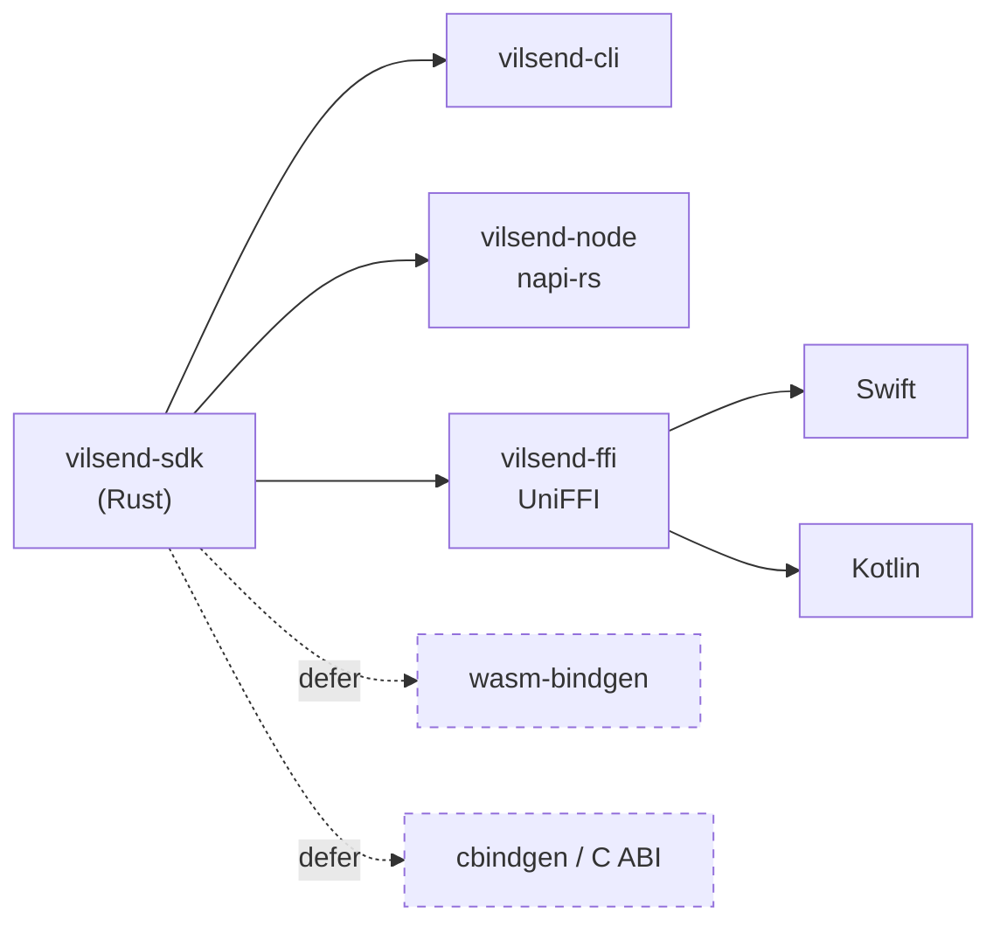

# 04 — SDK, CLI, and Mobile Build Plan

> Status: **proposal**. Covers the public API design, bindings strategy, build
> matrix, packaging, and versioning for shipping one core as four products.

---

## 1. The four products, and what each one is actually for

| Product | Consumer | Primary constraint | Why it exists |
|---|---|---|---|
| **Desktop app** | End users | Must never regress. Ships continuously. | Revenue today |
| **CLI** | Scripts, CI, ops, power users | Headless. No browser assumed. Exits with meaningful codes. | Proves the core has no hidden UI dependency. Also the fastest path to "send a file from a build server". |
| **SDK** | Third-party developers | Stable API, no surprises, no global state | Platform play. This is the strategic bet. |
| **Mobile app** | End users | Background execution limits, secure storage, small binary | Completes the "every device" promise |

Two of these have a hard dependency on the third: **the SDK is not a product,
it is the API the other three consume.** Build it first and eat your own
dogfood — the desktop shell should be refactored to call `vilsend-sdk` in
Phase 4, before any external developer sees it.

---

## 2. Public API design

### 2.1 Shape

```rust
// crates/sdk/src/lib.rs

pub struct Vilsend { /* opaque */ }

pub struct VilsendBuilder { /* ... */ }

impl VilsendBuilder {
    pub fn native() -> Self;      // LAN + tunnel, OS keyring, SQLite, real fs
    pub fn in_memory() -> Self;   // for tests and embedded/sandboxed hosts

    pub fn with_auth(self, auth: Arc<dyn AuthProvider>) -> Self;
    pub fn with_transport(self, t: Arc<dyn Transport>) -> Self;
    pub fn with_event_sink(self, sink: Arc<dyn EventSink>) -> Self;
    pub fn with_store(self, s: Arc<dyn TransferStore>) -> Self;
    pub fn with_credentials(self, c: Arc<dyn CredentialStore>) -> Self;
    pub fn with_policy(self, p: Policy) -> Self;
    pub fn api_base(self, url: Url) -> Self;
    pub fn protocol_version(self, v: u16) -> Self;

    pub fn build(self) -> Result<Vilsend, VilsendError>;
}
```

### 2.2 The four verbs

```rust
impl Vilsend {
    pub async fn send(&self, req: SendRequest) -> Result<TransferHandle, VilsendError>;
    pub async fn receive(&self, req: ReceiveRequest) -> Result<TransferHandle, VilsendError>;
    pub async fn auth(&self) -> AuthFacade;
    pub fn events(&self) -> EventStream;
}

impl TransferHandle {
    pub fn id(&self) -> TransferId;
    pub async fn progress(&self) -> Progress;
    pub async fn pause(&self) -> Result<(), VilsendError>;
    pub async fn resume(&self) -> Result<(), VilsendError>;
    pub async fn cancel(&self) -> Result<(), VilsendError>;
    /// Resolves when the transfer reaches a terminal state.
    pub async fn wait(self) -> Result<Outcome, VilsendError>;
    /// Dropping the handle cancels the transfer. Documented, not incidental.
}
```

Requests are **data, not closures**, so they serialise cleanly across FFI:

```rust
#[derive(Clone, Debug)]
pub struct SendRequest {
    pub peer: PeerRef,
    /// Opaque handles resolved by the injected ChunkSource.
    pub files: Vec<FileRef>,
    pub chunk_size: Option<usize>,
    pub concurrency: Option<u8>,
    pub max_retries: Option<u32>,
    /// Per-transfer override of the global policy.
    pub policy: Option<Policy>,
}
```

### 2.3 Progress and events

```rust
pub struct Progress {
    pub transfer_id: TransferId,
    pub bytes_confirmed: u64,
    pub total_bytes: u64,
    pub chunks_confirmed: u64,
    pub total_chunks: u64,
    pub files_done: usize,
    pub files_total: usize,
    pub retries: u32,
    pub status: TransferStatus,
    pub transport: TransportKind,
    pub throughput_bps: u64,
    pub eta: Option<Duration>,
    /// Set when failover occurred — the SDK should never hide this from users.
    pub degraded: Option<DegradedReason>,
}

pub fn events(&self) -> impl Stream<Item = DomainEvent> + Send + 'static;
```

**Why a `Stream` and not a callback.** A stream composes (`select!`,
`merge`, `throttle`), applies backpressure naturally, and maps cleanly onto
every binding target: Node `AsyncIterator`, Swift `AsyncSequence`, Kotlin
`Flow`, Python async generator. A callback API forces every binding to
re-implement backpressure and re-entrancy protection.

**`degraded` is deliberate.** Silently falling back from LAN to tunnel is
exactly the behaviour that makes downgrade attacks invisible
([`02-transport-layer.md`](./02-transport-layer.md) §7.5). Surface it.

### 2.4 Bring-your-own-auth

The SDK must work inside a host app that *already* has an identity system.

```rust
/// Adapter for a host app that manages its own credentials.
pub struct ByoAuthProvider {
    /// Host-supplied: return a bearer token for the VilSend API.
    token_fn: Arc<dyn Fn() -> BoxFuture<'static, Result<AccessToken, AuthError>> + Send + Sync>,
    /// Optional: how to trigger an interactive login in the host app.
    login_fn: Option<Arc<dyn Fn() -> BoxFuture<'static, Result<(), AuthError>> + Send + Sync>>,
}

impl AuthProvider for ByoAuthProvider { /* ... */ }
```

Consumption:

```rust
let vilsend = VilsendBuilder::native()
    .with_auth(Arc::new(ByoAuthProvider::new(move || {
        let token = my_app.current_bearer_token();
        Box::pin(async move { Ok(AccessToken::new(token)) })
    })))
    .build()?;
```

This must work **without** any Clerk dependency compiled in. Gate the Clerk
adapters behind the `clerk-pkce` / `clerk-device` cargo features so an embedder
that brings its own auth does not link an OAuth stack it will never use.

### 2.5 API stability contract

| Rule | Detail |
|---|---|
| Semver | Strict on `vilsend-sdk`. `0.x` still means "may break in a minor", but **prefer not to**. |
| Pre-1.0 discipline | Publish `0.1` as `@experimental` with a documented "we will not break this without a major" intent. Intent is not a contract, but it is a signal. |
| Internals | `vilsend-core`, `-engine`, `-protocol` are **not** published to crates.io. |
| Traits | `#[non_exhaustive]` on all public enums. Trait methods get default impls where a sensible default exists. |
| Deprecation | `#[deprecated(since, note)]` for one minor release minimum. |

---

## 3. Bindings strategy

### 3.1 Recommended order



| # | Target | Tool | Phase | Trade-offs |
|---|---|---|---|---|
| 1 | Rust crate | — | 4 | Free. Validates the API against the desktop shell as its first real consumer. |
| 2 | CLI | `clap` | 5 | Not a binding. Proves headless operation and exercises the device-code auth path. |
| 3 | Node / TS | **napi-rs** | 7 | Near-native overhead; production-proven (SWC, Rspack, Biome). Requires a second crate and per-platform prebuilt addons. |
| 4 | Swift / Kotlin | **UniFFI** | 8 | Firefox-grade maturity. **Caveat: the Kotlin/JVM path has materially higher marshalling overhead than Swift** — measured as "High" vs "Low" in published benchmarks. For a file-transfer API that overhead is irrelevant (per-call, not per-byte), but do not put it on a hot loop. |
| 5 | WASM | `wasm-bindgen` | **Defer** | The core needs real sockets and real files. A browser target needs an entirely different transport family (WebRTC/HTTP), so it is a different product, not a binding. |
| 6 | C ABI | `cbindgen` | **Defer** | UniFFI already emits a C ABI internally. A hand-rolled one is a permanent tax. Revisit only on explicit demand. |

### 3.2 Why not "UniFFI for everything"

`uniffi-bindgen-react-native` now generates Node bindings from the same UDL, and
`@ubjs/node` provides a generic N-API runtime. If that matures, one toolchain
could replace both crates. **It is not mature enough to bet a platform on
today.** Revisit at Phase 7 — the cost of switching later is one crate, so
waiting is cheap.

### 3.3 Binding surface rules

Whatever the binding, the rules are the same:

1. **No generic types in the FFI surface.** `Handle<T>` becomes `Handle`.
2. **No lifetimes.** Everything owned or `Arc`.
3. **Errors are enums, never strings.** UniFFI turns them into sealed classes /
   Swift enums; that is the whole point of §8 of the architecture doc.
4. **Streams become iterators.** Node: `AsyncIterator`. Swift: `AsyncSequence`.
   Kotlin: `Flow`. Never expose a Rust `Stream` across the boundary.
5. **Cancellation is explicit.** Foreign runtimes cannot drop a Rust future
   deterministically, so bindings must expose `handle.cancel()` and document
   that dropping is best-effort.
6. **The host runtime is respected.** napi-rs runs on libuv; UniFFI on the
   caller's thread pool. Never block synchronously inside a binding method.

---

## 4. Build matrix and CI

### 4.1 Artifact matrix

| # | Artifact | Target(s) | Runner | Phase |
|---|---|---|---|---|
| 1 | Desktop Linux (AppImage, deb) | `x86_64-unknown-linux-gnu` | `ubuntu-latest` | exists |
| 2 | Desktop Windows (MSI, NSIS) | `x86_64-pc-windows-msvc` | `windows-latest` | exists |
| 3 | Desktop macOS (dmg, app) | `aarch64-apple-darwin` **+ `x86_64-apple-darwin`** | `macos-latest` | exists — **arch bug, §4.3** |
| 4 | Windows Store MSIX | `x86_64-pc-windows-msvc` | `windows-latest` | exists, publish disabled |
| 5 | CLI Linux | `x86_64` + `aarch64` | `ubuntu-latest` | new |
| 6 | CLI Windows | `x86_64` | `windows-latest` | new |
| 7 | CLI macOS | `aarch64` + `x86_64` | `macos-latest` | new |
| 8 | Rust crate | — | `ubuntu-latest` | new (`cargo publish`) |
| 9 | Node addon | 3 OSes × {x64, arm64} | matrix | new |
| 10 | iOS xcframework | `aarch64-apple-ios`, `aarch64-apple-ios-sim` | `macos-latest` | new |
| 11 | Android `.aar` | 4 ABIs | `ubuntu-latest` | new |

### 4.2 Repository layout for CI

A single `release.yml` is currently 1799 lines
(`.github/workflows/release.yml`) with large commented-out blocks. Extending it
in place is not viable. Split into:

```
.github/workflows/
├── ci.yml            # on PR: fmt, clippy, test, arch-lint, frontend typecheck
├── release-desktop.yml   # tag-driven, the current path
├── release-cli.yml       # tag-driven
├── release-bindings.yml  # tag-driven, manual approval
└── release-store.yml     # manual dispatch
```

Use reusable workflows for the shared Rust caching steps — the current file
duplicates the sdkcache/toolchain/cache setup across every job
(`release.yml:932-950`, `:1055-1073`, `:173-…`).

### 4.3 Two build bugs to fix before widening the matrix

**Bug 1 — the tunnel does not work on Apple Silicon.**
`src-tauri/src/services/cloudflared.rs:270` resolves
`("macos", "aarch64") → "cloudflared/macos-arm64/cloudflared"`, but
`src-tauri/tauri.macos.conf.json` bundles **only**
`resources/cloudflared/macos-x64/cloudflared`. On an arm64 Mac the resolver
looks for a file that was never copied into the bundle and cloudflared fails to
start. **This is a hard failure, not a Rosetta fallback.** Fix by adding the
`macos-arm64` entry to the macOS config, or by selecting the resource per
`CARGO_CFG_TARGET_ARCH`.

**Bug 1b — the doubled `resources/` join.** `resource_dir()` already resolves to
a `resources`-style directory, and the code then joins an additional
`"resources"` segment (`cloudflared.rs:279-282`). It works today only because
Tauri copies `src-tauri/resources/**` into a `resources/` subdirectory of the
bundle. It will break silently if that layout changes.

**Bug 2 — the bundled arm64 cloudflared binaries are unreachable.**
`src-tauri/resources/cloudflared/` contains `linux-arm64/` and `macos-arm64/`
that no config file references. Either wire them up (recommended) or delete
them (they are committed binaries).

### 4.4 CI caching

The current cache keys on `hashFiles('src-tauri/Cargo.lock')` with
`restore-keys` — correct in shape, but once the workspace splits, `Cargo.lock`
moves to the root. Update the path in the same PR that introduces the workspace
manifest, or every CI job silently loses its cache and build times double.

### 4.5 Release gating

Add gates that do not exist today:

| Gate | Why |
|---|---|
| `cargo test --workspace` must pass | Currently **zero** tests exist, so this is free to add |
| Transport contract suite must pass | Prevents a broken transport shipping |
| `cargo tree -p vilsend-core` arch-lint | Enforces the dependency rule ([`01`](./01-target-architecture.md) §4.2) |
| Protocol compatibility test against a pinned v1 binary | Protects the installed base ([`02`](./02-transport-layer.md) §8) |
| `cargo-semver-checks` on `vilsend-sdk` | Catches accidental breaking changes |
| Artifact smoke test: assert cloudflared is present **and** the right arch | Directly catches Bug 1 above |

---

## 5. Packaging and distribution

| Artifact | Channel | Notes |
|---|---|---|
| Desktop (Win) | GitHub Releases + auto-updater via Cloudflare R2 | Existing. `update.vilsend.in/latest.json` (`tauri.conf.json:36`). |
| Desktop (Win, Store) | Microsoft Store MSIX | Pipeline exists; `publish-windows-store` is disabled. |
| Desktop (macOS) | GitHub Releases | **No notarization is configured.** macOS users get a Gatekeeper warning. Flagged R-09. |
| Desktop (Linux) | GitHub Releases (AppImage, deb) | Fine. Consider Flathub later. |
| CLI | `cargo install`, GitHub Releases, Homebrew tap, Scoop bucket, `npm` shim | Start with cargo + GitHub Releases. |
| Rust SDK | crates.io | Only `vilsend-sdk` publishes; internals stay private. |
| Node SDK | npm, prebuilt addons via `optionalDependencies` | Standard napi-rs pattern: one package per platform, resolved by the loader. |
| Swift | Swift Package Manager (`.xcframework`) | Manual or a release tag. |
| Kotlin | Maven Central (`.aar`) | Requires a namespace and signing. |

**Recommendation:** do not build a Homebrew tap, Scoop bucket, or Maven Central
publishing pipeline until someone asks. `cargo install`, npm, and GitHub
Releases cover the realistic early demand.

### 5.1 The version-alignment problem

Four products, one core, three release cadences. Decide now:

- **One version number for the workspace**, set in the root `Cargo.toml` via
  `[workspace.package] version = "..."`, inherited by every crate.
- Desktop app versions follow the workspace version. Today the desktop version
  lives in **two** places — `src-tauri/tauri.conf.json` (`1.0.4`) and
  `src-tauri/Cargo.toml` (`0.1.0`) — which already disagree.
- The *protocol* version is separate and changes far more slowly.
- Bindings are published under the same version as the SDK they wrap.

> The existing drift (app `1.0.4`, crate `0.1.0`, MSIX `1.0.0.0` in
> `src-tauri/msix/AppxManifest.xml`) is a symptom of not having decided this.
> Single-source it.

---

## 6. Mobile build plan

### 6.1 Recommendation

**Tauri 2 mobile**, with `vilsend-ffi` built alongside as an escape hatch.
Full rationale and the comparison table are in
[`01-target-architecture.md`](./01-target-architecture.md) §7.4.

### 6.2 What breaks on mobile, specifically

These are not hypotheticals — each is a concrete line in the current code:

| # | Blocker | Location | Fix |
|---|---|---|---|
| 1 | `window.open_devtools()` called **unconditionally**, including release builds | `src-tauri/src/lib.rs:123` | Gate behind `#[cfg(all(desktop, debug_assertions))]`. **Security fix regardless of mobile.** |
| 2 | `tauri-plugin-stronghold` registered; Stronghold is **desktop-only** | `src-tauri/src/lib.rs:112` | Gate with `#[cfg(desktop)]`; on mobile use Keychain/Keystore via the `CredentialStore` port |
| 3 | `tauri-plugin-single-instance` — **desktop only** | `src-tauri/src/lib.rs:68` | Already `#[cfg(any(windows, linux))]`. Still needs `desktop` in the cfg for macOS. |
| 4 | `tauri-plugin-updater` — **not available on mobile** | `Cargo.toml`, `services/updates_service.rs` | Already feature-gated behind `enable-updater`; ensure it is off for mobile |
| 5 | `keyring` crate — no mobile backend | `Cargo.toml:44`, `services/keyring_service.rs` | Replace with the `CredentialStore` port; platform impls per target |
| 6 | In-process axum receiver on `0.0.0.0:7878` | `src-tauri/src/lib.rs:298-337` | **iOS will suspend the app.** Needs `NSURLSession` background transfer. See R-07. |
| 7 | `windows` crate under `[target.'cfg(windows)']` | `Cargo.toml` | Already correctly scoped |
| 8 | `tracing` → `tauri-plugin-log` with `LogDir` | `src-tauri/src/lib.rs:90-106` | Verify LogDir resolves on mobile |

Items 1 and 2 are **worth fixing today**, before any mobile work starts — they
are a security defect (devtools in production) and dead weight respectively.

### 6.3 Mobile-specific design requirements

| Requirement | Design |
|---|---|
| Secure credential storage | iOS Keychain (`kSecAttrAccessibleAfterFirstUnlock`) / Android Keystore + EncryptedSharedPreferences |
| Biometric unlock | iOS `LAContext` / Android `BiometricPrompt`, gating access to the stored refresh token. **Optional, user-enabled.** |
| Auth redirect | Universal Links (iOS) / App Links (Android) preferred over custom schemes — custom schemes are claimable by any installed app |
| Background transfer | iOS `NSURLSession` background configuration. The axum in-process receiver model **does not survive backgrounding.** |
| Battery | LAN discovery must not run mDNS continuously. Discover on demand, or on a coarse timer. |
| Storage | `ChunkSink` must respect iOS's purgeable-data semantics |

---

## 7. CLI design

```bash
vilsend login                        # device code flow, prints a code + URL
vilsend login --browser              # loopback PKCE for desktop workstations
vilsend login --token $VILSEND_TOKEN # CI: service token via env
vilsend logout

vilsend send ./build.tar.gz --to device:abc123
vilsend send ./dist --to device:abc123 --transport lan --concurrency 8
vilsend receive --to ./downloads --wait
vilsend devices list
vilsend transfers list --json
vilsend whoami
```

### 7.1 CLI-specific requirements

| Requirement | Detail |
|---|---|
| **Exit codes** | Map `ErrorKind` → codes per [`01`](./01-target-architecture.md) §8.1. `0` success, `1` generic, `3` unauth, `4` no-route, `5` integrity, `6` storage, `130` cancelled (SIGINT convention). |
| **Machine-readable output** | `--json` on every command, emitting stable schemas. Never make a script parse a human sentence. |
| **Progress** | Human mode: a progress bar on stderr. `--json` mode: NDJSON events on stdout. Never mix. |
| **Non-interactive** | Must never *require* a TTY. Detect `!isatty` and refuse to prompt. |
| **Signals** | `SIGINT` → graceful cancel → checkpoint state → resume on next run. |
| **Idempotent resume** | `vilsend send` re-run with the same args resumes an interrupted transfer. |

### 7.2 CI/headless auth

Three options, in preference order:

1. **Service tokens / API keys** (`VILSEND_TOKEN`). Long-lived, scoped,
   revocable. The right answer for CI. **Requires backend change** — Clerk API
   Keys are GA and the backend can accept `ak_` prefixes via
   `acceptsToken: 'api_key'`.
2. **OAuth 2.0 Device Authorization Grant** — for interactive-but-headless
   (a build server a human can reach). Clerk supports this; see
   [`03-authentication.md`](./03-authentication.md) §3.
3. **Loopback PKCE** — for `vilsend login` on a workstation with a browser.

---

## 8. Definition of done, per product

| Product | Done when |
|---|---|
| **SDK (Rust)** | Published to crates.io; desktop shell depends on it; 100% of the transport contract suite passes; `cargo-semver-checks` is in CI; the README example compiles as a doctest. |
| **CLI** | `vilsend send` completes a real transfer in CI against a real receiver; exit codes are tested; `--json` schemas are documented and snapshot-tested. |
| **Desktop** | Still ships on every phase boundary. Zero user-visible regressions. The v1 wire protocol still works against the installed base. |
| **Mobile** | iOS and Android build in CI; a transfer completes in the foreground on both; background transfer works on iOS or is explicitly documented as unsupported. |

---

## See also

- [`01-target-architecture.md`](./01-target-architecture.md) — crate layout and the port traits
- [`03-authentication.md`](./03-authentication.md) — per-client auth flows
- [`05-migration-plan.md`](./05-migration-plan.md) — the phases that build this
- [`adr/0005-bindings-strategy.md`](./adr/0005-bindings-strategy.md)
- [`adr/0006-mobile-shell.md`](./adr/0006-mobile-shell.md)
