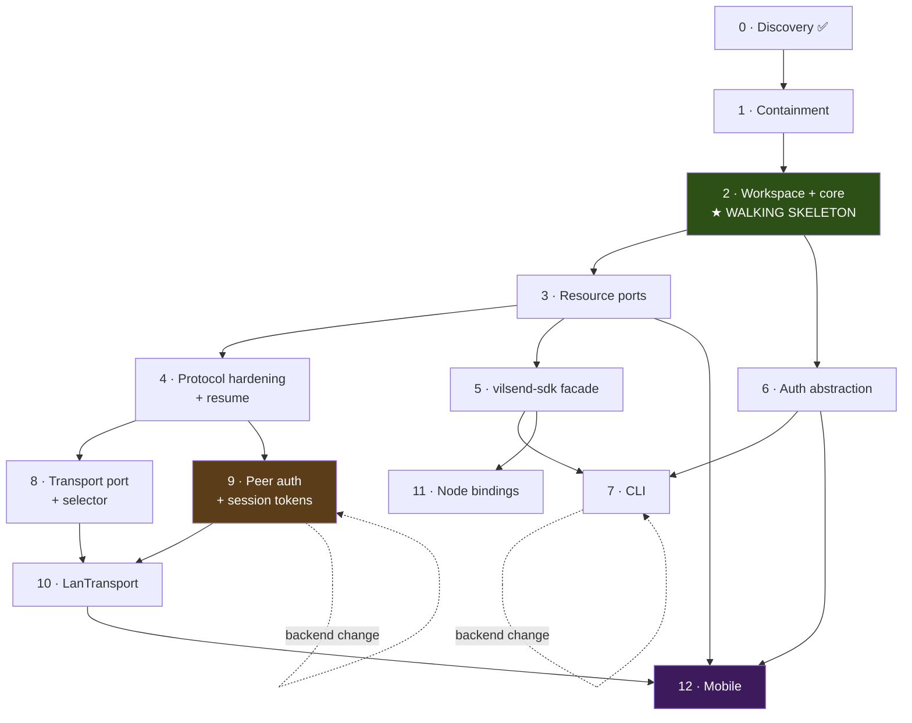

# 05 — Migration Plan

> Strangler-style, incremental. **The desktop app is shippable at the end of
> every phase** — that is the governing constraint, and every phase below states
> explicitly how it preserves it.

**Effort key:** `S` ≈ 1–2 focused days · `M` ≈ 3–5 days · `L` ≈ 1–2 weeks.
Estimates assume one engineer familiar with the codebase, and exclude time
waiting on backend changes.

---

## The rules this plan follows

1. **Never a big-bang rewrite.** Each phase is independently mergeable and
   independently revertable.
2. **The abstraction goes in before the new implementation.** Introduce the
   trait, wrap the *existing* code in it, prove nothing broke — *then* write the
   new thing. This is why Phase 2 precedes everything.
3. **No phase ships a security regression.** Peer authentication (Phase 9)
   strictly precedes the LAN transport (Phase 10), because LAN without it would
   be worse than today.
4. **Tests come with the seam, not after it.** The moment `vilsend-core` exists,
   it has tests. There are zero today, so this is not a burden — it is new.
5. **Delete as you go.** Every phase that touches a file removes the
   commented-out drafts around it.

---

## Phase overview

| # | Phase | Effort | Ships to users? | Blocked by |
|---|---|---|---|---|
| 0 | Discovery | ✅ done | — | — |
| 1 | Containment: P0 security + hygiene | **S–M** | ✅ yes | — |
| 2 | **Workspace + `vilsend-core` + `EventSink` port** ← *walking skeleton* | **M** | ✅ yes | 1 |
| 3 | Ports for files, config, credentials | **M** | ✅ yes | 2 |
| 4 | Protocol hardening + resume persistence | **L** | ✅ yes | 3 |
| 5 | `vilsend-sdk` facade; desktop consumes it | **M** | ✅ yes | 3 |
| 6 | Auth abstraction + discovery + revocation | **M** | ✅ yes | 2 |
| 7 | CLI + device grant + API-key provider | **M** | ✅ new artifact | 5, 6 |
| 8 | `Transport` port + selector (tunnel only) | **L** | ✅ yes | 4 |
| 9 | Peer authentication + session tokens | **M** | ✅ yes | 4 · **backend** |
| 10 | `LanTransport` + discovery | **L** | ✅ yes | 8, 9 |
| 11 | Node bindings (napi-rs) | **M** | ✅ new artifact | 5 |
| 12 | Mobile shell | **L** | ✅ new artifact | 3, 6, 10 |

---

## Dependency graph



**Critical path:** 1 → 2 → 3 → 4 → 8 → 10 → 12.
**Parallelisable after Phase 3:** {4}, {5→7}, {6}.
**Backend-gated:** 7 (API keys) and 9 (session tokens) — start the backend
conversation during Phase 1, because it is the long pole.

---

## Phase 1 — Containment

**Effort:** S–M · **Goal:** remove the P0 security issues and the worst hygiene
offenders, **without changing any architecture.** This phase exists so that the
refactor does not have to carry the defects forward.

### Why this is first

Several P0 items are one-line fixes and they are genuinely exploitable today.
Fixing them before any structural work means the structural work cannot be
blamed for them, and means the security posture only improves from here.

### Tasks

| # | Task | Files |
|---|---|---|
| 1.1 | Gate `window.open_devtools()` behind `#[cfg(all(desktop, debug_assertions))]` | `src-tauri/src/lib.rs:119-123` |
| 1.2 | Rotate the committed `TAURI_SIGNING_PRIVATE_KEY` and remove it from `.env`; add `.env` to `.gitignore` if not present | `.env`, `.gitignore` |
| 1.3 | Replace `"csp": null` with a real CSP | `src-tauri/tauri.conf.json` |
| 1.4 | Drop `LevelFilter::Trace` → `Info` in release | `src-tauri/src/lib.rs:90-106` |
| 1.5 | Stop logging token existence/length | **Corrected in Phase 1:** `src/lib/api.ts` was already clean. The live sites were five `println!` calls in `services/websocket_service.rs`, `state/websocket_state.rs` and `websocket/manager.rs`. |
| 1.6 | Register the missing `stop_websocket` command | `src-tauri/src/lib.rs:396-429`, `commands/` |
| 1.7 | Delete ~1500 lines of commented-out dead code | `app/mod.rs:1-287`, `services/secure_storage.rs`, `services/*.rs` drafts, `websocket/protocol.rs`, `lib.rs:78-88` |
| 1.8 | Delete the 3 case-duplicate orphan files | `state/AuthState.rs`, `state/WebSocketState.rs`, `websocket/WebSocketManager.rs` |
| 1.9 | Delete the 11 empty stub files and their dangling references | `transfer/{checksum,persistence,pause,download,cancle,worker}.rs`, `utils/{bitset,fs,hash,path,time}.rs` |
| 1.10 | Remove dead dependencies: `keyring`, `ed25519-dalek`, `iota_stronghold`, and unregister the unused Stronghold plugin | `Cargo.toml`, `lib.rs:112` |
| 1.11 | Remove the stray `src-tauri/2` file | `src-tauri/2` |
| 1.12 | Fix the `ConnectionStatus` casing mismatch | `src/hooks/useDesktopServices.ts:112` |
| 1.13 | Fix the macOS arm64 cloudflared bundle | `tauri.macos.conf.json`, `services/cloudflared.rs:268-282` |
| 1.14 | Single-source the version number | `Cargo.toml`, `tauri.conf.json`, `msix/AppxManifest.xml` |

> **Note on 1.7/1.10:** removing Stronghold is safe **only because** it is
> provably unused — the plugin is registered but never called, and
> `secure_storage.rs` is 100% commented out. Verify with a grep before merging;
> if any live path touches it, keep it and file a separate ticket.
>
> **Note on 1.13:** decide whether the arm64 cloudflared should be bundled or
> whether macOS should download it. Bundling is simpler; it adds ~30 MB.

### Acceptance criteria

- [ ] `cargo check` produces **zero warnings** (the baseline is 21, not ~27).
- [ ] No `devtools` window in a release build.
- [ ] `grep -rn "your-stronghold\|vilSend-strongHold" src-tauri/` returns nothing.
- [ ] `git ls-files src-tauri/src | wc -l` drops by ≥ 14.
- [ ] App launches, signs in, sends and receives a file.
- [ ] macOS arm64 build starts cloudflared successfully.

### Tests required

No unit tests (there is no harness yet). One source-tree check was added,
because `06-testing-and-quality.md` §5.1/§6.3 assigns it to this phase and
because task 1.6 is a bug fix that needs a failing-first guard:
`scripts/check-ipc-contract.mjs` (`npm run check:ipc`) asserts that every
`invoke("<name>")` in `src/` names a command registered in
`generate_handler!`. It fails on the pre-1.6 tree and found a second instance
of the same defect. Manual smoke: sign in → send → receive → sign out.
**Capture this as a written checklist** — it becomes the regression suite in
Phase 2.

### Risks

| Risk | Mitigation |
|---|---|
| Deleting something that is actually live | The codebase has a lot of dead code; verify each deletion with a grep for references, and land 1.7–1.11 as **separate commits** |
| CSP breaks the app (inline styles, Razorpay script, Tauri IPC) | Add the CSP in **report-only** mode first, ship, observe, then enforce |
| Rotating the signing key breaks auto-update for installed users | **This is the real risk of 1.2.** See rollback below. |

### Rollback

Per-commit revert. **Exception: 1.2** — rotating the updater signing key
invalidates updates for every installed client unless the old key is retained
for verification. **Do not rotate the update-signing key in this phase.**
Instead: remove it from the repo, keep using it, and schedule rotation as a
separate deliberate operation with a dual-key transition. **Revise task 1.2 to
"remove from the repo and rotate the secret out-of-band."**

---

## Phase 2 — Workspace + `vilsend-core` + `EventSink` port ★ WALKING SKELETON

**Effort:** M · **Goal:** prove the architecture with the smallest possible
end-to-end slice. This is the milestone that de-risks everything after it.

### What "walking skeleton" means here

A single vertical slice that touches every layer:

```
Tauri command → vilsend-core (port) → adapter → back up as a Tauri event
```

Specifically: **move `transfer/events.rs`'s `app.emit` behind an `EventSink`
trait**, implemented by the Tauri shell. That is a ~30-line change that
establishes the whole pattern, plus the workspace that makes it possible.

If this slice works — core compiles without Tauri, the shell injects an adapter,
a test runs in CI — then every later phase is repetition of a proven move.

### Tasks

| # | Task |
|---|---|
| 2.1 | Create the virtual workspace: root `Cargo.toml` with `[workspace]`, move `src-tauri/` → `crates/desktop/`, move `Cargo.lock` to the root. **Update the CI cache path** — the `Cache Rust` step of both the `release` and `build-windows-store` jobs in `.github/workflows/release.yml`, which caches `src-tauri/target` and hashes `src-tauri/Cargo.lock` — in the same commit. |
| 2.2 | Add `rust-toolchain.toml` pinning the toolchain. |
| 2.3 | Create `crates/core` (`vilsend-core`): domain types (`TransferId`, `DeviceId`, `PeerRef`, `TransferProgress`, `TransferStatus`) + `VilsendError` + the `EventSink` port + `DomainEvent`. |
| 2.4 | Move `TransferProgress`, `TransferStatus`, `ConnectionStatus`, and the transfer-event names out of the shell into `core`, replacing string literals with a `DomainEvent` enum. |
| 2.5 | Implement `TauriEventSink` in the desktop crate, mapping `DomainEvent` → event name + payload. **Wire format must not change** (see acceptance). |
| 2.6 | Inject `Arc<dyn EventSink>` into `UploadManager` and `ReceiverState`, replacing the `AppHandle` fields where they are used *only* for emission. |
| 2.7 | Add the architecture lint job to CI (`cargo tree -p vilsend-core \| grep -E '^(tauri\|reqwest\|axum\|sqlx)'` must fail the build). |
| 2.8 | Add `cargo fmt --check`, `cargo clippy -D warnings`, and `cargo test --workspace` to CI. |

### Acceptance criteria

- [ ] `cargo build -p vilsend-core` succeeds with **no Tauri in its dependency tree** (proven by the lint job, not by inspection).
- [ ] `cargo test -p vilsend-core` runs and passes ≥ 10 tests.
- [ ] **The frontend is unchanged.** Every existing `listen("transfer-progress")` still fires with the identical payload shape.
- [ ] A full file transfer still works end-to-end.
- [ ] `cargo tauri build` still produces an installer from the new path.

### Tests required

- Unit: `DomainEvent` → wire-name mapping (exhaustive `match`, so adding a
  variant without naming it fails the build).
- Unit: `TransferProgress` percentage/ETA arithmetic — the existing logic at
  `transfer/progress.rs:3-26` and `models/progress.rs:18-50`, currently untested.
- Integration: a `RecordingEventSink` that captures events; assert a simulated
  transfer emits the expected sequence.

### Risks

| Risk | Mitigation |
|---|---|
| Moving `src-tauri/` breaks the release pipeline (paths are hardcoded in `release.yml` and `tauri.conf.json`) | Do the move and all path updates in **one commit**; run the release workflow on a throwaway tag before merging |
| A behaviour change sneaks in during the move | **Phase 2 must be a pure refactor.** Any behaviour fix goes in a separate phase. Enforce by diffing event payloads before/after. |
| Cargo dependency cycles appear | Enforce the dependency rules from [`01`](./01-target-architecture.md) §4.1 in CI from day one |

### Rollback

Revert the merge commit. The workspace move is large but self-contained — no
runtime behaviour changes, so a revert is clean. **Tag the last pre-workspace
commit.**

---

## Phase 3 — Resource ports

**Effort:** M · **Goal:** remove the remaining Tauri and OS coupling from the
transfer engine by introducing ports for files, config, and credentials.

### Tasks

| # | Task |
|---|---|
| 3.1 | `ChunkSource` / `ChunkSink` ports in `core`; `StdChunkSource`/`StdChunkSink` adapters in a new `crates/runtime`. Replaces the direct `std::fs` calls in `transfer/{upload,scanner,merger,writer}.rs`. |
| 3.2 | `Clock` port (`now()`, `sleep()`) — required for deterministic retry/backoff tests. |
| 3.3 | `CredentialStore` port; `OsKeyringStore` adapter wrapping **`tauri-plugin-secure-storage`'s existing behaviour**. This moves `KeyringService` out of the shell and kills `OAuthService`'s last `AppHandle`. |
| 3.4 | `TransferStore` port; `SqliteTransferStore` adapter over the existing `LocalTransferFileService`. |
| 3.5 | `ConfigProvider` port — replaces the three-way split between `VITE_*` env vars, `DesktopAuthConfig`, and `AppConfig` (`utils/config.rs:21-33`). **One `ClientConfig`, constructed in the shell, injected.** |
| 3.6 | Extract the axum receiver out of `transfer/writer.rs` into a receiver module that takes a `ChunkSink` — leaving the HTTP layer thin. |
| 3.7 | Split `transfer/writer.rs` (819 lines) into: `receiver/http.rs` (transport), `receiver/session.rs` (policy: auth, path safety, resume), `receiver/write.rs` (via `ChunkSink`). |

### Acceptance criteria

- [ ] `cargo tree -p vilsend-engine` contains no `tauri`.
- [ ] **Every port has ≥ 2 implementations**: the real one and an in-memory one.
- [ ] `transfer/writer.rs` no longer exists; no file in `crates/` exceeds ~400 lines.
- [ ] A full transfer still works; the receiver still binds `:7878` and serves the same three endpoints with identical semantics.

### Tests required

- **In-memory `ChunkSource`/`ChunkSink`** — enables the first real transfer tests.
- Round-trip: chunk → encrypt → write → merge → verify, entirely in memory.
- Path-safety: assert `../`, absolute paths, and symlink escapes are rejected — this logic exists today at `writer.rs:476-490` and has **never been tested**.
- `FakeClock`: retry backoff produces exactly 1, 2, 4, 8 s.

### Risks

| Risk | Mitigation |
|---|---|
| The refactor of `writer.rs` changes receiver semantics subtly | Characterisation tests first: pin current behaviour (including its bugs) with tests, *then* refactor |
| `ChunkSource`/`ChunkSink` become an over-engineered abstract VFS | Keep them to three methods. Resist adding a `random_access` method "for later". |

### Rollback

Per-commit revert. Keep the old `writer.rs` in the tree behind a `#[cfg]` for
one release if you want a faster escape hatch — but delete it in the next one.

---

## Phase 4 — Protocol hardening + resume persistence

**Effort:** L · **Goal:** fix the cryptographic gaps and make transfers
resumable across restarts. **Must land before the LAN transport.**

### Tasks

| # | Task | Rationale |
|---|---|---|
| 4.1 | **Add AAD to chunk encryption**: `AAD = transfer_id ‖ file_id ‖ chunk_index ‖ relative_path ‖ proto_v`. Bump to `proto_v2`. | Closes the replay-binding gap (`docs/DECISIONS.md:13`). Today a captured chunk can be replayed into a different file or index. |
| 4.2 | **Salt the HKDF** with both handshake nonces. Currently `info = b"carsdv-transfer-key-v1"` with **no salt** (`transfer/crypto.rs:82-91`). | Key uniqueness across sessions |
| 4.3 | **Whole-file BLAKE3 integrity**, verified after merge. Currently a **0-byte stub** (`transfer/checksum.rs`). | Detects truncation, reordering, and a misbehaving receiver |
| 4.4 | **Nonce discipline**: keep random 12-byte nonces but add a bounded repeat check per transfer key. | Random-only nonce reuse is a birthday-bound risk on very large transfers |
| 4.5 | **Persist transfer state** in SQLite: `transfer_id`, per-file confirmed-chunk bitmap, transfer key (encrypted at rest via `CredentialStore`), status. | Enables restart recovery |
| 4.6 | **Sender-side resume**: on restart, load the checkpoint and resume from `resume_at`. | |
| 4.7 | **Manifest exchange**: `MANIFEST` / `MANIFEST_ACK` carrying the resume bitmap, replacing today's accidental `.part`-existence check. | Turns the existing implicit resume into a real one |
| 4.8 | **Replace the global write mutex** with per-transfer/per-file locks + a bounded global semaphore. | `writer.rs:37-45`, `:600` — flagged P1 |
| 4.9 | **Bounded channels** in place of `mpsc::unbounded_channel` (`manager.rs:158`, `websocket/sender.rs:4-7`). | Unbounded queues are an OOM reachable from a LAN peer |
| 4.10 | **Explicit cleanup** of `.part` directories on failure and cancellation. | Currently only cleaned on success |
| 4.11 | **Wire compatibility**: v2 endpoints under new paths (`/v2/session`, `/v2/stream`); keep `/transfer/*` serving v1 unchanged. | The installed base |

### Acceptance criteria

- [ ] A captured v2 chunk replayed at a different index is **rejected**.
- [ ] A truncated file fails integrity verification with `IntegrityMismatch`.
- [ ] Kill the app mid-transfer; on restart the transfer resumes and completes.
- [ ] A **v1 receiver** still completes a transfer from a v2 sender over the tunnel.
- [ ] 4 concurrent transfers no longer serialize on one mutex (measure: wall-clock for 4 × 1 GB vs 1 × 4 GB).
- [ ] Memory stays bounded under a fast-producer/slow-consumer test.

### Tests required

- Crypto vectors: fixed key + nonce + AAD → fixed ciphertext (regression on the wire format).
- Tamper tests: flip a byte in ciphertext, AAD, nonce — all must fail closed.
- Replay test: capture a chunk, replay at a different index → rejected.
- Resume test: checkpoint at 50%, restart, assert bytes re-sent ≤ 1 chunk.
- Concurrency test: 4 transfers, assert no inter-chunk serialization.
- Backpressure test: slow sink, fast source, assert bounded memory.

### Risks

| Risk | Mitigation |
|---|---|
| **AAD breaks compatibility with the installed base** | AAD is a v2-only change. v1 continues to work unmodified. **This is the highest-risk item in the plan.** |
| Nonce-repeat checking costs memory on huge transfers | Bound it: a sliding window, not a full set. |
| Persisting the transfer key in SQLite creates a new secret-at-rest problem | Encrypt it with a key held in the OS keychain. **Do not store the raw key.** |

### Rollback

v2 is additive. If v2 misbehaves, the feature flag `protocol-v2` can be turned
off and clients fall back to `/transfer/*`. **No rollback needed for v1 users.**

---

## Phase 5 — `vilsend-sdk` facade

**Effort:** M · **Goal:** create the stable public API and make the desktop app
its first consumer.

### Tasks

| # | Task |
|---|---|
| 5.1 | Create `crates/sdk` with `Vilsend`, `VilsendBuilder`, `SendRequest`/`ReceiveRequest`, `TransferHandle`, `EventStream`. |
| 5.2 | `VilsendBuilder::native()` (LAN + tunnel, OS keyring, SQLite) and `::in_memory()` (nothing real). |
| 5.3 | Refactor the Tauri commands to call `vilsend-sdk` instead of touching `engine` directly. Commands become thin marshalling. |
| 5.4 | Add `#[non_exhaustive]` to all public enums; write the semver policy into `crates/sdk/README.md`. |
| 5.5 | Add `cargo-semver-checks` to CI. |
| 5.6 | Write the README example and make it a **doctest** so it cannot rot. |

### Acceptance criteria

- [ ] The desktop app has **no direct dependency on `vilsend-engine`** — only on `vilsend-sdk`.
- [ ] `cargo test -p vilsend-sdk --doc` passes.
- [ ] A ~20-line example in `crates/sdk/examples/send.rs` completes a real transfer.
- [ ] No public API type exposes `tauri`, `axum`, `sqlx`, or a lifetime.

### Tests required

- A doctest that compiles.
- An integration test using `in_memory()` for the full send→receive cycle.
- A public-API snapshot test (like `cargo-public-api`) so accidental changes are visible in review.

### Risks

| Risk | Mitigation |
|---|---|
| Publishing an API you will want to change | **Do not publish to crates.io yet.** Keep it `publish = false` until Phase 7 is done and the CLI has exercised it. |
| The facade becomes a god-object | Keep it to four verbs. If a fifth is needed, it is probably a separate facade. |

### Rollback

Revert. The desktop app's commands are the only consumer at this point.

---

## Phase 6 — Auth abstraction

**Effort:** M · **Goal:** introduce `AuthProvider`/`CredentialStore`, move
issuer discovery, add revocation. **Zero user-visible change.**

### Tasks

| # | Task |
|---|---|
| 6.1 | `AuthProvider`, `CredentialStore`, `InteractiveAuthUi`, `TokenRefresher` traits in `core`. |
| 6.2 | Wrap the **existing** `OAuthService` as `ClerkPkceProvider`. **No behaviour change.** Generalise the refresh mutex to be per-account. |
| 6.3 | Move the issuer derivation out of TypeScript (`src/lib/auth-config.ts:26-45`) into Rust. |
| 6.4 | **Adopt OIDC discovery**: `GET {issuer}/.well-known/openid-configuration` for `authorization_endpoint` / `token_endpoint`, replacing string concatenation at `oauth_service.rs:83-85`. Keep the constructed URLs as a fallback. |
| 6.5 | Add **revocation on logout**. ⚠️ **First verify Clerk's revocation endpoint** — see Q-01/Q-04. |
| 6.6 | Implement `TauriInteractiveAuthUi` (opener + deep-link) in the desktop crate. |
| 6.7 | Add `ApiKeyProvider` and `ByoAuthProvider` (both small; not yet wired to a UI). |
| 6.8 | Apply `zeroize` to token buffers in memory. |

### Acceptance criteria

- [ ] `vilsend-auth` has no `tauri` dependency; `cargo tree -p vilsend-auth` is clean.
- [ ] Sign-in, refresh, and sign-out behave **identically** to today.
- [ ] Sign-out revokes server-side (verified by attempting to use the old refresh token and getting a rejection).
- [ ] Auth works against a mocked OIDC discovery document in tests.

### Tests required

- PKCE: verifier/challenge correctness against RFC 7636 test vectors.
- Refresh: concurrent refreshes spend the refresh token **exactly once**.
- Refresh failure modes: 4xx clears the session; 5xx does **not**.
- State mismatch and replay are rejected.
- Callback redirect matching (scheme/host/path) rejects a tampered URI.

### Risks

| Risk | Mitigation |
|---|---|
| Discovery adds a network call on the sign-in critical path | Cache the document; fall back to constructed URLs on failure. |
| Revocation endpoint guess is wrong | **Verify first.** If it cannot be verified, ship without revocation and file it as a known gap rather than shipping a broken call. |

### Rollback

Revert. Behaviour is unchanged by construction, so a revert is invisible.

---

## Phase 7 — CLI

**Effort:** M · **Goal:** the first non-desktop artifact. **This is the proof
that the core has no hidden UI dependency.**

### Tasks

| # | Task |
|---|---|
| 7.1 | Create `crates/cli` with `clap`: `login`, `logout`, `send`, `receive`, `devices list`, `transfers list`, `whoami`. |
| 7.2 | Implement `CliInteractiveAuthUi`: device-code display + polling. |
| 7.3 | **⚠️ Prerequisite: enable the Device Authorization Grant on the Clerk OAuth application.** |
| 7.4 | Exit-code mapping from `ErrorKind` ([`01`](./01-target-architecture.md) §8.1). |
| 7.5 | `--json` NDJSON output for every command; progress bar on stderr in human mode. |
| 7.6 | `VILSEND_TOKEN` env support via `ApiKeyProvider`. **Requires backend change.** |
| 7.7 | `SIGINT` → graceful cancel → checkpoint. |
| 7.8 | Detect `!isatty` and refuse to prompt. |
| 7.9 | Add CLI builds to CI (3 OSes). |

### Acceptance criteria

- [ ] `vilsend send ./file --to device:X` completes a real transfer from a headless shell.
- [ ] `vilsend login` works with **no browser on the machine** (device flow).
- [ ] The same binary works in a TTY and piped to a file.
- [ ] Exit codes are asserted in tests.
- [ ] `--json` output validates against a committed schema.

### Tests required

- Exit-code tests for each `ErrorKind`.
- `--json` snapshot tests.
- An end-to-end test in CI: start a receiver, `vilsend send`, assert the file arrives.

### Risks

| Risk | Mitigation |
|---|---|
| Device grant is **beta** and off by default | Keep loopback PKCE as a fallback path; get the grant enabled early (the long pole) |
| Headless token storage has no keychain | Provide `--credential-file` with `0600` and an explicit warning; never silently write a plaintext token |
| API-key support needs backend work | Ship with device-flow only if the backend is not ready; do not block the CLI on it |

### Rollback

The CLI is additive. If it fails, the desktop app is unaffected.

---

## Phase 8 — `Transport` port + selector

**Effort:** L · **Goal:** introduce the transport abstraction with **only the
existing tunnel** behind it. **No new transport, no behaviour change.**

### Why refactor with no new transport first

If you build the port and LAN at the same time, you cannot tell whether a bug is
in the abstraction or in the new transport. Phase 8 proves the abstraction is
sound with the transport you already have.

### Tasks

| # | Task |
|---|---|
| 8.1 | `Transport`, `DuplexStream`, `Capabilities`, `ProbeOutcome`, `Health` in `core`. |
| 8.2 | Create `crates/transport`. |
| 8.3 | `TunnelTransport` — wrap the existing `HttpClient` (`transfer/http_client.rs`) + cloudflared supervisor. Preserve the v1 wire format exactly. |
| 8.4 | `TransportSelector` with capability scoring ([`02`](./02-transport-layer.md) §5.1). With one candidate it is a passthrough. |
| 8.5 | Move `TransferMetadata.endpoint` resolution from the engine into `TunnelTransport`. |
| 8.6 | Implement **stall detection** (no `bytes_confirmed` progress in N seconds) — the data-plane liveness signal that does not exist today. |
| 8.7 | Add the **transport contract test suite** ([`02`](./02-transport-layer.md) §6.1). |
| 8.8 | Wire the selector into the engine; add a `--transport` policy knob (config only, no UI yet). |

### Acceptance criteria

- [ ] `TunnelTransport` passes the full contract suite.
- [ ] A transfer behaves **identically** to before — same speed, same wire format, same events.
- [ ] A stalled transfer (simulated) is detected within `stall_timeout` and fails with a typed error instead of hanging.
- [ ] `cargo tree -p vilsend-transport` contains no `tauri`, `axum`, or `sqlx`.
- [ ] Adding a second (mock) transport in a test requires **zero** changes to existing files.

### Tests required

- The contract suite (9 tests from [`02`](./02-transport-layer.md) §6.1).
- Selector scoring: table-driven tests over capability sets and policies.
- Selector racing: a mock where the fastest connect wins.
- A **"new transport" test**: a `MockTransport` added purely by registering it — this is the test that proves P4.

### Risks

| Risk | Mitigation |
|---|---|
| Abstraction is wrong and the next transport does not fit | The mock-transport test is the canary. If the mock needs special-casing, the abstraction is wrong — fix it in Phase 8, not Phase 10. |
| `DuplexStream` becomes a leaky abstraction over HTTP request/response | Keep it byte-oriented. Do not add `request(&str)` helpers. |

### Rollback

Feature-flag the selector (`transport-selector`). With one transport, the
fallback is a direct call to `TunnelTransport`.

---

## Phase 9 — Peer authentication + session tokens

**Effort:** M · **Goal:** close the two security holes that the LAN transport
would otherwise make exploitable. **This phase is a hard prerequisite for
Phase 10.**

### Tasks

| # | Task | Backend? |
|---|---|---|
| 9.1 | **Receiver authorization**: validate a real credential instead of "the `Authorization` header exists" (`transfer/writer.rs`). | ⚠️ yes |
| 9.2 | `SessionToken` — minted by the control plane, bound to `transfer_id` + `sender_device` + expiry, ≤ 15 min TTL, single-use per session. | ⚠️ yes |
| 9.3 | **Interim if the backend is not ready**: a per-receiver random secret in the OS keychain, exchanged out-of-band via the existing `START_TRANSFER` payload. Ship this to unblock; migrate to 9.2 when the backend lands. | no |
| 9.4 | **Device signing key**: add a signing identity (Ed25519) alongside the existing X25519 device key, or verify whether the dead Ed25519 code can be revived. | — |
| 9.5 | **Device signature in the handshake**: `HELLO_ACK.device_sig` over the full transcript ([`02`](./02-transport-layer.md) §7.3). | no |
| 9.6 | **Bind `chosen_transport` into the signed transcript** so a downgrade is detectable and surfaced. | no |
| 9.7 | **Bind `0.0.0.0` → a configurable interface.** Default to the tunnel-facing path and LAN only when a LAN transfer is active. | no |
| 9.8 | Add receiver resource limits: max concurrent sessions, per-session byte cap, header/path length limits, request rate limit. | no |
| 9.9 | `Policy::require_direct` — refuse relayed paths when policy demands it. | no |

### Acceptance criteria

- [ ] A chunk POST with a **valid-looking but wrong** Authorization value is **rejected**.
- [ ] A chunk POST with an expired session token is rejected.
- [ ] A chunk POST with a token bound to a different `transfer_id` is rejected.
- [ ] A forged `HELLO_ACK` (wrong device signature) is rejected **and surfaces as a typed error**, not a generic failure.
- [ ] Forcing a LAN→tunnel downgrade is **visible** in the event stream.
- [ ] The receiver no longer binds `0.0.0.0` by default.
- [ ] A flood of 1,000 concurrent sessions is capped, with bounded memory.

### Tests required

- Negative auth: wrong token, expired token, wrong transfer id, missing token.
- Signature: valid/invalid/tampered transcript.
- Downgrade: assert `TransportDegraded { from: Lan, to: Tunnel }` is emitted.
- Resource limits: session cap enforced; memory bounded.
- **A security regression test for the v1 path**, so the compatibility floor does not become the hole.

### Risks

| Risk | Mitigation |
|---|---|
| **Session tokens need backend work — this is the critical path** | Start the backend conversation in Phase 1. Ship 9.3 as the interim. |
| Requiring a signature breaks v1 clients | v1 clients do not sign. Apply signature enforcement **only on v2 handshakes**; v1 remains on the tunnel with the interim token. |
| Adding an Ed25519 key changes the device registration payload | Coordinate with the backend; register both keys during a transition window. |

### Rollback

Enforcement is configurable per protocol version. Turning v2 enforcement off
restores Phase 8 behaviour; v1 users are untouched throughout.

---

## Phase 10 — `LanTransport`

**Effort:** L · **Goal:** the first new transport. Direct, fast, and — because
Phase 9 landed first — **safer than the current tunnel path**.

### Tasks

| # | Task |
|---|---|
| 10.1 | mDNS advertisement/discovery (`mdns-sd`), TXT records: protocol version, device public key fingerprint, opaque device-id hash. **No friendly names by default.** |
| 10.2 | `LanTransport` implementing `Transport`, using the existing receiver over HTTP. |
| 10.3 | `probe()` — bounded (≤ 50 ms) reachability check. |
| 10.4 | `health()` — real liveness on the LAN path. |
| 10.5 | Discovery lifecycle: **on demand**, not continuous (battery). |
| 10.6 | Windows firewall handling; document the prompt; consider an installer rule. |
| 10.7 | Advertise LAN availability in `START_TRANSFER`'s additive `transport_hints`. |
| 10.8 | UI: show the chosen transport and the speed difference. **Silence here would hide downgrades.** |
| 10.9 | Fall back to the tunnel on any LAN failure — never fail a transfer because LAN was unavailable. |

### Acceptance criteria

- [ ] Two devices on the same Wi-Fi transfer a 1 GB file **without touching the internet** (verify by blocking WAN and watching it succeed).
- [ ] Measured throughput on LAN is **≥ 5×** the tunnel path.
- [ ] A LAN failure mid-transfer fails over to the tunnel and completes.
- [ ] Discovery does not run continuously (measurable: no mDNS traffic when idle).
- [ ] A spoofed mDNS advertisement is **rejected** by the Phase 9 signature check.
- [ ] v1 clients are entirely unaffected.

### Tests required

- Two `LanTransport` instances in one process (loopback) complete a transfer.
- Spoofed-advertisement rejection.
- Failover: kill the LAN path mid-transfer, assert completion via tunnel.
- Discovery bounded: assert no mDNS packets after a transfer completes.

### Risks

| Risk | Mitigation |
|---|---|
| Windows firewall prompt terrifies users | Bind only when a LAN transfer is desired; explain in the UI |
| mDNS is blocked on many corporate networks | `probe()` returns `Unavailable`; the selector falls back silently. **Never treat LAN as required.** |
| Battery drain on mobile | On-demand discovery only; this is a Phase 12 concern but design for it now |
| Two devices on the same LAN but different subnets | Out of scope; the tunnel covers it |

### Rollback

Feature flag `transport-lan`, default **off** for the first release, then on.
Turning it off restores Phase 9 behaviour exactly.

---

## Phase 11 — Node bindings

**Effort:** M · **Goal:** a third-party-consumable JS/TS SDK.

### Tasks

11.1 Create `crates/node` with napi-rs. 11.2 Map `EventStream` → an async
iterator. 11.3 Map `VilsendError` → a TS discriminated union. 11.4 Generate
`.d.ts` types. 11.5 Per-platform prebuilt addons via `optionalDependencies`.
11.6 Publish to npm under `@vilsend/sdk`.

**Acceptance:** a Node script completes a transfer; TypeScript types compile
under `strict`; the addon loads on all 3 OSes × 2 arches.

**Risk:** prebuilt addon publishing is fiddly. **Mitigation:** start with
`napi build --platform` in CI only; do not attempt a source-build fallback.

---

## Phase 12 — Mobile

**Effort:** L · **Goal:** iOS and Android, sharing the core.

### Tasks

| # | Task |
|---|---|
| 12.1 | Gate all desktop-only plugins with `#[cfg(desktop)]` (`single-instance`, `updater`, `stronghold`). |
| 12.2 | Platform `CredentialStore`: iOS Keychain / Android Keystore. |
| 12.3 | Universal Links (iOS) / App Links (Android) for the auth redirect; keep the custom scheme as fallback. |
| 12.4 | Mobile `InteractiveAuthUi` using `ASWebAuthenticationSession` / Custom Tabs. |
| 12.5 | **iOS background transfer.** Replace the in-process axum receiver with `NSURLSession` background downloads. **This is the hardest task in the plan.** |
| 12.6 | Optional biometric gate on the refresh token. |
| 12.7 | UI: Tauri 2 mobile with the existing React app, responsive. |
| 12.8 | Build `vilsend-ffi` (UniFFI) **alongside**, as the escape hatch — do not ship it, just keep it compiling. |
| 12.9 | CI: iOS + Android builds. |

**Acceptance:** a transfer completes in the foreground on both platforms; on iOS
a transfer survives backgrounding **or** is explicitly documented as
unsupported.

**Risk:** 12.5 may turn out to be impractical within the Tauri mobile model.
**Mitigation:** spike 12.5 **first**, in a timeboxed way, before 12.7. If it
fails, switch to option B (native shell over UniFFI) — which is exactly why
12.8 exists.

---

## Cross-phase concerns

| Concern | Rule |
|---|---|
| **Feature flags** | Every new behaviour ships behind a flag, default **off**, for one release. |
| **Wire compatibility** | Never change a v1 endpoint's semantics. Additive fields only. |
| **Deleting dead code** | Anything you touch, clean up around. |
| **Test growth** | Every phase adds tests; the count should never decrease. |
| **Desktop shippability** | If a phase cannot ship the desktop app, the phase is too big — split it. |

---

## Top risks to the plan as a whole

| Risk | Phase affected | Mitigation |
|---|---|---|
| **Backend changes are on the critical path** (session tokens, API keys, JWT-vs-opaque) and are outside this repo | 7, 9 | Start in Phase 1. Ship interims (9.3) so the client is never blocked. |
| **No tests exist**, so refactors are unverifiable | 2–5 | Phase 2 introduces the harness. Characterisation tests before any behaviour change. |
| **Clerk device grant is beta and off by default** | 7 | Verify and enable early; keep loopback PKCE as a fallback. |
| **The AAD change breaks the installed base** | 4 | v2-only; v1 untouched; compatibility test in CI. |
| **iOS background transfer may not fit the Tauri model** | 12 | Spike before committing; keep the UniFFI escape hatch. |
| **Workspace move breaks the release pipeline** | 2 | One atomic commit; dry-run the workflow on a throwaway tag. |

---

## See also

- [`00-current-state.md`](./00-current-state.md) — what each phase is fixing
- [`01-target-architecture.md`](./01-target-architecture.md) — where this ends up
- [`06-testing-and-quality.md`](./06-testing-and-quality.md) — the harness each phase needs
- [`07-risks-and-open-questions.md`](./07-risks-and-open-questions.md) — what I need from you
